# Table of Contents

* [1. Executive Summary](#1-executive-summary)
  * [1.1 Product Vision](#11-product-vision)
  * [1.2 Product Overview](#12-product-overview)
    * [MVP Workflow](#mvp-workflow)
  * [1.3 Mission Statement](#13-mission-statement)
  * [1.4 Vision Statement](#14-vision-statement)
  * [1.5 Value Proposition](#15-value-proposition)
  * [1.6 Product Positioning](#16-product-positioning)
  * [1.7 Core Promise](#17-core-promise)
  * [1.8 Market Timing (Why Now?)](#18-market-timing-why-now)
  * [1.9 Design Principles](#19-design-principles)
  * [1.10 Expected Business Outcomes](#110-expected-business-outcomes)
* [8. Product Epics & MVP Requirements](#8-product-epics-&-mvp-requirements)
  * [Epic: AI Investigation Engine Outputs](#epic:-ai-investigation-engine-outputs)
  * [8.8 Epic 4: Investigation Results UI](#88-epic-4:-investigation-results-ui)
  * [8.9 Epic 5: Report Generation](#89-epic-5:-report-generation)
  * [8.10 Epic 6: Investigation History](#810-epic-6:-investigation-history)
  * [8.11 Epic 7: Basic Settings](#811-epic-7:-basic-settings)
  * [8.12 MVP Feature Matrix](#812-mvp-feature-matrix)
  * [8.13 MVP Success Criteria](#813-mvp-success-criteria)
* [2. Problem Statement](#2-problem-statement)
  * [2.1 Background](#21-background)
  * [2.2 Current Investigation Workflow](#22-current-investigation-workflow)
  * [2.3 Current Pain Points](#23-current-pain-points)
    * [2.3.1 Interpretation of Raw Security Logs](#231-interpretation-of-raw-security-logs)
    * [2.3.2 Alert Fatigue](#232-alert-fatigue)
    * [2.3.3 Over-Reliance on Senior Personnel](#233-over-reliance-on-senior-personnel)
    * [2.3.4 Manual MITRE ATT&CK Mapping](#234-manual-mitre-att&ck-mapping)
    * [2.3.5 Redundant Incident Reporting](#235-redundant-incident-reporting)
    * [2.3.6 Inconsistent Investigative Outcomes](#236-inconsistent-investigative-outcomes)
  * [2.4 Root Causes](#24-root-causes)
  * [2.5 Business Impact](#25-business-impact)
  * [2.6 Existing Solutions and Limitations](#26-existing-solutions-and-limitations)
  * [2.7 Core Problem Statement](#27-core-problem-statement)
  * [2.8 Product Hypothesis](#28-product-hypothesis)
  * [2.9 Strategic Imperative](#29-strategic-imperative)
* [3. Business Opportunity](#3-business-opportunity)
  * [3.1 Executive Overview](#31-executive-overview)
  * [3.2 Market Opportunity](#32-market-opportunity)
    * [Cybersecurity Industry Growth](#cybersecurity-industry-growth)
    * [The SOC Efficiency Gap](#the-soc-efficiency-gap)
  * [3.3 Target Market Segments](#33-target-market-segments)
    * [Primary Market](#primary-market)
    * [Secondary Market](#secondary-market)
  * [3.4 Ideal Customer Profile (ICP)](#34-ideal-customer-profile-icp)
  * [3.5 Customer Pain-to-Value Mapping](#35-customer-pain-to-value-mapping)
  * [3.6 Competitive Landscape](#36-competitive-landscape)
  * [3.7 Competitive Advantages](#37-competitive-advantages)
  * [3.8 Go-to-Market Strategy (Early Stage)](#38-go-to-market-strategy-early-stage)
  * [3.9 Monetization Strategy (Future)](#39-monetization-strategy-future)
  * [3.10 Why Start with Wazuh?](#310-why-start-with-wazuh)
  * [3.11 Business Hypothesis](#311-business-hypothesis)
  * [3.12 Long-Term Vision](#312-long-term-vision)
* [4. Target Users](#4-target-users)
  * [4.1 Overview](#41-overview)
  * [4.2 User Segmentation](#42-user-segmentation)
  * [4.3 Primary Target Users (P0)](#43-primary-target-users-p0)
    * [4.3.1 Tier 1 SOC Analyst](#431-tier-1-soc-analyst)
    * [4.3.2 Cybersecurity Students](#432-cybersecurity-students)
  * [4.4 Secondary Target Users (P1)](#44-secondary-target-users-p1)
    * [4.4.1 Tier 2 SOC Analyst](#441-tier-2-soc-analyst)
    * [4.4.2 Security Engineer](#442-security-engineer)
    * [4.4.3 Managed Security Service Provider (MSSP) Analyst](#443-managed-security-service-provider-mssp-analyst)
    * [4.4.4 Blue Team Professionals](#444-blue-team-professionals)
  * [4.5 Tertiary Target Users (P2)](#45-tertiary-target-users-p2)
    * [4.5.1 University Cybersecurity Labs](#451-university-cybersecurity-labs)
  * [4.6 User Needs Matrix](#46-user-needs-matrix)
  * [4.7 Cross-Functional User Goals](#47-cross-functional-user-goals)
  * [4.8 User Constraints & Design Implications](#48-user-constraints-&-design-implications)
    * [Key Architectural Decisions:](#key-architectural-decisions:)
* [5. User Personas](#5-user-personas)
  * [5.1 Purpose](#51-purpose)
  * [5.2 Persona Prioritization](#52-persona-prioritization)
  * [5.3 Persona Profiles](#53-persona-profiles)
    * [5.3.1 Persona 1: Alex Carter (Tier 1 SOC Analyst)](#531-persona-1:-alex-carter-tier-1-soc-analyst)
    * [5.3.2 Persona 2: Sarah Nguyen (Tier 2 SOC Analyst)](#532-persona-2:-sarah-nguyen-tier-2-soc-analyst)
    * [5.3.3 Persona 3: Daniel Kim (Security Engineer)](#533-persona-3:-daniel-kim-security-engineer)
    * [5.3.4 Persona 4: Ahmed Khan (Cybersecurity Student)](#534-persona-4:-ahmed-khan-cybersecurity-student)
    * [5.3.5 Persona 5: Olivia Martinez (MSSP Security Analyst)](#535-persona-5:-olivia-martinez-mssp-security-analyst)
  * [5.4 Persona Comparison Matrix](#54-persona-comparison-matrix)
  * [5.5 Persona-Driven Product Decisions](#55-persona-driven-product-decisions)
    * [5.5.1 The North Star Persona](#551-the-north-star-persona)
* [6. Goals](#6-goals)
  * [6.1 Purpose](#61-purpose)
  * [6.2 Product Vision](#62-product-vision)
  * [6.3 Business Goals (BG)](#63-business-goals-bg)
  * [6.4 User Goals (UG)](#64-user-goals-ug)
  * [6.5 Technical Goals (TG)](#65-technical-goals-tg)
  * [6.6 AI Goals (AG)](#66-ai-goals-ag)
  * [6.7 MVP Success Objectives & Metrics](#67-mvp-success-objectives-&-metrics)
    * [6.7.1 North Star Metric](#671-north-star-metric)
    * [6.7.2 Supporting Operational Metrics](#672-supporting-operational-metrics)
  * [6.8 MoSCoW Prioritization Framework](#68-moscow-prioritization-framework)
  * [6.9 Guiding Principles](#69-guiding-principles)
* [7. Non-Goals](#7-non-goals)
  * [7.1 Purpose](#71-purpose)
  * [7.2 Core Product Principle](#72-core-product-principle)
  * [7.3 Out of Scope Capabilities](#73-out-of-scope-capabilities)
    * [7.3.1 Live SIEM Integration & Streaming](#731-live-siem-integration-&-streaming)
    * [7.3.2 Multi-SIEM Support](#732-multi-siem-support)
    * [7.3.3 Enterprise Infrastructure (Auth, RBAC, Multi-Tenancy, Billing)](#733-enterprise-infrastructure-auth,-rbac,-multi-tenancy,-billing)
    * [7.3.4 Automated Incident Response (SOAR)](#734-automated-incident-response-soar)
    * [7.3.5 Advanced Threat Operations (Hunting & Intel)](#735-advanced-threat-operations-hunting-&-intel)
    * [7.3.6 Ancillary Modules (AI Chat, Vulnerability Management, Compliance)](#736-ancillary-modules-ai-chat,-vulnerability-management,-compliance)
    * [7.3.7 Client Deployments (Mobile & Offline)](#737-client-deployments-mobile-&-offline)
  * [7.4 Scope Boundary Matrix](#74-scope-boundary-matrix)
  * [7.5 Product Management Decision Framework](#75-product-management-decision-framework)
  * [7.6 Strategic Trade-Offs](#76-strategic-trade-offs)
* [9. Future Roadmap](#9-future-roadmap)
  * [9.1 Purpose](#91-purpose)
  * [9.2 Product Evolution Strategy](#92-product-evolution-strategy)
    * [Phase 1: MVP (v1.0) — AI-Assisted Investigation](#phase-1:-mvp-v10---ai-assisted-investigation)
    * [Phase 2: Connected Platform (v1.5) — Security Tool Integration](#phase-2:-connected-platform-v15---security-tool-integration)
    * [Phase 3: Multi-SIEM Platform (v2.0) — AI Investigation Layer](#phase-3:-multi-siem-platform-v20---ai-investigation-layer)
    * [Phase 4: AI Security Platform (v3.0) — Security Lifecycle Expansion](#phase-4:-ai-security-platform-v30---security-lifecycle-expansion)
    * [Phase 5: Autonomous Security Operations (v4.0) — Agentic AI](#phase-5:-autonomous-security-operations-v40---agentic-ai)
  * [9.3 Technology Evolution](#93-technology-evolution)
  * [9.4 AI Capabilities Roadmap](#94-ai-capabilities-roadmap)
  * [9.5 User Experience (UX) Roadmap](#95-user-experience-ux-roadmap)
  * [9.6 Business & Go-To-Market Roadmap](#96-business-&-go-to-market-roadmap)
  * [9.7 Release Timeline (Illustrative)](#97-release-timeline-illustrative)
  * [9.8 Product Strategy Principles](#98-product-strategy-principles)
* [10. User Journey](#10-user-journey)
  * [10.1 Purpose](#101-purpose)
  * [10.2 User Journey Overview](#102-user-journey-overview)
  * [10.3 Primary User Flow](#103-primary-user-flow)
  * [10.4 Alternative User Flows](#104-alternative-user-flows)
  * [10.5 UX Principles](#105-ux-principles)
  * [10.6 MVP UX Success Criteria](#106-mvp-ux-success-criteria)
* [11. Detailed Functional Requirements](#11-detailed-functional-requirements)
  * [11.1 Purpose](#111-purpose)
  * [11.2 Functional Requirement Modules](#112-functional-requirement-modules)
    * [Module 1: Alert Upload](#module-1:-alert-upload)
    * [Module 2: JSON Validation](#module-2:-json-validation)
    * [Module 3: Alert Parser](#module-3:-alert-parser)
    * [Module 4: AI Investigation Engine](#module-4:-ai-investigation-engine)
    * [Module 5: Investigation Results UI](#module-5:-investigation-results-ui)
    * [Module 6: Report Generation](#module-6:-report-generation)
    * [Module 7: Investigation History](#module-7:-investigation-history)
    * [Module 8: Settings](#module-8:-settings)
  * [11.3 Architectural Recommendations](#113-architectural-recommendations)
* [12. Non-Functional Requirements (NFRs)](#12-non-functional-requirements-nfrs)
  * [12.1 Purpose](#121-purpose)
  * [12.2 NFR Traceability Summary](#122-nfr-traceability-summary)
    * [12.3 Performance Requirements](#123-performance-requirements)
    * [12.4 Reliability Requirements](#124-reliability-requirements)
    * [12.5 Availability Requirements](#125-availability-requirements)
    * [12.6 Security Requirements](#126-security-requirements)
    * [12.7 Scalability Requirements](#127-scalability-requirements)
    * [12.8 Maintainability Requirements](#128-maintainability-requirements)
    * [12.9 Usability Requirements](#129-usability-requirements)
    * [12.10 Compatibility Requirements](#1210-compatibility-requirements)
    * [12.11 Observability Requirements](#1211-observability-requirements)
* [13. Technical Constraints](#13-technical-constraints)
  * [13.1 Overview](#131-overview)
  * [13.2 Development Constraints](#132-development-constraints)
  * [13.3 Technology Stack Constraints](#133-technology-stack-constraints)
  * [13.4 Infrastructure Constraints](#134-infrastructure-constraints)
  * [13.5 AI Operational Constraints](#135-ai-operational-constraints)
  * [13.6 Security Constraints](#136-security-constraints)
  * [13.7 Architectural Constraints](#137-architectural-constraints)
  * [13.8 Integration Constraints](#138-integration-constraints)
  * [13.9 Operational Constraints](#139-operational-constraints)
  * [13.10 Engineering Trade-Off Analysis](#1310-engineering-trade-off-analysis)
  * [13.11 Constraint Summary Matrix](#1311-constraint-summary-matrix)
* [14. System Overview](#14-system-overview)
  * [14.1 Purpose](#141-purpose)
  * [14.2 High-Level System Description](#142-high-level-system-description)
  * [14.3 Core System Components & Responsibilities](#143-core-system-components-&-responsibilities)
  * [14.4 Logical Architecture](#144-logical-architecture)
  * [14.5 Data Flow](#145-data-flow)
  * [14.6 Design Principles](#146-design-principles)
  * [14.7 External Dependencies](#147-external-dependencies)
  * [14.8 Deployment View](#148-deployment-view)
  * [14.9 System Boundaries](#149-system-boundaries)
    * [In Scope (MVP)](#in-scope-mvp)
    * [Out of Scope (MVP)](#out-of-scope-mvp)
  * [14.10 System Overview Summary](#1410-system-overview-summary)
* [15. High-Level Architecture](#15-high-level-architecture)
  * [15.1 Purpose](#151-purpose)
  * [15.2 Architectural Style](#152-architectural-style)
  * [15.3 Layered Architecture](#153-layered-architecture)
  * [15.4 Major Architectural Components](#154-major-architectural-components)
    * [15.4.1 Presentation Layer](#1541-presentation-layer)
    * [15.4.2 API Layer](#1542-api-layer)
    * [15.4.3 Application Layer](#1543-application-layer)
    * [15.4.4 Domain Layer](#1544-domain-layer)
    * [15.4.5 Infrastructure Layer](#1545-infrastructure-layer)
  * [15.5 Request Lifecycle](#155-request-lifecycle)
  * [15.6 Module Boundaries](#156-module-boundaries)
  * [15.7 Directory Structure](#157-directory-structure)
  * [15.8 Deployment Architecture (MVP)](#158-deployment-architecture-mvp)
  * [15.9 Architectural Decision Records (ADRs)](#159-architectural-decision-records-adrs)
  * [15.10 Error Flow Handling](#1510-error-flow-handling)
  * [15.11 Future Architectural Evolution](#1511-future-architectural-evolution)
  * [15.12 Architecture Summary](#1512-architecture-summary)
* [16. API Requirements](#16-api-requirements)
  * [16.1 Purpose](#161-purpose)
  * [16.2 API Architecture and Conventions](#162-api-architecture-and-conventions)
    * [16.2.1 Base URLs](#1621-base-urls)
    * [16.2.2 Versioning Strategy](#1622-versioning-strategy)
    * [16.2.3 Content Types](#1623-content-types)
    * [16.2.4 Authentication Framework](#1624-authentication-framework)
  * [16.3 Standard Response Format](#163-standard-response-format)
    * [16.3.1 Success Response](#1631-success-response)
    * [16.3.2 Error Response](#1632-error-response)
  * [16.4 API Modules Overview](#164-api-modules-overview)
  * [16.5 Investigation API](#165-investigation-api)
    * [16.5.1 Create Investigation](#1651-create-investigation)
    * [16.5.2 Retrieve Investigation](#1652-retrieve-investigation)
    * [16.5.3 List Investigations](#1653-list-investigations)
    * [16.5.4 Delete Investigation](#1654-delete-investigation)
  * [16.6 Report API](#166-report-api)
    * [16.6.1 Download PDF Report](#1661-download-pdf-report)
    * [16.6.2 Download Markdown Report](#1662-download-markdown-report)
    * [16.6.3 Regenerate Report](#1663-regenerate-report)
  * [16.7 Health API](#167-health-api)
    * [16.7.1 System Health Check](#1671-system-health-check)
  * [16.8 System API](#168-system-api)
    * [16.8.1 Application Metadata](#1681-application-metadata)
  * [16.9 HTTP Status Codes](#169-http-status-codes)
  * [16.10 Error Code Catalog](#1610-error-code-catalog)
  * [16.11 Security Considerations](#1611-security-considerations)
  * [16.12 OpenAPI Documentation](#1612-openapi-documentation)
  * [16.13 API Design Summary](#1613-api-design-summary)
* [17. Database Requirements](#17-database-requirements)
  * [17.1 Purpose](#171-purpose)
  * [17.2 Database Technology Stack](#172-database-technology-stack)
  * [17.3 Database Design Principles](#173-database-design-principles)
  * [17.4 Entity Relationship Overview](#174-entity-relationship-overview)
  * [17.5 Core Database Tables](#175-core-database-tables)
    * [17.5.1 Table: `uploaded_alerts`](#1751-table:-`uploaded_alerts`)
    * [17.5.2 Table: `investigations`](#1752-table:-`investigations`)
    * [17.5.3 Table: `ai_analysis`](#1753-table:-`ai_analysis`)
    * [17.5.4 Table: `reports`](#1754-table:-`reports`)
    * [17.5.5 Table: `audit_logs`](#1755-table:-`audit_logs`)
  * [17.6 Relationships Overview](#176-relationships-overview)
  * [17.7 Indexing Strategy](#177-indexing-strategy)
  * [17.8 Data Retention](#178-data-retention)
  * [17.9 Backup and Recovery](#179-backup-and-recovery)
  * [17.10 Future Schema Extensions](#1710-future-schema-extensions)
  * [17.11 Database Design Summary](#1711-database-design-summary)
* [18. AI Workflow](#18-ai-workflow)
  * [18.1 Purpose](#181-purpose)
  * [18.2 AI Workflow Overview](#182-ai-workflow-overview)
  * [18.3 AI Workflow Objectives](#183-ai-workflow-objectives)
  * [18.4 AI Pipeline Stages](#184-ai-pipeline-stages)
  * [18.5 Stage 1: Alert Validation](#185-stage-1:-alert-validation)
  * [18.6 Stage 2: Alert Parsing](#186-stage-2:-alert-parsing)
  * [18.7 Stage 3: Prompt Construction](#187-stage-3:-prompt-construction)
  * [18.8 Stage 4: AI Orchestration](#188-stage-4:-ai-orchestration)
  * [18.9 Stage 5: AI Investigation & Output Schema](#189-stage-5:-ai-investigation-&-output-schema)
  * [18.10 Stage 6: Response Validation](#1810-stage-6:-response-validation)
  * [18.11 Quality Assurance: Confidence & Hallucination Mitigation](#1811-quality-assurance:-confidence-&-hallucination-mitigation)
    * [18.11.1 Confidence Assessment](#18111-confidence-assessment)
    * [18.11.2 Hallucination Mitigation Strategies](#18112-hallucination-mitigation-strategies)
  * [18.12 Operational Controls](#1812-operational-controls)
    * [18.12.1 Token & Cost Management](#18121-token-&-cost-management)
    * [18.12.2 Exception & Error Handling](#18122-exception-&-error-handling)
  * [18.13 Architecture: Provider Abstraction](#1813-architecture:-provider-abstraction)
  * [18.14 Future AI Enhancements](#1814-future-ai-enhancements)
  * [18.15 Summary](#1815-summary)
* [19. Incident Investigation Workflow](#19-incident-investigation-workflow)
  * [19.1 Purpose](#191-purpose)
  * [19.2 Investigation Lifecycle Overview](#192-investigation-lifecycle-overview)
  * [19.3 Workflow Actors](#193-workflow-actors)
  * [19.4 Investigation States](#194-investigation-states)
  * [19.5 Detailed Workflow](#195-detailed-workflow)
    * [Phase 1: Alert Ingestion (Upload)](#phase-1:-alert-ingestion-upload)
    * [Phase 2: Alert Validation](#phase-2:-alert-validation)
    * [Phase 3: Alert Parsing](#phase-3:-alert-parsing)
    * [Phase 4: Investigation Instantiation](#phase-4:-investigation-instantiation)
    * [Phase 5: AI-Driven Analysis](#phase-5:-ai-driven-analysis)
    * [Phase 6: Investigation Persistence](#phase-6:-investigation-persistence)
    * [Phase 7: Result Presentation](#phase-7:-result-presentation)
    * [Phase 8: Report Generation](#phase-8:-report-generation)
  * [19.6 Workflow Activity Diagram](#196-workflow-activity-diagram)
  * [19.7 Error Handling Workflow](#197-error-handling-workflow)
  * [19.8 Investigation Timeline Service Level Objectives (SLOs)](#198-investigation-timeline-service-level-objectives-slos)
  * [19.9 Investigation Audit Trail](#199-investigation-audit-trail)
  * [19.10 Future Workflow Enhancements](#1910-future-workflow-enhancements)
  * [19.11 Investigation Workflow Summary](#1911-investigation-workflow-summary)
* [20. User Interface (UI) Screens](#20-user-interface-ui-screens)
  * [20.1 Purpose](#201-purpose)
  * [20.2 Application Navigation](#202-application-navigation)
  * [20.3 Screen 1: Dashboard](#203-screen-1:-dashboard)
    * [Purpose](#purpose)
    * [Components](#components)
    * [User Actions](#user-actions)
    * [Empty State](#empty-state)
  * [20.4 Screen 2: New Investigation](#204-screen-2:-new-investigation)
    * [Purpose](#purpose)
    * [Components](#components)
    * [Validation Rules](#validation-rules)
    * [Error States](#error-states)
  * [20.5 Screen 3: Investigation Progress](#205-screen-3:-investigation-progress)
    * [Purpose](#purpose)
    * [Components](#components)
    * [Example Processing Pipeline Steps](#example-processing-pipeline-steps)
  * [20.6 Screen 4: Investigation Results](#206-screen-4:-investigation-results)
    * [Purpose](#purpose)
    * [Layout Hierarchy](#layout-hierarchy)
    * [Action Controls](#action-controls)
  * [20.7 Screen 5: Investigation History](#207-screen-5:-investigation-history)
    * [Purpose](#purpose)
    * [Components](#components)
    * [Table Schema](#table-schema)
  * [20.8 Screen 6: About](#208-screen-6:-about)
    * [Purpose](#purpose)
    * [Contents](#contents)
  * [20.9 Global Components](#209-global-components)
  * [20.10 Dialogs](#2010-dialogs)
    * [Delete Investigation](#delete-investigation)
    * [Upload Validation Error](#upload-validation-error)
    * [AI Service Unavailable](#ai-service-unavailable)
  * [20.11 Loading States](#2011-loading-states)
  * [20.12 Empty States](#2012-empty-states)
  * [20.13 Responsive Design Behavior](#2013-responsive-design-behavior)
  * [20.14 Accessibility Standards](#2014-accessibility-standards)
  * [20.15 UI Design Principles](#2015-ui-design-principles)
  * [20.16 Suggested Screen Flow](#2016-suggested-screen-flow)
  * [20.17 Future Screens (Post-MVP)](#2017-future-screens-post-mvp)
  * [20.18 UI Screens Summary](#2018-ui-screens-summary)
* [21. Acceptance Criteria](#21-acceptance-criteria)
  * [21.1 Purpose](#211-purpose)
  * [21.2 Functional Acceptance Criteria](#212-functional-acceptance-criteria)
    * [Feature: Upload Wazuh Alert](#feature:-upload-wazuh-alert)
    * [Feature: Alert Parsing](#feature:-alert-parsing)
    * [Feature: AI Investigation](#feature:-ai-investigation)
    * [Feature: Investigation Results](#feature:-investigation-results)
    * [Feature: Investigation History](#feature:-investigation-history)
    * [Feature: Report Generation](#feature:-report-generation)
  * [21.3 Non-Functional Acceptance Criteria](#213-non-functional-acceptance-criteria)
    * [System Reliability](#system-reliability)
    * [Performance](#performance)
    * [Security](#security)
  * [21.4 Usability Acceptance Criteria](#214-usability-acceptance-criteria)
  * [21.5 Definition of Done (MVP)](#215-definition-of-done-mvp)
  * [21.6 Acceptance Criteria Summary](#216-acceptance-criteria-summary)
* [22. Success Metrics (KPIs)](#22-success-metrics-kpis)
  * [22.1 Purpose](#221-purpose)
  * [22.2 Product Success Goals](#222-product-success-goals)
  * [22.3 Primary KPIs](#223-primary-kpis)
  * [22.4 AI Performance Metrics](#224-ai-performance-metrics)
  * [22.5 System Performance Metrics](#225-system-performance-metrics)
  * [22.6 Reliability & Security Metrics](#226-reliability-&-security-metrics)
    * [Reliability KPIs](#reliability-kpis)
    * [Security KPIs](#security-kpis)
  * [22.7 User Experience (UX) Metrics](#227-user-experience-ux-metrics)
  * [22.8 Operational Telemetry](#228-operational-telemetry)
  * [22.9 Future Business & Commercial Metrics](#229-future-business-&-commercial-metrics)
  * [22.10 Future KPI Dashboard Capabilities](#2210-future-kpi-dashboard-capabilities)
  * [22.11 Success Criteria for MVP Release](#2211-success-criteria-for-mvp-release)
  * [22.12 KPI Summary](#2212-kpi-summary)
  * [22. Success Metrics](#22-success-metrics)
    * [22.1 Operational Efficiency Metrics](#221-operational-efficiency-metrics)
    * [22.2 AI Performance & System Latency](#222-ai-performance-&-system-latency)
    * [22.3 User Engagement & Satisfaction](#223-user-engagement-&-satisfaction)
    * [22.4 System Economics & Infrastructure Cost](#224-system-economics-&-infrastructure-cost)
* [23. Risks](#23-risks)
  * [23.1 Purpose](#231-purpose)
  * [23.2 Risk Assessment Scale](#232-risk-assessment-scale)
    * [Likelihood](#likelihood)
    * [Impact](#impact)
  * [23.3 Technical Risks](#233-technical-risks)
  * [23.4 AI-Specific Risks](#234-ai-specific-risks)
  * [23.5 Security Risks](#235-security-risks)
  * [23.6 Project Risks](#236-project-risks)
  * [23.7 Operational Risks](#237-operational-risks)
  * [23.8 Product & UX Risks](#238-product-&-ux-risks)
  * [23.9 External Risks](#239-external-risks)
  * [23.10 Priority Risk Mitigation Matrix](#2310-priority-risk-mitigation-matrix)
  * [23.11 Operational Risk Monitoring](#2311-operational-risk-monitoring)
  * [23.12 Accepted Risks for MVP](#2312-accepted-risks-for-mvp)
  * [23.13 Risk Summary](#2313-risk-summary)
* [24. Assumptions](#24-assumptions)
  * [24.1 Purpose](#241-purpose)
  * [24.2 User Assumptions](#242-user-assumptions)
  * [24.3 Technical Assumptions](#243-technical-assumptions)
  * [24.4 AI and Machine Learning Assumptions](#244-ai-and-machine-learning-assumptions)
  * [24.5 Operational Assumptions](#245-operational-assumptions)
  * [24.6 Infrastructure Assumptions](#246-infrastructure-assumptions)
  * [24.7 Project and Business Assumptions](#247-project-and-business-assumptions)
  * [24.8 Core Dependency Assumptions](#248-core-dependency-assumptions)
  * [24.9 Post-MVP Validation Criteria](#249-post-mvp-validation-criteria)
* [25. Future Enhancements](#25-future-enhancements)
  * [25.1 Purpose](#251-purpose)
  * [25.2 Product Evolution Trajectory](#252-product-evolution-trajectory)
  * [25.3 Phase 2: Post-MVP Enhancements (3–6 Months)](#253-phase-2:-post-mvp-enhancements-3–6-months)
  * [25.4 Phase 3: Advanced AI Capabilities (6–12 Months)](#254-phase-3:-advanced-ai-capabilities-6–12-months)
  * [25.5 Phase 4: Enterprise Scaling (12–24 Months)](#255-phase-4:-enterprise-scaling-12–24-months)
  * [25.6 Phase 5: Autonomous Security Operations (24+ Months)](#256-phase-5:-autonomous-security-operations-24+-months)
  * [25.7 Architectural Evolution Strategy](#257-architectural-evolution-strategy)
    * [Current MVP Architecture](#current-mvp-architecture)
    * [Target Enterprise Architecture](#target-enterprise-architecture)
  * [25.8 Advanced AI Research & Development](#258-advanced-ai-research-&-development)
  * [25.9 Reporting, Analytics, and Security Expansions](#259-reporting,-analytics,-and-security-expansions)
    * [Advanced Reporting & Analytics](#advanced-reporting-&-analytics)
    * [Enterprise Security Posture](#enterprise-security-posture)
  * [25.10 Feature Prioritization Matrix](#2510-feature-prioritization-matrix)
  * [25.11 Strategic Long-Term Vision](#2511-strategic-long-term-vision)
* [26. Glossary](#26-glossary)
  * [26.1. Purpose](#261-purpose)
  * [26.2. Product and Software Terminology](#262-product-and-software-terminology)
  * [26.3. Artificial Intelligence Terminology](#263-artificial-intelligence-terminology)
  * [26.4. Cybersecurity Terminology](#264-cybersecurity-terminology)
  * [26.5. Infrastructure Terminology](#265-infrastructure-terminology)
  * [26.6. User Experience (UX) and Product Terminology](#266-user-experience-ux-and-product-terminology)
  * [26.7. Project Management Terminology](#267-project-management-terminology)
  * [26.8. Acronym Index](#268-acronym-index)
  * [26.9. Glossary Summary](#269-glossary-summary)
* [27. Release Plan](#27-release-plan)
  * [27.1 Purpose](#271-purpose)
  * [27.2 Release Strategy](#272-release-strategy)
  * [27.3 90-Day Development Roadmap](#273-90-day-development-roadmap)
  * [27.4 Phase Details](#274-phase-details)
    * [27.4.1 Phase 1 – Foundation (Weeks 1–2)](#2741-phase-1-–-foundation-weeks-1–2)
    * [27.4.2 Phase 2 – Backend Development (Weeks 3–4)](#2742-phase-2-–-backend-development-weeks-3–4)
    * [27.4.3 Phase 3 – AI Integration (Weeks 5–6)](#2743-phase-3-–-ai-integration-weeks-5–6)
    * [27.4.4 Phase 4 – Frontend Development (Weeks 7–8)](#2744-phase-4-–-frontend-development-weeks-7–8)
    * [27.4.5 Phase 5 – Reporting (Weeks 9–10)](#2745-phase-5-–-reporting-weeks-9–10)
    * [27.4.6 Phase 6 – Testing & Release (Weeks 11–12)](#2746-phase-6-–-testing-&-release-weeks-11–12)
  * [27.5 Key Milestones](#275-key-milestones)
  * [27.6 Testing Strategy](#276-testing-strategy)
  * [27.7 Deployment Strategy](#277-deployment-strategy)
  * [27.8 Release Readiness Checklist](#278-release-readiness-checklist)
  * [27.9 Post-Release Activities](#279-post-release-activities)
  * [27.10 Release Summary](#2710-release-summary)

# 1. Executive Summary

## 1.1 Product Vision
AI SOC Copilot aims to become the intelligent investigation layer for modern Security Operations Centers (SOCs). By leveraging artificial intelligence, the platform enables security analysts to comprehend, investigate, and respond to security alerts with unprecedented efficiency. Rather than replacing human analysts, the platform augments their capabilities by automating repetitive investigative workflows and transforming raw security telemetry into structured, actionable intelligence. The long-term vision is to establish AI SOC Copilot as the foundational AI-powered operating system for security operations, seamlessly supporting detection, investigation, response, threat hunting, compliance, and knowledge management across diverse SIEM environments. The initial Minimum Viable Product (MVP) strategically focuses on solving a single, high-value problem exceptionally well: drastically reducing the time required to investigate individual Wazuh alerts.

## 1.2 Product Overview
AI SOC Copilot is a web-based AI cybersecurity platform designed to ingest exported Wazuh JSON alerts, execute automated investigations using a Large Language Model (LLM), and generate structured, comprehensive investigation reports. Instead of requiring analysts to manually inspect nested JSON fields, correlate discrete security events, reference the MITRE ATT&CK framework, determine severity, and draft manual reports, the platform autonomously produces these outputs in seconds.

### MVP Workflow
The MVP workflow is intentionally streamlined to facilitate rapid validation of product-market fit before expanding into live SIEM integrations and advanced automation:

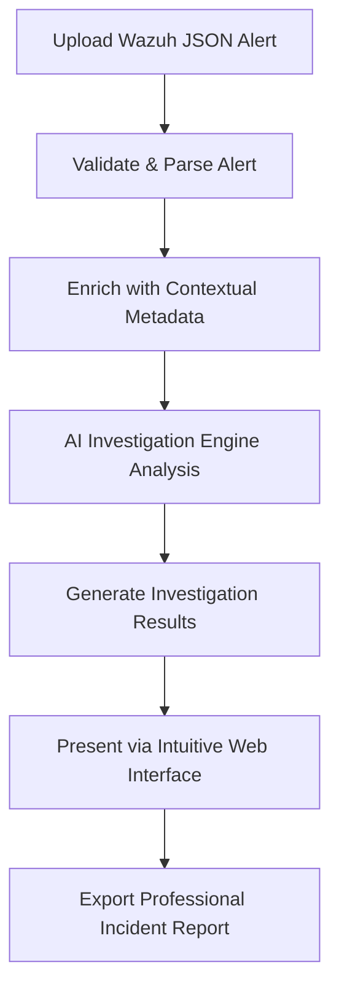
```mermaid
flowchart TD
    A[Upload Wazuh JSON Alert] --> B[Validate & Parse Alert]
    B --> C[Enrich with Contextual Metadata]
    C --> D[AI Investigation Engine Analysis]
    D --> E[Generate Investigation Results]
    E --> F[Present via Intuitive Web Interface]
    F --> G[Export Professional Incident Report]
```

**Investigation Output Components:**
- Plain-English explanation
- Severity assessment
- MITRE ATT&CK mapping
- Indicators of Compromise (IOCs)
- Possible attack chain
- Recommended response actions
- Executive incident summary

## 1.3 Mission Statement
To reduce security alert investigation time from hours to seconds through trustworthy, AI-assisted analysis, while rigorously maintaining transparency, explainability, and analyst control.

## 1.4 Vision Statement
To become the premier AI-first security operations platform that empowers organizations of all sizes to execute enterprise-grade threat investigation and response, eliminating the absolute dependency on large teams of senior security analysts.

## 1.5 Value Proposition
AI SOC Copilot delivers compounding value by fusing artificial intelligence with structured cybersecurity heuristics to automate the most resource-intensive phases of security investigations.

| Target Audience | Key Benefits |
| :--- | :--- |
| **Security Analysts** | • Eliminates manual parsing of raw JSON logs.<br>• Accelerates contextual understanding of security events.<br>• Reduces cognitive overload during complex investigations.<br>• Standardizes incident reporting.<br>• Assists junior analysts in making evidence-based decisions. |
| **Security Teams** | • Ensures consistency across all investigations.<br>• Significantly reduces Mean Time to Investigate (MTTI).<br>• Increases overall analyst productivity and throughput.<br>• Standardizes documentation quality and format.<br>• Supports continuous analyst training and knowledge sharing. |
| **SMBs** | • Democratizes access to AI-assisted investigations without requiring senior analyst headcount.<br>• Lowers operational security costs.<br>• Enhances security posture despite constrained resources. |
| **Universities & Academia** | • Provides a practical educational platform for learning SOC workflows.<br>• Demonstrates real-world Wazuh alert investigations.<br>• Facilitates student comprehension of MITRE ATT&CK, IOCs, and incident response lifecycles. |

## 1.6 Product Positioning
AI SOC Copilot is **not** a traditional Security Information and Event Management (SIEM) platform, nor is it an Endpoint Detection and Response (EDR) solution. Instead, it operates as an **AI Investigation Layer** situated on top of existing security telemetry. 

Rather than replacing platforms like Wazuh, Splunk, Microsoft Sentinel, or Elastic, AI SOC Copilot acts as a force multiplier, enhancing these systems by converting raw alerts into analyst-ready, comprehensive investigations. This positioning enables organizations to maximize their existing security infrastructure investments while seamlessly integrating cutting-edge, AI-assisted investigation capabilities.

## 1.7 Core Promise
The fundamental promise of AI SOC Copilot is:
> *"Upload a security alert and receive a complete, explainable investigation report in seconds."*

This automated report includes:
- Human-readable event explanation
- Security impact assessment
- MITRE ATT&CK technique mapping
- Extracted Indicators of Compromise (IOCs)
- Comprehensive attack narrative
- Recommended containment and remediation steps
- Professional incident report suitable for internal documentation and compliance

## 1.8 Market Timing (Why Now?)
Several converging industry trends make the introduction of AI SOC Copilot highly relevant and timely:
- **Analyst Fatigue:** Security teams are overwhelmed by exponentially increasing alert volumes, leading to burnout and missed threats.
- **Resource Constraints:** Small and Medium-sized Businesses (SMBs) frequently lack dedicated SOC expertise due to stringent budget constraints.
- **LLM Advancements:** Recent breakthroughs in Large Language Models enable high-fidelity natural language explanations and complex, structured reasoning over dense security telemetry.
- **Demand for Non-Disruptive AI:** Organizations are actively seeking AI-assisted workflows to drive operational efficiency without the risk and cost of replacing existing security infrastructure.

## 1.9 Design Principles
The architecture and user experience of AI SOC Copilot are governed by six core principles:

1. **Explainability First:** Every AI-generated conclusion must be traceable to specific evidence within the source alert. The system strictly distinguishes observed empirical facts from inferred analysis to foster analyst trust.
2. **Human-in-the-Loop:** The AI serves as a powerful assistant, but the human analyst retains ultimate responsibility for investigation decisions. All AI recommendations are fully editable and reviewable.
3. **Focused MVP:** The initial release is designed to solve a single, critical problem exceptionally well, avoiding the feature bloat of attempting to immediately replace an entire SIEM or SOAR platform.
4. **Security by Design:** Alert data is handled with the highest security standards, incorporating encrypted storage, transport-layer protection, and minimal data retention policies tailored to the deployment environment.
5. **Professional Output:** Automatically generated reports adhere to the stringent documentation standards expected in mature, enterprise SOC environments, minimizing the need for post-investigation manual editing.
6. **Scalable Architecture:** The platform is built on a highly modular architecture, ensuring that future integrations (e.g., Splunk, Microsoft Sentinel, Elastic, external threat intelligence feeds, and automated response playbooks) can be incorporated without requiring major structural overhauls.

## 1.10 Expected Business Outcomes
Within the first year post-MVP launch, AI SOC Copilot targets the following strategic outcomes:
- Quantifiable reduction in average alert investigation time.
- Rapid adoption by cybersecurity students, university labs, and lean SOC teams.
- Empirical validation of market demand for AI-assisted security investigation tools.
- Establishment of a robust technical foundation for future expansion into live SIEM integrations and broader AI-driven security orchestration.

---

# 8. Product Epics & MVP Requirements

*(Note: The following sections outline the specific epics and requirements for the AI SOC Copilot MVP.)*

## Epic: AI Investigation Engine Outputs
*(Consolidated from original document)*

**Purpose:** Ensure the AI generates a structured, comprehensive, and reliable investigation report based on the ingested alert.

**Required Investigation Sections:**
1. Executive Summary
2. Plain-English Explanation
3. Severity Assessment
4. MITRE ATT&CK Mapping
5. Indicators of Compromise (IOCs)
6. Attack Narrative
7. Business Impact
8. Confidence Score
9. Recommended Actions
10. Suggested Next Investigation Steps

**Technical Requirements:**
- Utilize structured prompts to ensure consistent LLM behavior.
- Mandate structured JSON responses from the LLM.
- Implement robust error handling to manage AI failures gracefully.
- Strictly separate observed factual data from AI-inferred conclusions.
- Include confidence scoring for AI assertions where applicable.

**Acceptance Criteria:**
- Every successfully processed investigation contains all required sections.
- Sections lacking sufficient data are explicitly marked as unavailable rather than omitted or hallucinated.
- AI processing failures produce meaningful, user-facing error messages without causing application crashes.

**Priority:** Must Have

## 8.8 Epic 4: Investigation Results UI
**Purpose:** Present AI-generated investigation results in a highly readable format optimized for rapid comprehension by security analysts.

**User Story:** As a user, I want investigation results organized into clear, logical sections so that I can quickly understand the alert context without manually parsing raw JSON.

**UI Sections:**
- Alert Overview
- AI Summary
- Severity Badge
- MITRE ATT&CK Mapping
- Indicators of Compromise (IOCs)
- Attack Chain
- Response Recommendations
- Original JSON (collapsible view)
- Investigation Metadata

**UX Requirements:**
- Responsive, desktop-first layout optimized for SOC dashboard monitors.
- Expandable/collapsible section accordions to manage cognitive load.
- One-click "copy-to-clipboard" actions for IOCs and summaries.
- Syntax highlighting for the raw JSON view.
- Clear visual states for loading, processing, and error conditions.

**Acceptance Criteria:**
- Results render consistently and accurately for all valid investigations.
- Long-form content remains easily readable with appropriate typography and spacing.
- The original raw JSON is accessible for deep-dives without cluttering the primary interface.

**Priority:** Must Have

## 8.9 Epic 5: Report Generation
**Purpose:** Enable users to seamlessly export investigations as professional, ready-to-share incident reports.

**User Story:** As a SOC analyst, I want to export a formatted incident report so that I can fulfill documentation requirements while minimizing manual writing time.

**Report Contents:**
- Cover Information & Metadata
- Executive Incident Summary
- Technical Alert Details
- Severity Assessment
- MITRE ATT&CK Mapping
- Indicators of Compromise (IOCs)
- Attack Narrative
- Remediation Recommendations
- Investigation Timestamp

**Export Formats:**
- **MVP:** PDF, Markdown
- **Future:** DOCX, HTML

**Acceptance Criteria:**
- Exported reports accurately preserve the structural hierarchy of the investigation.
- File exports generate and download successfully across supported browsers.
- PDF layouts remain professional and highly readable when printed or shared digitally.

**Priority:** Must Have

## 8.10 Epic 6: Investigation History
**Purpose:** Provide persistent access to previously completed investigations.

**User Story:** As a user, I want to securely access past investigations so that I do not have to re-upload and re-process the same alert data.

**Features:**
- Chronological list view of past investigations.
- Search functionality targeting rule IDs or hostnames.
- Filtering capabilities based on alert severity.
- Ability to reopen and view a previous investigation in the UI.
- Ability to re-export reports for past investigations.

**Acceptance Criteria:**
- Investigation records persist reliably across page refreshes and sessions.
- Search queries return accurate and relevant results.
- Users can successfully reopen and interact with historically stored investigations.

**Priority:** Must Have

## 8.11 Epic 7: Basic Settings
**Purpose:** Offer essential application configuration options without introducing unnecessary account management complexity during the MVP phase.

**Features:**
- UI Theme Selection (Light/Dark mode).
- AI Model Selection (Foundational support for future multi-model capabilities).
- Report export preferences.
- Product About/Information page.

**Priority:** Should Have

## 8.12 MVP Feature Matrix

| Feature | Priority | Status |
| :--- | :--- | :--- |
| Upload JSON Alert | Must Have | MVP |
| Multi-alert Upload | Must Have | MVP |
| JSON Validation | Must Have | MVP |
| Alert Parsing | Must Have | MVP |
| AI Investigation Engine | Must Have | MVP |
| Plain-English Summary | Must Have | MVP |
| Severity Assessment | Must Have | MVP |
| MITRE ATT&CK Mapping | Must Have | MVP |
| IOC Extraction | Must Have | MVP |
| Attack Narrative | Must Have | MVP |
| Response Recommendations | Must Have | MVP |
| Report Export (PDF/Markdown) | Must Have | MVP |
| Investigation History | Must Have | MVP |
| Search History | Must Have | MVP |
| Basic Settings | Should Have | MVP |
| User Authentication | Won't Have | Future |
| Live Wazuh Integration | Won't Have | Future |
| Multi-Tenancy | Won't Have | Future |

## 8.13 MVP Success Criteria
The MVP launch will be considered empirically successful if the following conditions are met:
1. A valid Wazuh JSON alert can be uploaded and processed without system errors.
2. The ingestion parser reliably extracts all required fields from the raw alert.
3. The AI engine produces a complete, structured investigation report in under 60 seconds.
4. Users can seamlessly review the investigation results within an intuitive, responsive interface.
5. Professional investigation reports can be exported successfully in both PDF and Markdown formats.
6. The investigation history persists accurately across user sessions.
7. Early adopters and beta testers report a measurable, meaningful reduction in the time and effort required to investigate alerts compared to manual processes.


---

# 2. Problem Statement

## 2.1 Background
Modern Security Operations Centers (SOCs) rely on Security Information and Event Management (SIEM) platforms—such as Wazuh, Splunk, Microsoft Sentinel, Elastic Security, IBM QRadar, and Google SecOps—to aggregate, normalize, and correlate security events across endpoints, servers, firewalls, cloud services, and network devices. 

While these platforms excel at telemetry collection and alert generation, they do not provide end-to-end investigation automation. A security alert represents only the inception of an investigation. Analysts must manually parse the alert, determine its contextual significance, identify the underlying attack vector or technique, assess the potential business impact, and formulate an appropriate remediation strategy. 

As digital infrastructure footprint expands, the sheer volume of security events has exponentially increased. This escalation introduces alert fatigue, inconsistent investigative outcomes, and inflated operational costs—challenges particularly acute for small-to-medium enterprises (SMEs) lacking dedicated, experienced SOC personnel. 

AI SOC Copilot remediates this operational gap by dynamically transforming raw Wazuh telemetry into structured, explainable investigations in seconds.

## 2.2 Current Investigation Workflow
For a standard Wazuh alert, a Tier 1 SOC analyst executes a manual, multi-step triage sequence. Although SIEM platforms automate alert generation, these subsequent investigative phases remain labor-intensive and require specialized domain expertise.

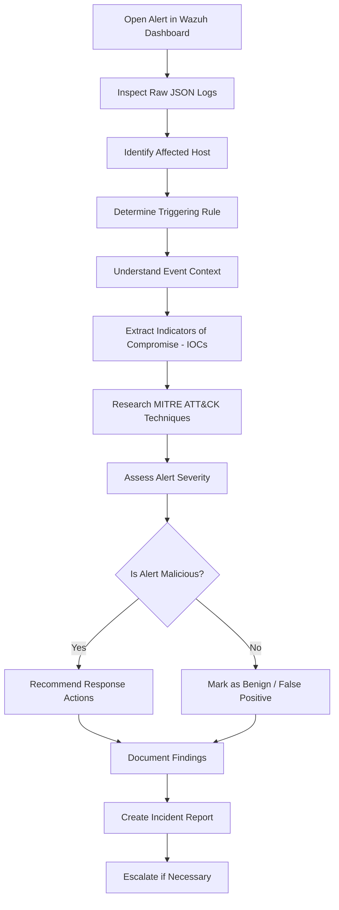
```mermaid
flowchart TD
    A[Open Alert in Wazuh Dashboard] --> B[Inspect Raw JSON Logs]
    B --> C[Identify Affected Host]
    C --> D[Determine Triggering Rule]
    D --> E[Understand Event Context]
    E --> F[Extract Indicators of Compromise - IOCs]
    F --> G[Research MITRE ATT&CK Techniques]
    G --> H[Assess Alert Severity]
    H --> I{Is Alert Malicious?}
    I -->|Yes| J[Recommend Response Actions]
    I -->|No| K[Mark as Benign / False Positive]
    J --> L[Document Findings]
    K --> L
    L --> M[Create Incident Report]
    M --> N[Escalate if Necessary]
```

## 2.3 Current Pain Points

### 2.3.1 Interpretation of Raw Security Logs
Wazuh alerts are exported as structured JSON documents comprising nested telemetry fields (e.g., `rule`, `agent`, `decoder`, `data`, `location`, `manager`, `timestamp`, and `event metadata`). Designed for machine parsability rather than human readability, these schemas pose significant cognitive overhead. Junior analysts frequently struggle to ascertain the core event sequence, isolate critical indicators from benign noise, and determine the baseline threat level. This cognitive friction inherently delays time-to-resolution (TTR) and yields inconsistent triage.

### 2.3.2 Alert Fatigue
Security teams routinely ingest thousands of daily alerts, with a high proportion being false positives or low-fidelity signals. The manual effort required to distinguish actionable threats from routine background noise directly results in reduced operational productivity, analyst burnout, inconsistent triage quality, and an increased risk of missing critical, high-severity incidents.

### 2.3.3 Over-Reliance on Senior Personnel
Experienced analysts leverage historical exposure and intuition to rapidly identify anomalous patterns, map behaviors to specific MITRE techniques, and define containment strategies. Conversely, junior analysts must rely heavily on external documentation, ad-hoc web research, or escalations to senior staff, introducing substantial bottlenecks into the incident response pipeline.

### 2.3.4 Manual MITRE ATT&CK Mapping
Correlating alerts to the MITRE ATT&CK framework provides critical threat context but remains highly manual. Analysts must interpret the event, infer attacker objectives, map the correct tactical phase, select corresponding techniques, and document the justification. This process is time-intensive and highly susceptible to mapping errors, particularly among junior staff.

### 2.3.5 Redundant Incident Reporting
Standard incident reports follow a rigid schema: incident summary, chronological timeline, evidentiary data, severity rating, MITRE ATT&CK mapping, IOCs, impact assessment, and remediation steps. Despite this structural predictability, analysts manually author these reports, leading to duplicated effort and high variance in documentation quality.

### 2.3.6 Inconsistent Investigative Outcomes
Discrepancies in analyst experience lead to divergent interpretations of identical alerts. This inconsistency cascades into variable severity assessments, inaccurate MITRE mappings, and misaligned response protocols. Standardized, AI-assisted analysis mitigates this variance while retaining the human-in-the-loop decision-making model.

## 2.4 Root Causes
The aforementioned investigative bottlenecks originate from several foundational issues:
- **Data Complexity:** Raw security telemetry is highly technical and lacks human-readable context.
- **Volume vs. Capacity:** Alert generation rates vastly exceed human processing bandwidth.
- **Resource Scarcity:** A persistent industry shortage of highly skilled cybersecurity professionals.
- **Tooling Limitations:** Legacy SIEM solutions prioritize detection mechanics over investigative enablement.
- **Process Redundancy:** Standardized, repetitive triage and reporting tasks remain largely unautomated.
- **Siloed Knowledge:** Institutional knowledge resides within senior personnel or fragmented documentation rather than being embedded in operational workflows.

## 2.5 Business Impact
These operational friction points translate directly into measurable business liabilities:

| Impact Area | Description |
| :--- | :--- |
| **Increased Operational Costs** | Organizations must acquire and retain premium cybersecurity talent to ensure investigation fidelity, driving up personnel expenditures. |
| **Elevated MTTR & MTTI** | Manual analysis inflates the Mean Time to Investigate (MTTI) and Mean Time to Respond (MTTR), extending threat dwell time and organizational risk. |
| **Analyst Burnout** | Continuous exposure to high alert volumes and repetitive administrative tasks accelerates mental fatigue and increases staff attrition rates. |
| **Inconsistent Documentation** | High variance in reporting quality complicates post-incident audits, compliance reporting, and cross-team knowledge sharing. |
| **Delayed Incident Response** | Bottlenecks in the triage phase inherently delay containment, directly increasing the potential blast radius and financial impact of a breach. |

## 2.6 Existing Solutions and Limitations
While the broader cybersecurity market offers tools to assist with detection, few effectively accelerate the manual investigation phase.

| Solution Category | Primary Strengths | Limitations |
| :--- | :--- | :--- |
| **Traditional SIEM** | Excellent at log collection, normalization, and alert correlation. | Relies entirely on manual analyst investigation and interpretation. |
| **SOAR Platforms** | Automates predefined, linear workflows and response actions. | Expensive, highly complex to deploy, and fully dependent on maintaining rigid playbooks. |
| **Threat Intelligence Platforms** | Enriches indicators with external threat context. | Fails to automatically interpret the specific alert narrative or provide actionable summaries. |
| **AI Chatbots (General)** | Capable of answering ad-hoc security queries. | Lack structured, event-driven workflows and deep integration with specific alert telemetry. |
| **Manual Investigation** | Delivers high accuracy when executed by senior analysts. | Slow, cost-prohibitive, and fundamentally unscalable. |

*AI SOC Copilot is architected to complement these existing systems by strictly optimizing the investigation phase.*

## 2.7 Core Problem Statement
Security analysts allocate a disproportionate percentage of their operational bandwidth to repetitive, manual investigation tasks following a security alert. These tasks—interpreting raw JSON logs, determining severity, mapping attacker behavior to the MITRE ATT&CK framework, extracting IOCs, formulating remediation strategies, and compiling incident reports—are time-consuming, highly dependent on scarce senior expertise, and difficult to scale. 

While existing SIEM platforms successfully detect potential threats, they fail to provide automated investigative context or explainability. Consequently, organizations suffer from elevated operational costs, inconsistent triage quality, delayed incident containment, and severe analyst fatigue.

## 2.8 Product Hypothesis
**If** security analysts are equipped to submit a raw Wazuh alert and immediately receive an AI-generated, fully explainable investigation—comprising a plain-language executive summary, standardized severity assessment, justified MITRE ATT&CK mapping, extracted IOCs, a chronological attack narrative, actionable remediation recommendations, and a formatted incident report—**then** they will execute investigations exponentially faster, with unprecedented consistency and confidence.

Success will be empirically validated through documented reductions in MTTI, standardized report quality, and high Net Promoter Scores (NPS) from Tier 1 and Tier 2 analysts.

## 2.9 Strategic Imperative
This Minimum Viable Product (MVP) deliberately isolates a singular, high-value workflow. Rather than attempting to displace established SIEM, SOAR, or comprehensive SOC platforms, AI SOC Copilot directly addresses a universal bottleneck experienced across all organizational tiers: the manual triage and investigation of security alerts. By unequivocally resolving this specific friction point, the product establishes a robust technical and operational foundation for subsequent feature expansions, including live SIEM API integrations, automated response orchestration, proactive threat hunting, and comprehensive AI-driven security operations.


---

# 3. Business Opportunity

## 3.1 Executive Overview
The cybersecurity industry is experiencing unprecedented growth driven by escalating cyber threats, expanding digital transformation initiatives, and a global shortage of skilled security professionals. Organizations generate vast volumes of security telemetry across Security Information and Event Management (SIEM) systems, Endpoint Detection and Response (EDR) platforms, firewalls, cloud infrastructure, and identity providers. However, security teams struggle to triage and investigate this sheer volume of alerts efficiently.

AI SOC Copilot addresses this critical gap by serving as an AI-powered investigation layer that augments existing security infrastructure rather than replacing it. Initially focusing on Wazuh users, the product provides a highly practical entry point into an underserved market. Its underlying architecture is purpose-built to scale toward a multi-SIEM, AI-native security operations platform.

## 3.2 Market Opportunity

### Cybersecurity Industry Growth
Cybersecurity expenditures continue to accelerate globally as organizations invest heavily in defensive technologies, regulatory compliance, and specialized talent. Despite this, the adoption of security technology has significantly outpaced the availability of experienced analysts.

Key market drivers include:
*   Rising frequency and sophistication of automated cyberattacks.
*   Increasing migration to and reliance on cloud infrastructure.
*   Expansion of remote and hybrid workforce attack surfaces.
*   Stringent regulatory and compliance mandates.
*   Growing dependence on uninterrupted digital services.
*   Emergence of AI-driven threat vectors requiring accelerated defensive capabilities.

These trends create a critical demand for technologies that not only improve threat detection but fundamentally enhance investigation efficiency and accuracy.

### The SOC Efficiency Gap
Most organizations successfully aggregate security logs via SIEM platforms. The primary operational bottleneck occurs post-alert generation. A standard alert investigation requires analysts to:
1.  Parse technical logs and raw telemetry (e.g., JSON payloads).
2.  Interpret complex security events.
3.  Research underlying attack techniques and indicators of compromise (IoCs).
4.  Correlate disparate pieces of evidence across the environment.
5.  Determine alert severity and assess organizational impact.
6.  Recommend targeted remediation steps.
7.  Document findings comprehensively.

These tasks are highly repetitive, knowledge-intensive, and time-consuming, making them prime candidates for AI-driven automation and assistance.

## 3.3 Target Market Segments

### Primary Market

#### Small and Medium Businesses (SMBs)
*   **Characteristics:** Constrained cybersecurity budgets, small or non-existent dedicated SOC teams, heavy reliance on open-source solutions like Wazuh, and difficulty attracting or retaining experienced analysts.
*   **Pain Points:** Prolonged investigation lifecycles, inconsistent incident documentation, over-reliance on external consultants, and limited in-house security expertise.
*   **Value Proposition:** Delivers enterprise-grade, AI-assisted security investigations without the overhead of enterprise-level staffing costs.

#### Managed Security Service Providers (MSSPs)
*   **Characteristics:** Monitor multiple diverse customer environments, process massive daily alert volumes, and operate under stringent Service Level Agreements (SLAs).
*   **Pain Points:** Crushing analyst workloads, the necessity for standardized cross-tenant reporting, and constant pressure to reduce Mean Time to Investigate (MTTI) and Mean Time to Respond (MTTR).
*   **Value Proposition:** Provides standardized, AI-generated investigations that dramatically improve analyst productivity and reporting quality at scale across all customer environments.

#### Dedicated Security Operations Centers (SOCs)
*   **Characteristics:** Maintain dedicated security analysts, utilize established SIEM deployments, and follow structured incident response playbooks.
*   **Pain Points:** Severe alert fatigue, highly manual investigation workflows, and significant challenges in knowledge transfer between senior and junior staff.
*   **Value Proposition:** Accelerates investigations through explainable AI assistance, offloading repetitive triage and enabling analysts to focus on higher-order tasks such as proactive threat hunting and complex incident response.

### Secondary Market

#### Universities & Academia
Many cybersecurity academic programs utilize Wazuh and similar tools within laboratory environments.
*   **Value Proposition:** Offers hands-on investigation practice, automated explanations of security alerts, and educational reinforcement of the MITRE ATT&CK framework and standard incident response procedures.

#### Cybersecurity Training Providers
Training organizations can leverage AI SOC Copilot to demonstrate real-world investigations, reduce instructor workload, and ensure standardized, high-quality learning experiences for students.

#### Independent Security Professionals
Freelancers, consultants, and independent researchers can utilize AI SOC Copilot to expedite complex investigations and generate professional, client-ready reports rapidly.

## 3.4 Ideal Customer Profile (ICP)
The ideal early adopter is an organization that:
*   Utilizes Wazuh as its primary SIEM.
*   Employs a security team of 1 to 20 analysts.
*   Currently investigates security alerts manually.
*   Lacks extensive SOAR (Security Orchestration, Automation, and Response) automation.
*   Seeks immediate productivity improvements without overhauling existing security infrastructure.

These organizations are positioned to extract immediate, measurable value from the MVP's focused feature set.

## 3.5 Customer Pain-to-Value Mapping

| Customer Pain | AI SOC Copilot Solution |
| :--- | :--- |
| **Complex Telemetry:** Raw JSON and dense logs are difficult to parse rapidly. | **Plain-English Explanations:** Translates complex telemetry into clear, narrative summaries. |
| **Manual Threat Context:** Laborious manual MITRE ATT&CK mapping. | **Automated Contextualization:** Automatically maps alerts to the MITRE ATT&CK framework. |
| **Administrative Overhead:** Repetitive and time-consuming report writing. | **Automated Reporting:** Generates professional, structured reports with a single click. |
| **Delayed Response:** Unacceptably long investigation times. | **Accelerated Triage:** Completes AI-assisted investigations in seconds. |
| **Skills Gap:** Junior analysts lack contextual experience for complex alerts. | **Guided Workflows:** Provides explainable, step-by-step recommendations and analysis. |
| **Quality Variance:** Inconsistent investigation quality across the team. | **Standardized Output:** Enforces standardized analysis workflows and formatting. |
| **Resource Constraints:** High operational costs associated with manual triage. | **Force Multiplier:** Significantly increases individual analyst productivity. |

## 3.6 Competitive Landscape
AI SOC Copilot operates within a competitive ecosystem encompassing SIEM vendors, SOAR platforms, general AI assistants, and threat intelligence solutions. However, its specific focus on explainable, AI-driven investigation tailored for Wazuh users provides a distinct differentiation from broader, more complex platforms.

| Category | Examples | Primary Focus | Gap Addressed by AI SOC Copilot |
| :--- | :--- | :--- | :--- |
| **SIEM** | Wazuh, Splunk, Microsoft Sentinel | Detection, log aggregation, and compliance | Bridges the gap where post-alert investigation remains highly manual. |
| **SOAR** | Cortex XSOAR, Splunk SOAR | Complex workflow orchestration and automated response | Eliminates the need for developing and maintaining complex playbooks for triage. |
| **EDR/XDR** | CrowdStrike, Microsoft Defender | Endpoint-level detection, isolation, and response | Provides deeper, multi-source alert explanation beyond single-endpoint context. |
| **Threat Intelligence** | Recorded Future, Mandiant | External threat context and indicator feeds | Delivers actionable context tailored to specific, individual alerts rather than raw feeds. |
| **General AI Assistants** | Microsoft Security Copilot, Google Gemini | Broad conversational AI capabilities | Offers structured, investigation-specific outputs without being locked into a proprietary vendor ecosystem. |

## 3.7 Competitive Advantages

*   **Explainability:** Every AI-generated conclusion is rigorously supported by direct evidence extracted from the alert payload. This transparency ensures analysts understand the rationale behind the AI's assessment, building trust and facilitating learning.
*   **Wazuh-First Approach:** Instead of attempting shallow support across numerous SIEMs initially, the product delivers exceptionally deep, tailored value for the Wazuh ecosystem, establishing a strong foothold before horizontal expansion.
*   **Structured Investigations:** Outputs are meticulously organized into standardized, analyst-friendly sections (e.g., Summary, Indicators, MITRE ATT&CK, Recommendations) rather than unstructured, open-ended chatbot dialogues.
*   **Educational Value:** The platform inherently serves as a learning tool, helping junior analysts and students internalize established investigation workflows and threat models alongside experienced practitioners.
*   **Modular Architecture:** The underlying service-oriented architecture ensures future extensibility, allowing for seamless integration of additional SIEMs, diverse threat intelligence feeds, and advanced AI workflows without requiring fundamental system redesign.

## 3.8 Go-to-Market Strategy (Early Stage)

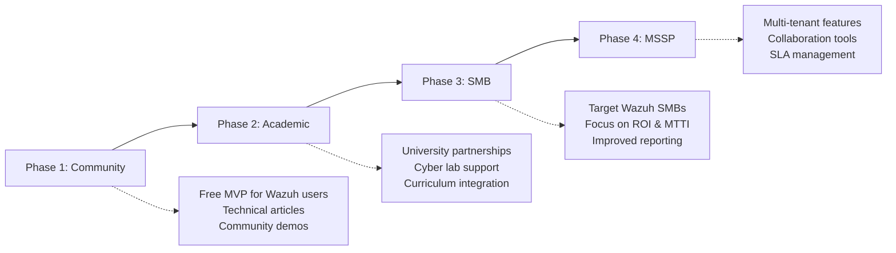
```mermaid
flowchart LR
    A[Phase 1: Community] --> B[Phase 2: Academic]
    B --> C[Phase 3: SMB]
    C --> D[Phase 4: MSSP]
    
    A_Sub[Free MVP for Wazuh users<br>Technical articles<br>Community demos]
    B_Sub[University partnerships<br>Cyber lab support<br>Curriculum integration]
    C_Sub[Target Wazuh SMBs<br>Focus on ROI & MTTI<br>Improved reporting]
    D_Sub[Multi-tenant features<br>Collaboration tools<br>SLA management]

    A -.-> A_Sub
    B -.-> B_Sub
    C -.-> C_Sub
    D -.-> D_Sub
```

*   **Phase 1: Community Adoption:** Launch a free MVP tailored for Wazuh users. Drive awareness through technical articles, open-source community engagement, and targeted demonstrations.
*   **Phase 2: Academic Partnerships:** Collaborate with universities and cybersecurity training programs to integrate the tool into laboratory environments and educational curricula.
*   **Phase 3: SMB Outreach:** Execute targeted outreach to organizations already leveraging Wazuh, emphasizing immediate ROI through reduced investigation times and standardized reporting.
*   **Phase 4: MSSP Expansion:** Introduce enterprise-grade features including multi-tenancy, collaborative workspaces, and API access to capture the MSSP market.

## 3.9 Monetization Strategy (Future)
While the MVP is entirely focused on user acquisition and validation without billing, the long-term commercial model will transition to a tiered SaaS structure:

| Tier | Target Audience | Key Capabilities |
| :--- | :--- | :--- |
| **Free / Community** | Students, Hobbyists, Micro-SMBs | Limited monthly investigations, community-driven support, basic report generation. |
| **Professional** | Standard SMBs, Small SOC Teams | Unlimited investigations, live SIEM API integrations, enhanced reporting templates, basic collaboration tools. |
| **Enterprise** | MSSPs, Large Enterprises | Full multi-tenancy, Role-Based Access Control (RBAC), comprehensive API access, automated compliance reporting, priority SLA support, and custom AI model tuning. |

## 3.10 Why Start with Wazuh?
Targeting Wazuh for the initial MVP is a calculated strategic decision driven by several key factors:
*   **Broad Adoption:** Highly popular open-source SIEM/XDR widely utilized by SMBs, educational institutions, and emerging MSSPs.
*   **Standardized Telemetry:** Wazuh utilizes a consistent JSON alert format, simplifying initial data ingestion and AI prompt engineering.
*   **Strong Community:** An active, vocal open-source community provides an ideal environment for rapid feedback and organic adoption.
*   **Accessibility:** Free to deploy, making it an accessible target for a product initially focused on community growth and academic use.

This focused integration significantly reduces initial development friction and complexity, allowing for rapid validation of core AI investigation assumptions before scaling to commercial SIEM platforms.

## 3.11 Business Hypothesis
**Hypothesis:** Organizations utilizing Wazuh will rapidly adopt AI-assisted investigation workflows if the product demonstrably:
1.  Reduces overall investigation time (MTTI).
2.  Improves the consistency and quality of incident reports.
3.  Serves as an effective force multiplier for less experienced analysts.
4.  Provides transparent, explainable outputs rather than "black box" decisions.
5.  Integrates seamlessly with existing workflows without necessitating costly infrastructure modifications.

Successful validation of this hypothesis with the Wazuh user base will justify and inform subsequent investments in live SIEM integrations, advanced autonomous AI capabilities, and enterprise-grade feature development.

## 3.12 Long-Term Vision
The MVP serves as the foundational wedge for a comprehensive, AI-native security operations platform. As the product matures, capabilities will expand horizontally and vertically to encompass the entire incident response lifecycle.

**Future Platform Capabilities:**
*   **Broad SIEM/XDR Integration:** Native integrations with Splunk, Microsoft Sentinel, Elastic Security, and leading EDR solutions.
*   **Proactive Threat Hunting:** AI-driven identification of advanced persistent threats (APTs) based on behavioral anomalies and threat intelligence.
*   **Dynamic Vulnerability Prioritization:** Contextualizing vulnerabilities based on active exploitation trends and specific asset criticality.
*   **Automated Incident Response:** AI-assisted remediation recommendations and potential automated enforcement via webhook integrations.
*   **Continuous Compliance Reporting:** Automated generation of evidence for frameworks such as SOC 2, ISO 27001, and NIST CSF.
*   **Multi-Agent Workflows:** Orchestrating specialized AI agents (e.g., Malware Analyst Agent, Threat Intel Agent) for complex, multi-faceted investigations.

The ultimate objective is to evolve AI SOC Copilot from a tactical investigation assistant into an indispensable, strategic AI companion for security operations, drastically reducing cyber risk while solving the industry's acute talent shortage.


---

# 4. Target Users

## 4.1 Overview
The efficacy of the AI SOC Copilot relies on addressing specific, high-impact workflows for clearly delineated user personas. Rather than functioning as a generalized cybersecurity assistant, the Minimum Viable Product (MVP) specifically targets security professionals and academic learners engaged in routine investigations of Wazuh security alerts.

Adopting a persona-first design philosophy ensures that every feature addresses a documented user requirement. This approach maintains strict scope boundaries during the MVP phase and channels engineering resources toward high-value, repetitive workflows.

For the initial release, user prioritization is governed by the following criteria:
* High frequency of alert investigations.
* Pre-existing deployment of the Wazuh platform.
* Demonstrated requirement for investigative augmentation.
* Budgetary constraints favoring cost-effective tooling.
* High propensity for early adoption.

## 4.2 User Segmentation

| User Segment | Priority | MVP Utilization | Future Customer Pipeline |
| :--- | :---: | :---: | :---: |
| **Tier 1 SOC Analyst** | Critical (P0) | Yes | Yes |
| **Cybersecurity Student** | Critical (P0) | Yes | Yes |
| **Tier 2 SOC Analyst** | High (P1) | Yes | Yes |
| **Security Engineer** | High (P1) | Yes | Yes |
| **Blue Team Professional** | High (P1) | Yes | Yes |
| **MSSP Analyst** | High (P1) | Yes | Yes |
| **University Cyber Lab** | Medium (P2) | Yes | Yes |
| **Incident Response Team** | Low (P3) | Post-MVP | Yes |
| **Threat Hunter** | Minimal (P4) | Future Roadmap | Yes |
| **CISO / Management** | Minimal (P4) | Reporting Only | Future Roadmap |

## 4.3 Primary Target Users (P0)

### 4.3.1 Tier 1 SOC Analyst
**Profile:** First responders within a Security Operations Center (SOC). They conduct initial triage, monitor alerts, and make critical decisions regarding escalation or closure.

* **Responsibilities:** Monitor SIEM dashboards, conduct initial alert investigations, validate automated detections, classify incident severity, escalate suspicious activities, and maintain documentation.
* **Pain Points:** High alert volume leading to alert fatigue, cognitive load of parsing complex JSON payloads, manual correlation to MITRE ATT&CK frameworks, repetitive report authoring, and operational friction due to limited contextual experience.
* **Goals:** Rapidly comprehend alert context, minimize mean-time-to-investigate (MTTI), increase decision confidence, and output standardized documentation.
* **AI SOC Copilot Value Proposition:** Translates raw JSON telemetry into natural language summaries, automates MITRE ATT&CK technique mapping, evaluates conceptual severity, extracts Indicators of Compromise (IOCs), provides actionable remediation steps, and auto-generates structured investigation reports.
* **Expected Outcomes:** Accelerated investigation workflows, superior documentation consistency, reduced dependency on senior engineering staff, and accelerated on-the-job training.

### 4.3.2 Cybersecurity Students
**Profile:** Individuals actively studying SOC operations, SIEM technologies, incident response methodologies, and threat detection frameworks.

* **Responsibilities:** Execute academic lab environments, analyze historical security alerts, master MITRE ATT&CK applications, and simulate enterprise investigations.
* **Pain Points:** Lack of practical, real-world context; difficulty interpreting raw log data structures; and procedural uncertainty during complex investigations.
* **Goals:** Assimilate professional investigation methodologies, develop analytical confidence, and thoroughly comprehend attack vectors.
* **AI SOC Copilot Value Proposition:** Demystifies complex alerts through simplified explanations, models structured investigative logic, contextualizes MITRE ATT&CK concepts, and demonstrates enterprise-grade reporting standards.

## 4.4 Secondary Target Users (P1)

### 4.4.1 Tier 2 SOC Analyst
**Profile:** Escalation engineers tasked with investigating complex security incidents requiring advanced analysis, validation, and contextualization.

* **Responsibilities:** Analyze escalated alerts, validate multi-stage attack chains, conduct preliminary forensic reviews, coordinate incident response efforts, and mentor Tier 1 personnel.
* **Pain Points:** Excessive time allocated to redundant preliminary analysis, manual evidence compilation, and workflow friction caused by context switching between disparate security tools.
* **Goals:** Automate baseline analysis to focus engineering cycles on complex investigations and ensure cross-team consistency.
* **AI SOC Copilot Value Proposition:** Delivers pre-computed baseline investigations, logically structures forensic evidence, proposes contextual attack narratives, and synthesizes executive summaries.

### 4.4.2 Security Engineer
**Profile:** Infrastructure specialists responsible for maintaining, optimizing, and deploying defensive architectures including Wazuh, firewalls, and endpoint protection platforms (EPP/EDR).

* **Responsibilities:** Deploy security infrastructure, tune detection logic, investigate recurring benign alerts (false positives), and enhance overall detection fidelity.
* **Pain Points:** Deciphering ambiguous or noisy alerts, identifying and tuning pervasive false positives, and prioritizing rule development.
* **Goals:** Elevate detection accuracy, drastically reduce false-positive ratios (alert noise), and optimize rule performance.
* **AI SOC Copilot Value Proposition:** Provides detailed mechanistic explanations of alert triggers, identifies recurring data patterns, and accelerates rule validation efforts.

### 4.4.3 Managed Security Service Provider (MSSP) Analyst
**Profile:** Security analysts operating within multi-tenant environments, monitoring and defending diverse customer infrastructures.

* **Responsibilities:** Execute cross-tenant alert investigations, maintain stringent Service Level Agreements (SLAs), generate professional deliverables, and facilitate customer communications.
* **Pain Points:** High-velocity investigation workloads, maintaining strict quality assurance across varied customer reports, and continuous time-to-resolution pressures.
* **Goals:** Accelerate alert resolution, enforce standardized reporting across disparate customer environments, and maximize analyst throughput.
* **AI SOC Copilot Value Proposition:** Minimizes manual investigative overhead, ensures uniform documentation quality, and significantly compresses investigation timelines.

### 4.4.4 Blue Team Professionals
**Profile:** Dedicated defensive operators focused on monitoring, detecting, and mitigating cyber threats against organizational infrastructure.

* **Responsibilities:** Deconstruct attack methodologies, investigate anomalous activities, coordinate containment strategies, and harden defensive postures.
* **Pain Points:** Navigating highly complex, multi-faceted investigations; extensive documentation requirements; and processing massive volumes of disparate security telemetry.
* **Goals:** Expedite complex investigations, maintain analytical rigor, and eliminate redundant investigative tasks.
* **AI SOC Copilot Value Proposition:** Streamlines data aggregation, provides rapid threat contextualization, and automates routine analytical procedures.

## 4.5 Tertiary Target Users (P2)

### 4.5.1 University Cybersecurity Labs
**Profile:** Academic and training laboratories focused on delivering practical, hands-on cybersecurity education.

* **Responsibilities:** Facilitate interactive exercises, evaluate student investigation methodologies, and simulate real-world security operations.
* **Pain Points:** High instructor overhead for grading and assisting students, difficulty standardizing complex lab environments.
* **Goals:** Reduce administrative and instructional workloads while providing high-quality, standardized educational experiences.
* **AI SOC Copilot Value Proposition:** Automates baseline explanations, standardizes the investigative framework for exercises, and acts as an intelligent, on-demand tutor.

## 4.6 User Needs Matrix

| User Requirement | Tier 1 | Tier 2 | Security Engineer | MSSP Analyst | Student |
| :--- | :---: | :---: | :---: | :---: | :---: |
| **Natural Language Alert Translation** | ✅ | ✅ | ✅ | ✅ | ✅ |
| **Automated Severity Assessment** | ✅ | ✅ | ✅ | ✅ | ✅ |
| **MITRE ATT&CK Framework Mapping** | ✅ | ✅ | ✅ | ✅ | ✅ |
| **IOC Identification & Extraction** | ✅ | ✅ | ✅ | ✅ | ✅ |
| **Attack Chain Visualization** | ✅ | ✅ | ✅ | ✅ | ⚠️ *(Basic)* |
| **Actionable Response Recommendations** | ✅ | ✅ | ✅ | ✅ | ✅ |
| **Professional Report Generation** | ✅ | ✅ | ⚠️ *(Optional)* | ✅ | ✅ |
| **Historical Investigation Context** | ⚠️ *(Basic)* | ✅ | ✅ | ✅ | ⚠️ *(Basic)* |
| **Live SIEM Integration** | ❌ *(Post-MVP)* | ❌ *(Post-MVP)* | ❌ *(Post-MVP)* | 📅 *(Future)* | ❌ |

## 4.7 Cross-Functional User Goals
Across all target demographics, the platform is engineered to deliver the following core capabilities:
1. **Telemetry Comprehension:** Interpret complex security alerts without requiring manual parsing of raw JSON structures.
2. **Velocity:** Drastically reduce mean-time-to-investigate (MTTI).
3. **Standardization:** Automatically generate consistent, enterprise-grade documentation.
4. **Knowledge Transfer:** Facilitate continuous learning through transparent, AI-driven explanations.
5. **Efficiency:** Eliminate repetitive, low-value investigative tasks.
6. **Assurance:** Elevate decision confidence through structured, evidence-backed analysis.

These ubiquitous goals serve as the primary drivers for feature prioritization within the MVP scope.

## 4.8 User Constraints & Design Implications

To ensure operational viability, the platform architecture and user experience (UX) must accommodate specific environmental and operational constraints.

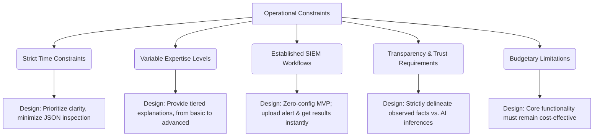
```mermaid
graph TD
    A[Operational Constraints] --> B(Strict Time Constraints)
    A --> C(Variable Expertise Levels)
    A --> D(Established SIEM Workflows)
    A --> E(Transparency & Trust Requirements)
    A --> F(Budgetary Limitations)
    
    B --> B1[Design: Prioritize clarity, minimize JSON inspection]
    C --> C1[Design: Provide tiered explanations, from basic to advanced]
    D --> D1[Design: Zero-config MVP; upload alert & get results instantly]
    E --> E1[Design: Strictly delineate observed facts vs. AI inferences]
    F --> F1[Design: Core functionality must remain cost-effective]
```

### Key Architectural Decisions:
* **Interface Clarity:** The UI must prioritize actionable intelligence over raw data presentation, minimizing the necessity for analysts to inspect raw JSON payloads manually.
* **AI Transparency:** System outputs must explicitly differentiate between extracted factual evidence (e.g., source IPs, timestamps) and AI-generated heuristic interpretations (e.g., deduced intent).
* **Frictionless Onboarding:** The MVP must eliminate complex configuration prerequisites, allowing users to simply input alert data and immediately receive analytical outputs.
* **Extensibility:** Advanced capabilities (e.g., bidirectional SIEM integrations, Role-Based Access Control [RBAC], multi-user collaboration) must be architected as modular extensions to avoid polluting the core MVP experience.
* **Exportability:** All auto-generated reports and summaries must be fully editable and exportable to integrate smoothly into existing ticketing systems (e.g., Jira, ServiceNow).


---

# 5. User Personas

## 5.1 Purpose
User personas translate target user demographics into realistic representations to guide product strategy, UX design, feature prioritization, and engineering decisions. Each persona embodies a distinct set of responsibilities, technical expertise, motivations, and operational pain points. For the Minimum Viable Product (MVP), every implemented feature must deliver measurable value to at least one primary persona; features failing to meet this criterion are deferred to subsequent releases.

## 5.2 Persona Prioritization

| Persona | Role | Priority | Significance to MVP |
| :--- | :--- | :--- | :--- |
| **Alex Carter** | Tier 1 SOC Analyst | P0 | Primary Persona |
| **Sarah Nguyen** | Tier 2 SOC Analyst | P1 | Secondary Persona |
| **Daniel Kim** | Security Engineer | P1 | Secondary Persona |
| **Ahmed Khan** | Cybersecurity Student | P2 | Educational Persona |
| **Olivia Martinez** | MSSP Security Analyst | P2 | Future Commercial Persona |

## 5.3 Persona Profiles

### 5.3.1 Persona 1: Alex Carter (Tier 1 SOC Analyst)
**Priority: P0 | Primary Persona**

**Overview:** An entry-level Security Operations Center (SOC) analyst in a small-to-medium business (SMB). Alex conducts initial triage of security alerts and preliminary investigations before escalating confirmed incidents to senior personnel.

* **Demographics:** Age 25 | 1–2 Years Experience | Bachelor's in Cybersecurity | SMB (150 Employees)
* **Technical Level:** Intermediate
* **Core Skills:** Linux, Windows Administration, Wazuh, Basic MITRE ATT&CK, Networking, Basic Python, Security Fundamentals

**Operational Profile:**
* **Daily Responsibilities:** Monitor the Wazuh dashboard, review incoming alerts, investigate suspicious events, determine true positive rates, escalate confirmed incidents, and document findings.
* **Goals:** Expedite alert investigations, ensure zero-miss rates for critical threats, produce high-fidelity reports, expand technical acumen, and achieve promotion to Tier 2.
* **Pain Points:** Interpreting complex JSON telemetry, repeatedly querying external documentation, manually mapping threats to MITRE ATT&CK, authoring repetitive reports, and mitigating the risk of false negatives.
* **Success Metrics:** Mean Time to Investigate (MTTI), triage accuracy, report quality, escalation precision, and investigation confidence.

**How AI SOC Copilot Provides Value:**
* Translates technical log data into natural language summaries.
* Elucidates attack behaviors and suggests MITRE ATT&CK techniques.
* Automatically calculates risk severity and generates standardized incident reports.
* Bolsters analytical confidence during triage.

> *"I understand security concepts, but I spend too much time figuring out what a single alert actually means."*

### 5.3.2 Persona 2: Sarah Nguyen (Tier 2 SOC Analyst)
**Priority: P1 | Secondary Persona**

**Overview:** A senior analyst in an enterprise environment responsible for investigating complex, escalated security incidents. Sarah validates attack chains, conducts in-depth analysis, and orchestrates incident response activities.

* **Demographics:** Age 31 | 7 Years Experience | Enterprise Organization
* **Technical Level:** Advanced

**Operational Profile:**
* **Daily Responsibilities:** Conduct deep-dive investigations, perform malware analysis, map advanced threats to MITRE ATT&CK, validate threat vectors, mentor junior analysts, and coordinate incident response.
* **Goals:** Minimize time allocated to repetitive documentation, focus on advanced threat analysis, effectively mentor Tier 1 analysts, and drive consistency across investigations.
* **Pain Points:** Authoring redundant reports, context switching between disparate security tools, manual documentation workflows, and high alert volumes.
* **Success Metrics:** Investigation fidelity, escalation efficiency, time-per-incident reduction, and overall team productivity.

**How AI SOC Copilot Provides Value:**
* Generates comprehensive investigation drafts and hypothesizes attack narratives.
* Organizes evidentiary data and standardizes reporting formats.
* Accelerates routine investigative workflows.

> *"I want AI to handle repetitive work so I can focus on the attacks that actually require human expertise."*

### 5.3.3 Persona 3: Daniel Kim (Security Engineer)
**Priority: P1 | Secondary Persona**

**Overview:** An infrastructure expert responsible for maintaining the organization's defensive security posture, managing systems such as SIEM, IDS/IPS, endpoint protection, and detection engineering.

* **Demographics:** Age 34 | 10 Years Experience
* **Technical Level:** Expert

**Operational Profile:**
* **Daily Responsibilities:** Deploy and manage Wazuh, tune detection rules, investigate high-noise alerts, optimize detection efficacy, and maintain overall security infrastructure.
* **Goals:** Minimize false positive rates, enhance rule fidelity, identify recurring alert patterns, and expand detection coverage.
* **Pain Points:** High volumes of repetitive alerts, difficulty pinpointing opportunities for rule tuning, and manual analysis of recurring events.

**How AI SOC Copilot Provides Value:**
* Provides deterministic explanations for alert triggers.
* Highlights recurring behavioral patterns and structures evidence.
* Facilitates data-driven rule optimization.

> *"If I understand why alerts fire more quickly, I can improve detection quality instead of repeatedly investigating the same issues."*

### 5.3.4 Persona 4: Ahmed Khan (Cybersecurity Student)
**Priority: P2 | Educational Persona**

**Overview:** A university student acquiring practical SOC operational skills via laboratory environments. Ahmed possesses foundational networking and OS knowledge but lacks enterprise investigation experience. *(Note: While this persona reflects the intended educational audience, the product design must support a broad range of students.)*

* **Demographics:** Age 23 | Student
* **Technical Level:** Beginner to Intermediate

**Operational Profile:**
* **Daily Responsibilities:** Execute SOC lab exercises, learn Wazuh operations, practice incident investigations, study the MITRE ATT&CK framework, and develop portfolio projects.
* **Goals:** Comprehend real-world investigative workflows, refine SOC competencies, prepare for industry internships, and master professional reporting standards.
* **Pain Points:** Parsing raw JSON logs, validating analytical conclusions, lack of exposure to authentic incidents, and needing guided learning over direct answers.

**How AI SOC Copilot Provides Value:**
* Explains the context of individual alerts and teaches investigation methodologies.
* Demonstrates practical MITRE ATT&CK mapping.
* Generates professional-grade reports as pedagogical examples.

> *"I don't just want the answer—I want to understand how an experienced analyst would investigate this alert."*

### 5.3.5 Persona 5: Olivia Martinez (MSSP Security Analyst)
**Priority: P2 | Future Commercial Persona**

**Overview:** An analyst at a Managed Security Service Provider (MSSP) tasked with monitoring and defending multiple, concurrent customer environments.

* **Demographics:** Age 29 | 5 Years Experience
* **Technical Level:** Advanced

**Operational Profile:**
* **Daily Responsibilities:** Investigate alerts across disparate client environments, adhere to strict SLAs, deliver customer-ready reports, and prioritize critical incidents.
* **Goals:** Maximize analyst throughput, ensure reporting consistency, and minimize investigation lifecycles.
* **Pain Points:** Overwhelming alert volumes, rigid reporting deadlines, and maintaining quality standards across diverse client architectures.

**How AI SOC Copilot Provides Value:**
* Standardizes investigation workflows across tenants.
* Generates consistent, client-ready reports.
* Accelerates repetitive, high-volume tasks.

> *"Every minute saved on routine investigations lets me spend more time on the incidents that truly matter."*

## 5.4 Persona Comparison Matrix

| Capability | Tier 1 (Alex) | Tier 2 (Sarah) | SecEng (Daniel) | Student (Ahmed) | MSSP (Olivia) |
| :--- | :---: | :---: | :---: | :---: | :---: |
| **Upload Wazuh Alerts** | ✅ | ✅ | ✅ | ✅ | ✅ |
| **Plain-English Explanation** | ⭐⭐⭐⭐⭐ | ⭐⭐⭐ | ⭐⭐⭐ | ⭐⭐⭐⭐⭐ | ⭐⭐⭐⭐ |
| **MITRE Mapping** | ⭐⭐⭐⭐ | ⭐⭐⭐⭐⭐ | ⭐⭐⭐ | ⭐⭐⭐⭐ | ⭐⭐⭐⭐ |
| **IOC Extraction** | ⭐⭐⭐⭐ | ⭐⭐⭐⭐⭐ | ⭐⭐⭐⭐ | ⭐⭐⭐ | ⭐⭐⭐⭐ |
| **Response Recommendations** | ⭐⭐⭐⭐⭐ | ⭐⭐⭐⭐ | ⭐⭐⭐ | ⭐⭐⭐⭐ | ⭐⭐⭐⭐ |
| **Report Generation** | ⭐⭐⭐⭐⭐ | ⭐⭐⭐⭐⭐ | ⭐⭐ | ⭐⭐⭐⭐ | ⭐⭐⭐⭐⭐ |
| **Historical Reports** | ⭐⭐⭐ | ⭐⭐⭐⭐ | ⭐⭐⭐ | ⭐⭐ | ⭐⭐⭐⭐⭐ |

*(⭐⭐⭐⭐⭐ = Highest importance)*

## 5.5 Persona-Driven Product Decisions

The defined personas directly govern the MVP architecture and feature set:
* **Single-Click Workflow:** Tier 1 analysts and students require frictionless onboarding with minimal configuration.
* **Explainable AI:** Algorithmic conclusions must cite explicit evidence from the source alert to establish trust and transparency.
* **Professional Reporting:** Automated, high-fidelity documentation is critical for analysts and MSSPs.
* **Educational Clarity:** The UX must incorporate definitions, contextual data, and explicit MITRE mappings to support learning.
* **Architectural Scalability:** The backend must support future enterprise capabilities (e.g., multi-tenancy, RBAC) without bloating the MVP scope.

### 5.5.1 The North Star Persona
**Decision:** The **Tier 1 SOC Analyst (Alex)** is designated as the North Star Persona for the MVP.

**Rationale:**
1. Represents the highest volume of repetitive, manual investigations.
2. Embodies the most prevalent workflow suitable for AI acceleration.
3. Yields the most significant measurable productivity gains from automation.
4. Solutions engineered for Tier 1 inherently provide cascading value to Tier 2, Security Engineers, MSSPs, and students.

Optimizing for the Tier 1 analyst maximizes the probability of achieving product-market fit while maintaining strict scope containment.

---

# 6. Goals

## 6.1 Purpose
This section defines the success criteria for the AI SOC Copilot MVP. Explicit goals ensure cross-functional alignment (Engineering, Product, UX, and AI) around measurable outcomes rather than arbitrary feature accumulation. Every capability introduced in the MVP must directly advance one or more of these goals.

## 6.2 Product Vision
Build an AI-powered investigation assistant that transforms raw Wazuh telemetry into explainable, actionable security investigations within seconds. The solution empowers analysts to investigate faster, document consistently, and learn effectively. The platform operates on the principle of **augmentation, not automation**—supporting human analysts without making autonomous operational decisions.

## 6.3 Business Goals (BG)

* **BG-1: Validate Product-Market Fit:** Demonstrate that AI-assisted triage resolves a critical bottleneck for Wazuh users.
  * *Success Indicators:* Positive user feedback, sustained usage by target personas, and empirical reduction in investigation lifecycles.
* **BG-2: Deliver a Production-Grade Portfolio Asset:** Showcase enterprise architecture, seamless AI integration, and domain expertise.
  * *Success Indicators:* Modular codebase, comprehensive documentation, scalable cloud deployment, and positive peer reception.
* **BG-3: Establish a Scalable Foundation:** Architect a backend capable of absorbing future SIEM integrations and enterprise feature sets.
  * *Success Indicators:* Microservice-oriented design, extensible AI pipelines, robust APIs, and minimal technical debt.

## 6.4 User Goals (UG)

* **UG-1: Rapid Alert Comprehension:** Analysts must quickly grasp the context of a Wazuh alert without manually parsing raw JSON.
* **UG-2: Reduced Investigation Lifecycle:** The system must drastically lower the Mean Time to Investigate (MTTI).
* **UG-3: Standardized Outputs:** Deliver structured investigations to minimize variability in severity scoring, MITRE mapping, and documentation.
* **UG-4: Contextual Learning:** Explanations must clarify the "why" behind an alert, facilitating skill development for junior personnel.
* **UG-5: Automated Documentation:** Generate professional incident reports suitable for audit logs, academic review, or client distribution.

## 6.5 Technical Goals (TG)

* **TG-1: Modular Architecture:** Segregate the application into independent domains (Frontend, API Layer, Alert Parser, AI Investigation Engine, Report Generator, Database) to streamline maintenance and testing.
* **TG-2: API-First Design:** Expose all core operations via RESTful APIs to enable future automation and third-party integrations.
* **TG-3: Maintainable Codebase:** Enforce strict coding standards, layered architecture, automated testing, and comprehensive dependency management.
* **TG-4: Deployment Agility:** Ensure the MVP can deploy on resource-constrained environments (e.g., student labs) while remaining portable to scalable cloud infrastructure.

## 6.6 AI Goals (AG)

* **AG-1: High-Fidelity Explanations:** Summarize alerts in precise natural language while maintaining strict fidelity to the source telemetry.
* **AG-2: Structured Investigations:** Ensure deterministic output structures (Summary, Severity, MITRE Mapping, IOCs, Narrative, Recommendations, Incident Report).
* **AG-3: Explainable Reasoning:** Explicitly differentiate between *Observed Facts* (information directly present in the alert) and *AI Inferences* (reasoned conclusions based on the evidence).
* **AG-4: Cost/Performance Optimization:** Balance prompt engineering to maximize analytical quality while minimizing token latency and API overhead.

## 6.7 MVP Success Objectives & Metrics

### 6.7.1 North Star Metric
**Mean Time to Investigate (MTTI) Reduction:** The percentage decrease in the average time required to complete a full investigation using AI SOC Copilot versus manual workflows.

### 6.7.2 Supporting Operational Metrics

| Metric | Description | MVP Target |
| :--- | :--- | :--- |
| **Investigation Latency** | Time from JSON upload to rendered AI results | < 60 seconds |
| **AI Reliability Rate** | Investigations completed without LLM/parsing errors | ≥ 95% |
| **Report Generation** | Time to render downloadable incident report | < 10 seconds |
| **Parsing Efficacy** | Valid Wazuh alerts processed successfully | ≥ 98% |
| **User Satisfaction** | Post-investigation qualitative rating | ≥ 4.0 / 5.0 |
| **System Uptime** | Availability during testing and evaluation phases | ≥ 99% |

## 6.8 MoSCoW Prioritization Framework

| Category | Features |
| :--- | :--- |
| **Must Have (M)** | Wazuh JSON upload, Alert validation/parsing, AI investigation, Plain-English summaries, Severity assessment, MITRE ATT&CK mapping, IOC extraction, Attack narratives, Response recommendations, Incident report generation, Investigation history. |
| **Should Have (S)** | History search, Report export (PDF/Markdown), Result copy-to-clipboard, Enhanced error handling, Basic telemetry analytics. |
| **Could Have (C)** | Dark mode UX, Custom report templates, Multi-model support, Investigation tagging, Bookmarks. |
| **Won't Have (W)** | Live SIEM integrations, Real-time streaming, RBAC, Billing, Multi-tenancy, SOAR capabilities, Threat hunting. *(Deferred to post-MVP)* |

## 6.9 Guiding Principles
1. **Solve One Problem Exceptionally Well:** Prioritize investigation quality over feature breadth.
2. **Keep the Analyst in Control:** AI provides recommendations, not final decisions.
3. **Design for Explainability:** Surface the evidentiary reasoning behind AI conclusions.
4. **Optimize for Simplicity:** Minimize configuration and clicks.
5. **Build for Extension:** Ensure the MVP foundation can support tomorrow's enterprise integrations.

---

# 7. Non-Goals

## 7.1 Purpose
Scope creep is the primary threat to MVP delivery. The objective of the AI SOC Copilot MVP is not to architect a holistic Security Operations Platform, but to empirically validate that AI can reduce the friction of investigating singular Wazuh alerts. This section delineates strict boundaries to enforce prioritization across engineering and product teams.

## 7.2 Core Product Principle
**The MVP solves one specific problem: AI-assisted investigation of uploaded Wazuh JSON telemetry.** Any feature failing to directly support this workflow is unequivocally deferred.

## 7.3 Out of Scope Capabilities

### 7.3.1 Live SIEM Integration & Streaming
* **Description:** The MVP will not interface directly with live Wazuh instances or stream real-time events.
* **Rationale:** Live integrations require complex network configurations, authentication handling, continuous synchronization, and queue management. This technical overhead delays the validation of the core AI investigation engine.
* **Roadmap:** Deferred to Version 2.0+.

### 7.3.2 Multi-SIEM Support
* **Description:** The MVP exclusively supports Wazuh JSON schemas (excluding Splunk, Sentinel, Elastic, QRadar, etc.).
* **Rationale:** Supporting heterogeneous SIEMs necessitates multiple parsers, schema normalization, and extensive prompt engineering variants. A single-SIEM focus accelerates time-to-market.
* **Roadmap:** Deferred until Wazuh validation is complete.

### 7.3.3 Enterprise Infrastructure (Auth, RBAC, Multi-Tenancy, Billing)
* **Description:** The MVP omits user registration, SSO, permission models, tenant isolation, and subscription logic.
* **Rationale:** These components represent infrastructural maturity, not core product value. The backend will utilize modular design to accommodate these layers in future iterations without refactoring the core engine.
* **Roadmap:** Deferred to Enterprise SaaS releases.

### 7.3.4 Automated Incident Response (SOAR)
* **Description:** The system will not execute remediation actions (e.g., blocking IPs, isolating hosts, executing scripts).
* **Rationale:** Autonomous remediation introduces significant operational risk. The MVP restricts its scope to analysis and recommendation, requiring human authorization for downstream actions.
* **Roadmap:** Deferred pending SOAR integrations and robust approval workflows.

### 7.3.5 Advanced Threat Operations (Hunting & Intel)
* **Description:** The MVP excludes proactive threat hunting across historical data lakes and automated Threat Intelligence (TI) enrichment via external APIs (e.g., VirusTotal, AbuseIPDB).
* **Rationale:** Hunting requires large-scale data storage and complex query engines. External TI introduces rate limits and dependency risks. The MVP relies solely on telemetry embedded in the source alert.
* **Roadmap:** Deferred to Version 2.0+.

### 7.3.6 Ancillary Modules (AI Chat, Vulnerability Management, Compliance)
* **Description:** The MVP will not feature free-form AI chatbots, vulnerability scanning, or compliance reporting (e.g., PCI-DSS, ISO 27001).
* **Rationale:** These constitute entirely separate operational domains. The MVP remains strictly task-oriented around alert triage.
* **Roadmap:** Deferred to future platform modules.

### 7.3.7 Client Deployments (Mobile & Offline)
* **Description:** The MVP will not support dedicated mobile applications or offline inference modes.
* **Rationale:** SOC analysts primarily investigate alerts on desktop interfaces. Offline mode requires localized LLMs which exceed targeted infrastructure constraints.
* **Roadmap:** Responsive web design addresses initial mobile needs; localized AI deferred to specific enterprise use cases.

## 7.4 Scope Boundary Matrix

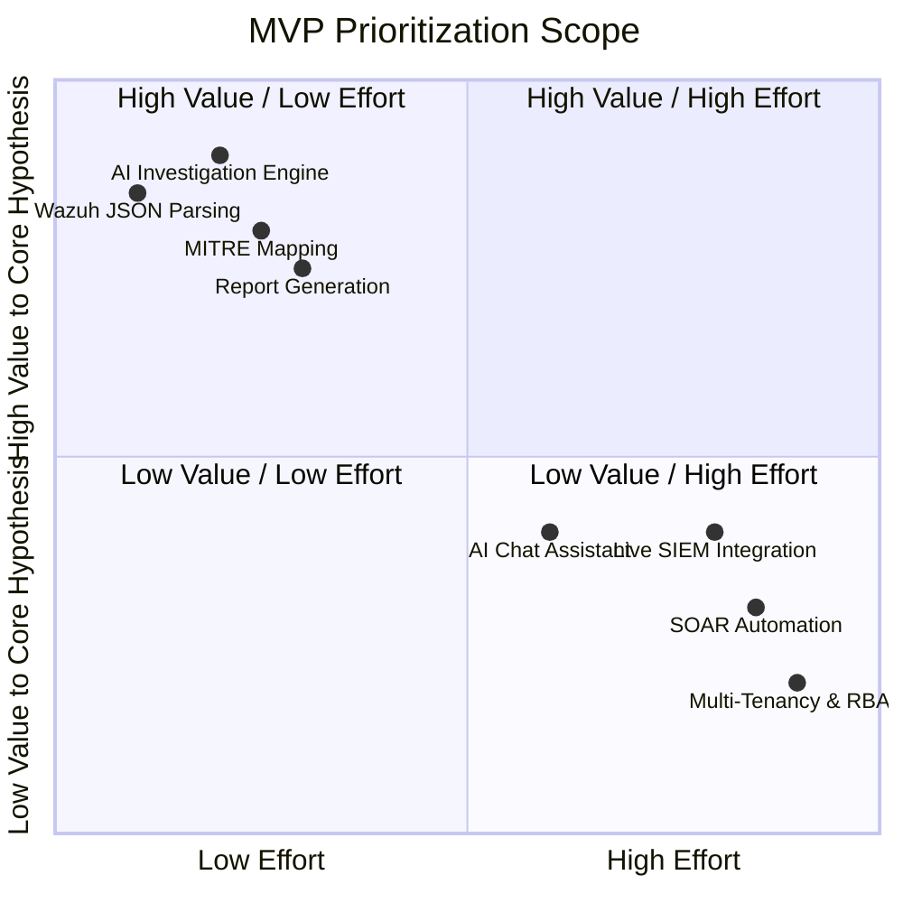
```mermaid
quadrantChart
    title MVP Prioritization Scope
    x-axis Low Effort --> High Effort
    y-axis Low Value to Core Hypothesis --> High Value to Core Hypothesis
    quadrant-1 High Value / High Effort
    quadrant-2 High Value / Low Effort
    quadrant-3 Low Value / Low Effort
    quadrant-4 Low Value / High Effort
    "AI Investigation Engine": [0.2, 0.9]
    "Wazuh JSON Parsing": [0.1, 0.85]
    "Report Generation": [0.3, 0.75]
    "MITRE Mapping": [0.25, 0.8]
    "Live SIEM Integration": [0.8, 0.4]
    "Multi-Tenancy & RBAC": [0.9, 0.2]
    "SOAR Automation": [0.85, 0.3]
    "AI Chat Assistant": [0.6, 0.4]
```

| Capability | MVP (In-Scope) | Future (Out-of-Scope) |
| :--- | :---: | :---: |
| Upload Wazuh JSON | ✅ | |
| AI Investigation & MITRE Mapping | ✅ | |
| Report Generation & History | ✅ | |
| Live SIEM Integration (Wazuh, Splunk, etc.) | | ✅ |
| Threat Intelligence Enrichment | | ✅ |
| SOAR / Automated Remediation | | ✅ |
| Threat Hunting & Vulnerability Scanning | | ✅ |
| Multi-Tenancy, RBAC, Billing | | ✅ |

## 7.5 Product Management Decision Framework
When evaluating feature requests during the MVP lifecycle, product teams must apply the following heuristic:
1. Does this directly enhance the investigation of a single uploaded Wazuh alert?
2. Is this indispensable for validating the core product hypothesis?
3. Can the MVP achieve its objectives without this feature?

*If the answer to Question 3 is **Yes**, the feature is deferred.* This rigorous filtering preserves the 90-day development window.

## 7.6 Strategic Trade-Offs
The MVP deliberately prioritizes depth over breadth. By executing one critical workflow—alert triage—with exceptional fidelity, the project avoids the pitfalls of building a superficial, feature-bloated platform. This strategy yields rapid iteration, clearer product positioning, minimized technical debt, and a compelling foundation for future enterprise capabilities.


---

# 9. Future Roadmap

## 9.1 Purpose
The AI SOC Copilot Minimum Viable Product (MVP) is deliberately scoped to address immediate operational bottlenecks. Long-term, the platform will evolve into a comprehensive, AI-native security operations center (SOC) solution encompassing detection, investigation, incident response, threat hunting, and security intelligence. This roadmap provides a directional strategy; feature prioritization remains subject to market validation, user feedback, and technical feasibility.

## 9.2 Product Evolution Strategy

The platform will evolve across five major phases, transitioning from a reactive, isolated investigation tool to a proactive, integrated, and autonomous security platform.

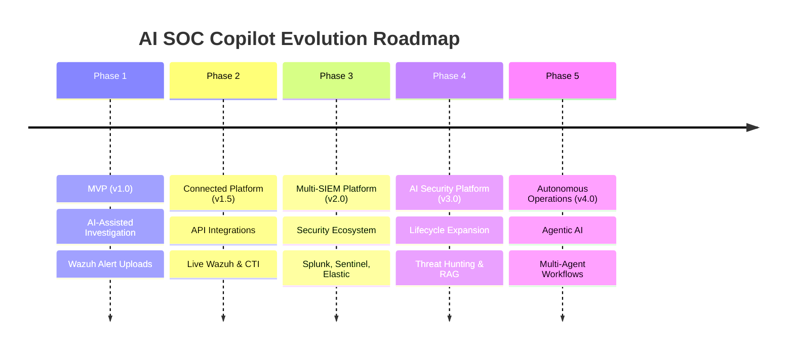
```mermaid
timeline
    title AI SOC Copilot Evolution Roadmap
    Phase 1: MVP (v1.0) : AI-Assisted Investigation : Wazuh Alert Uploads
    Phase 2: Connected Platform (v1.5) : API Integrations : Live Wazuh & CTI
    Phase 3: Multi-SIEM Platform (v2.0) : Security Ecosystem : Splunk, Sentinel, Elastic
    Phase 4: AI Security Platform (v3.0) : Lifecycle Expansion : Threat Hunting & RAG
    Phase 5: Autonomous Operations (v4.0) : Agentic AI : Multi-Agent Workflows
```

### Phase 1: MVP (v1.0) — AI-Assisted Investigation
**Objective**: Enable analysts to upload Wazuh JSON alerts and receive structured, explainable AI-driven investigations.
* **Key Features**: 
  * Wazuh alert upload and JSON schema validation.
  * AI-generated investigations with plain-English contextual explanations.
  * MITRE ATT&CK framework mapping and automated Indicator of Compromise (IOC) extraction.
  * Dynamic severity assessment and actionable response recommendations.
  * Investigation history tracking with PDF and Markdown report exports.
* **Success Criteria**: Validate product-market fit, demonstrate a measurable reduction in investigation triage time, and aggregate user feedback for subsequent iterations.

### Phase 2: Connected Platform (v1.5) — Security Tool Integration
**Objective**: Reduce manual toil by integrating AI SOC Copilot directly with established security platforms and intelligence feeds.
* **Live Wazuh Integration**: Direct API connectivity for automated alert ingestion, eliminating manual file uploads.
* **Alert Queue Management**: Centralized event queue with severity-based sorting, status filtering, and one-click investigation triggers.
* **Threat Intelligence Enrichment**: Automated data enrichment via integrations with VirusTotal, AbuseIPDB, AlienVault OTX, and MISP.
* **Advanced Reporting**: Extensible export options (DOCX, HTML) incorporating organization-specific branding.

### Phase 3: Multi-SIEM Platform (v2.0) — AI Investigation Layer
**Objective**: Centralize and unify investigations across heterogeneous enterprise security ecosystems.
* **Supported Integrations**: Expansion to Splunk, Microsoft Sentinel, Elastic Security, IBM QRadar, and Google SecOps.
* **Multi-SIEM Dashboard**: A unified investigation interface abstracting underlying data sources and normalizations.
* **Cross-Alert Correlation**: Automated IOC correlation, relationship mapping across discrete incidents, and visual timeline reconstruction of attack progressions.
* **Collaboration Suite**: Shared investigation workspaces, analyst commenting, task assignment, and persistent note-taking.
* **Enterprise Authentication**: Role-Based Access Control (RBAC) and comprehensive multi-tenant organization management.

### Phase 4: AI Security Platform (v3.0) — Security Lifecycle Expansion
**Objective**: Extend AI capabilities beyond reactive investigation into proactive security operations and intelligence gathering.
* **AI Threat Hunting**: Natural-language query translation (e.g., "Show PowerShell executions from HR systems in the last 7 days") into native SIEM syntax.
* **Vulnerability Prioritization**: Dynamic risk scoring based on CVE analysis, asset criticality context, and patch prioritization requirements.
* **Compliance Assistant**: Automated evidence aggregation and report generation aligned with frameworks such as NIST CSF, ISO 27001, PCI DSS, and HIPAA.
* **Threat Intelligence Hub & AI Chat**: A centralized intelligence aggregator paired with a Retrieval-Augmented Generation (RAG) conversational interface grounded in historical investigations, MITRE techniques, and internal documentation.

### Phase 5: Autonomous Security Operations (v4.0) — Agentic AI
**Objective**: Deploy autonomous AI agents to orchestrate complex investigation workflows, preserving human-in-the-loop oversight for high-impact response decisions.
* **Multi-Agent Orchestration**: Specialized agents (e.g., Alert Parsing, MITRE Mapping, IOC Analysis, Threat Intelligence, Report Generation) collaborating concurrently on complex incidents.
* **AI Incident Commander**: Autonomous coordination of evidence collection and logical sequence optimization.
* **Dynamic AI Playbooks**: Context-aware recommendation of standardized investigation paths based on alert characteristics and historical efficacy.
* **Human-Gated Response Workflows**: Mandatory analyst approval checkpoints prior to executing disruptive remediation actions (e.g., endpoint isolation, credential revocation).

## 9.3 Technology Evolution
The underlying architecture will scale to support increased data volumes, real-time processing, and advanced AI paradigms.

| Version | Evolution Focus | Key Technologies |
| :--- | :--- | :--- |
| **v1.0** | MVP Foundation | FastAPI, PostgreSQL, Flutter Web, OpenAI API |
| **v1.5** | Scalability & Async Operations | Docker, Redis, Background Job Queues |
| **v2.0** | Enterprise Integration | Live SIEM APIs, RBAC, S3-Compatible Object Storage |
| **v3.0** | Advanced AI Capabilities | LangGraph, RAG Architectures, Vector Databases |
| **v4.0** | Autonomous Operations | Multi-Agent Orchestration Frameworks, SOAR Integrations |

## 9.4 AI Capabilities Roadmap
The AI models and prompting strategies will mature from basic processing to context-aware orchestration.

| Stage | Focus Areas |
| :--- | :--- |
| **MVP** | Prompt engineering, structured JSON outputs, zero-shot single-model reasoning. |
| **Next Stage** | Prompt optimization, output confidence scoring, domain-specific evaluation metrics and benchmarking. |
| **Long-Term** | Retrieval-Augmented Generation (RAG), organization-specific context ingestion, fine-tuned security models (conditional on data availability and cost constraints), and multi-agent orchestration. |

## 9.5 User Experience (UX) Roadmap
The interface will evolve to support deeper analytical workflows and team collaboration.

| Stage | Key Enhancements |
| :--- | :--- |
| **MVP** | Desktop-first responsive layout, dedicated single-alert investigation view, and basic report export. |
| **Future** | Customizable dashboards, interactive investigation timelines, complex boolean filtering, real-time multiplayer collaboration, robust keyboard-driven navigation, and WCAG accessibility compliance. |

## 9.6 Business & Go-To-Market Roadmap
Market penetration will progress through structured adoption phases, validating the platform at increasing scales.

| Phase | Target Audience & Objectives |
| :--- | :--- |
| **Stage 1: Incubation** | University pilot programs, cybersecurity student cohorts, and open-source community engagement. |
| **Stage 2: Early Adopters** | Small-to-Medium Businesses (SMBs), constrained SOC teams, and early design partners. |
| **Stage 3: Commercialization** | Managed Security Service Providers (MSSPs), mid-market enterprises, and the introduction of structured paid subscription tiers. |
| **Stage 4: Enterprise Scale** | Large enterprise deployments, strategic industry partnerships, and major security marketplace integrations. |

## 9.7 Release Timeline (Illustrative)
*Note: Release cadences are directional and driven by customer validation and market feedback rather than rigid calendar schedules.*

| Version | Target Horizon | Primary Focus |
| :--- | :--- | :--- |
| **v1.0** | 90 Days | **MVP Launch:** Core AI-assisted investigation workflow and manual alert parsing. |
| **v1.1** | Post-Launch | Platform stability, UX refinements, and high-priority bug remediation. |
| **v1.5** | TBD | Live Wazuh API integration and automated threat intelligence enrichment. |
| **v2.0** | TBD | Multi-SIEM architecture rollout, enterprise authentication, and collaboration tools. |
| **v3.0** | TBD | Platform expansion: Proactive threat hunting, automated compliance reporting, and RAG integration. |
| **v4.0** | TBD | Agentic AI orchestration and human-gated autonomous incident response. |

## 9.8 Product Strategy Principles
As the platform scales, engineering and product decisions will adhere to the following core tenets:
1. **Depth Before Breadth**: Deliver exceptional, frictionless support for specific workflows (e.g., Wazuh investigations) prior to horizontal expansion across other platforms.
2. **Evidence-Backed AI**: Maintain strict demarcation between observed telemetry facts and AI-generated inferences to preserve analyst trust.
3. **Human-in-the-Loop Operations**: AI systems recommend and orchestrate; human analysts retain ultimate decision-making authority over critical responses.
4. **Composable Architecture**: Ensure new integrations and modules plug into existing services seamlessly with minimal architectural refactoring.
5. **Incremental Validation**: Gate the introduction of advanced autonomous capabilities behind rigorous validation of preceding analytical stages.


---

# 10. User Journey

## 10.1 Purpose
This section describes the end-to-end user experience within the AI SOC Copilot application, mapping the complete workflow from initial launch to incident report exportation. The primary objective is to deliver a fast, intuitive, and optimized interface for Security Operations Center (SOC) analysts, significantly reducing cognitive load and unnecessary manual interactions. The Minimum Viable Product (MVP) implements a desktop-first, web-based workflow tailored to standard SOC operational patterns.

## 10.2 User Journey Overview
The ideal user journey demands minimal input while yielding maximal investigative value.

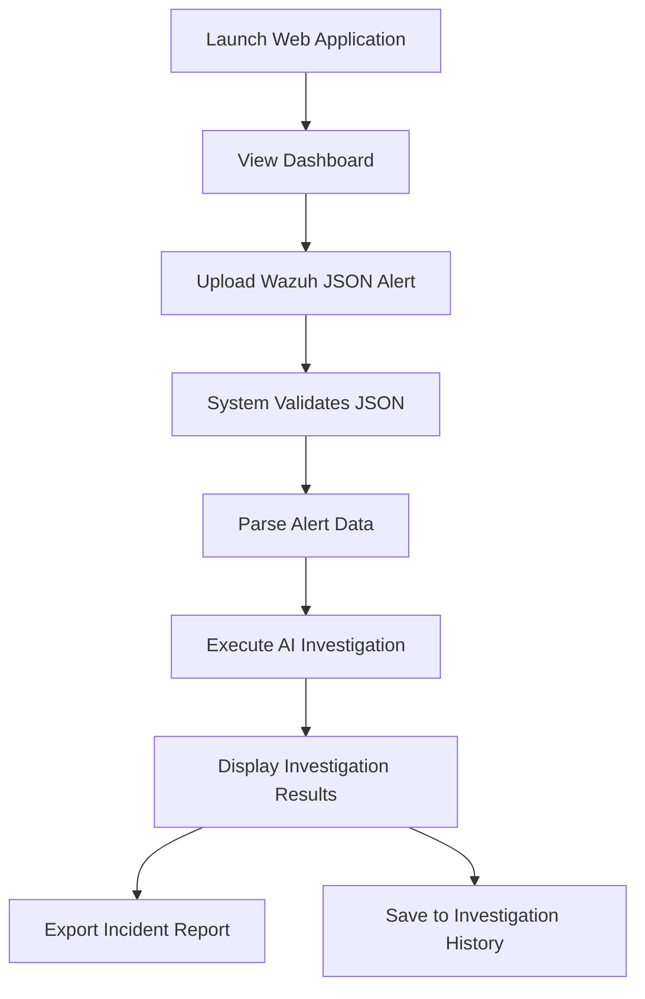
```mermaid
flowchart TD
    A[Launch Web Application] --> B[View Dashboard]
    B --> C[Upload Wazuh JSON Alert]
    C --> D[System Validates JSON]
    D --> E[Parse Alert Data]
    E --> F[Execute AI Investigation]
    F --> G[Display Investigation Results]
    G --> H[Export Incident Report]
    G --> I[Save to Investigation History]
```

## 10.3 Primary User Flow
| Step | Phase | User Action / System Response | Objective / Result |
| :--- | :--- | :--- | :--- |
| **1** | **Launch Application** | **Action:** User accesses the application via a supported desktop browser.<br>**Response:** System loads the dashboard. | Initiate a new investigation session. |
| **2** | **Dashboard Navigation** | **Action:** User selects an action (e.g., Start New Investigation, View History, Settings).<br>**Response:** System directs attention to the primary investigative workflow. | Provide immediate access to core platform capabilities. |
| **3** | **Alert Upload** | **Action:** User uploads one or multiple Wazuh JSON alerts via drag-and-drop or file browser.<br>**Response:** System validates syntax, schema, encoding, and file limits. | Transition to data parsing on success, or display actionable errors on failure. |
| **4** | **Alert Parsing** | **Action:** User waits during processing.<br>**Response:** Backend extracts/normalizes fields and prepares the AI prompt while displaying a progress indicator. | Structure the alert data for the AI engine while preserving the raw original. |
| **5** | **AI Investigation** | **Action:** User monitors progress.<br>**Response:** AI engine interprets the alert, assesses severity, extracts IOCs, maps MITRE ATT&CK tactics, and builds an attack narrative. | Generate comprehensive analytical insights without exposing backend implementation details. |
| **6** | **Results Review** | **Action:** User reviews findings, expands/collapses sections, and copies actionable insights.<br>**Response:** System displays a structured results dashboard (Overview, Summary, Severity, IOCs, Narrative, Actions). | Deliver the core investigative value of the product to the analyst. |
| **7** | **Report Export** | **Action:** User selects export format (PDF or Markdown).<br>**Response:** System generates a professional, shareable incident report. | Facilitate external documentation and communication. |
| **8** | **History Retention** | **Action:** Automated.<br>**Response:** System stores the original alert, parsed data, AI output, and metadata into the database. | Ensure auditability and long-term retention. |
| **9** | **History Access** | **Action:** User searches, filters, and opens previous investigations.<br>**Response:** System retrieves historical records for review or re-export. | Enable retrospective analysis of past incidents. |

## 10.4 Alternative User Flows
| Scenario | Trigger | System Behavior |
| :--- | :--- | :--- |
| **Invalid JSON** | Uploaded file contains malformed JSON syntax. | Reject upload, display validation error (highlighting the issue if possible), and allow immediate retry. |
| **Unsupported Format** | Uploaded file is not a Wazuh-compatible JSON document. | Explain format requirements, reject processing, and prevent progression to AI analysis. |
| **AI Service Failure** | LLM API is unavailable, times out, or returns an error. | Display a non-technical error, preserve the parsed alert state, and offer a clear retry mechanism. |
| **Large Alert Set** | User uploads a JSON array containing multiple distinct alerts. | Parse and investigate each alert individually, present results in a navigable list, and support individual report exports. |

## 10.5 UX Principles
- **Minimal Friction:** Facilitate the completion of investigations with the fewest possible steps.
- **Clear Feedback:** Continuously inform the user regarding validation, processing, and system state.
- **Transparency:** Explicitly differentiate between deterministic factual evidence and probabilistic AI interpretations.
- **Recoverability:** Enable seamless recovery from errors without requiring workflow restarts.
- **Consistency:** Maintain standardized layouts, terminology, and interaction patterns across the application.

## 10.6 MVP UX Success Criteria
The user experience is validated if a first-time user can successfully accomplish the following without onboarding or external documentation:
1. Launch the application.
2. Upload a valid Wazuh alert.
3. Receive AI-generated investigative results.
4. Comprehend the incident context without reading the raw JSON.
5. Export a professional report.
6. Retrieve the investigation from the historical archive.

---

# 11. Detailed Functional Requirements

## 11.1 Purpose
This section defines the functional capabilities of the AI SOC Copilot using uniquely identifiable requirements (FR-XXX). These identifiers ensure traceability across the design, development, testing, and operational lifecycles.

## 11.2 Functional Requirement Modules

### Module 1: Alert Upload
| ID | Requirement | Description & Acceptance Criteria | Priority |
| :--- | :--- | :--- | :--- |
| **FR-001** | Upload Wazuh Alert | **Description:** Allow users to upload Wazuh JSON files via the web interface.<br>**Inputs:** JSON file<br>**Outputs:** Uploaded alert<br>**Acceptance Criteria:** Upload completes successfully and passes to validation. | Must Have |
| **FR-002** | Drag-and-Drop Upload | **Description:** Support drag-and-drop JSON file uploads.<br>**Acceptance Criteria:** File uploads immediately; visual feedback confirms successful drop. | Must Have |
| **FR-003** | File Browser Upload | **Description:** Support file selection using the OS-native file picker. | Must Have |
| **FR-004** | Multiple Alert Support | **Description:** Accept single Wazuh JSON objects or JSON arrays containing multiple alerts. | Must Have |
| **FR-005** | Supported File Type | **Description:** Restrict uploads exclusively to `.json` files. | Must Have |
| **FR-006** | File Size Validation | **Description:** Enforce a configurable maximum upload size (default: 10 MB). | Should Have |
| **FR-007** | Upload Progress | **Description:** Display a progress indicator for larger file uploads. | Should Have |
| **FR-008** | Cancel Upload | **Description:** Allow users to terminate an in-progress upload. | Could Have |
| **FR-009** | Upload Confirmation | **Description:** Display visual confirmation upon a successful upload. | Must Have |
| **FR-010** | Upload Error Handling | **Description:** Present descriptive error messages for upload failures. | Must Have |

### Module 2: JSON Validation
| ID | Requirement | Description & Acceptance Criteria | Priority |
| :--- | :--- | :--- | :--- |
| **FR-011** | JSON Syntax Validation | **Description:** Validate uploaded files for valid JSON syntax and UTF-8 encoding prior to processing. | Must Have |
| **FR-012** | Wazuh Schema Validation | **Description:** Confirm the JSON structure matches expected Wazuh alert schemas (e.g., presence of `rule`, `timestamp`, `agent`). | Must Have |
| **FR-013** | Invalid JSON Handling | **Description:** Reject malformed JSON.<br>**Acceptance Criteria:** User receives an actionable error message. | Must Have |
| **FR-014** | Empty File Validation | **Description:** Reject empty files. | Must Have |
| **FR-015** | Unsupported Format | **Description:** Reject unsupported formats (e.g., XML, CSV, TXT, YAML). | Must Have |
| **FR-016** | Partial Validation | **Description:** When processing a JSON array, accept valid alerts while gracefully flagging invalid entries. | Should Have |
| **FR-017** | Validation Summary | **Description:** Display the total count of alerts, successful validations, and failed validations. | Should Have |
| **FR-018** | Preserve Original File | **Description:** Store the original uploaded JSON exactly as provided for auditing and troubleshooting purposes. | Must Have |

### Module 3: Alert Parser
| ID | Requirement | Description & Acceptance Criteria | Priority |
| :--- | :--- | :--- | :--- |
| **FR-019** | Parse Rule Info | **Description:** Extract Rule ID, Rule Level, Rule Description, and Rule Groups. | Must Have |
| **FR-020** | Parse Agent Info | **Description:** Extract Agent Name, Agent ID, and Hostname. | Must Have |
| **FR-021** | Parse Network Info | **Description:** Extract Source IP, Destination IP, Ports (if present), and Protocol. | Must Have |
| **FR-022** | Parse User Info | **Description:** Extract Username, Domain, and SID (if present). | Must Have |
| **FR-023** | Parse Process Info | **Description:** Extract Process Name, Command Line, and Parent Process. | Must Have |
| **FR-024** | Parse File Info | **Description:** Extract File Path, File Name, and Hashes (if present). | Must Have |
| **FR-025** | Parse Timestamp | **Description:** Normalize timestamps to UTC while preserving the original localized value for reference. | Must Have |
| **FR-026** | Parse Decoder Info | **Description:** Extract decoder metadata provided by Wazuh. | Must Have |
| **FR-027** | Parse Raw Log | **Description:** Retain the original raw log field for evidence extraction and UI display. | Must Have |
| **FR-028** | Missing Field Handling| **Description:** Ensure optional missing fields default to `null` without triggering parser failures. | Must Have |
| **FR-029** | Parsing Status | **Description:** Expose explicit parsing success or failure states to the frontend client. | Must Have |
| **FR-030** | Parser Error Logging | **Description:** Log parsing exceptions internally for diagnostics without leaking implementation details to the user. | Must Have |
| **FR-031** | Standard Internal Model| **Description:** Transform parsed alerts into a normalized, consistent internal data structure before submission to the AI engine. | Must Have |

### Module 4: AI Investigation Engine
> [!TIP]
> **Product Management Recommendation:** To build analyst trust and ensure transparency, the UI and API must explicitly distinguish between **Observed Evidence** (deterministic data derived from Wazuh) and **AI Interpretation** (probabilistic analysis). This aligns with augmenting, rather than replacing, human decision-making.

| ID | Requirement | Description & Acceptance Criteria | Priority |
| :--- | :--- | :--- | :--- |
| **FR-032** | AI Request Generation | **Description:** Construct a structured prompt utilizing the normalized internal alert data model. | Must Have |
| **FR-033** | Plain-English Expl. | **Description:** Synthesize a concise, accessible explanation suitable for both junior analysts and students. | Must Have |
| **FR-034** | Executive Summary | **Description:** Generate a high-level strategic overview of the security incident. | Must Have |
| **FR-035** | Severity Assessment | **Description:** Assign a standardized severity level (Informational, Low, Medium, High, Critical) accompanied by a rationale rooted in evidence. | Must Have |
| **FR-036** | MITRE ATT&CK Mapping| **Description:** Identify relevant tactics and techniques. The AI must explicitly flag tentative mappings when confidence is low. | Must Have |
| **FR-037** | IOC Extraction | **Description:** Identify and extract Indicators of Compromise (IPs, Domains, URLs, Hashes, Usernames, Hostnames, Process Names). | Must Have |
| **FR-038** | Attack Narrative | **Description:** Formulate a coherent chronological narrative of the attack sequence, delineating hard evidence from AI inference. | Must Have |
| **FR-039** | Business Impact | **Description:** Assess potential organizational impact on Confidentiality, Integrity, and Availability (CIA triad). | Must Have |
| **FR-040** | Recommended Response| **Description:** Provide prioritized, advisory (non-prescriptive) mitigation and remediation steps. | Must Have |
| **FR-041** | Next Steps | **Description:** Suggest logical follow-up investigative actions (e.g., querying related logs). | Must Have |
| **FR-042** | Confidence Score | **Description:** Output a confidence level (Low/Medium/High) detailing the factors influencing the score. | Should Have |
| **FR-043** | Structured JSON Out | **Description:** Enforce a predefined JSON schema for the AI response to guarantee reliable UI parsing and rendering. | Must Have |
| **FR-044** | AI Timeout Handling | **Description:** Return a user-friendly error and retry prompt if the LLM request exceeds configured timeout thresholds. | Must Have |
| **FR-045** | AI Error Handling | **Description:** Gracefully manage external provider API failures, rate limits, and malformed responses. | Must Have |
| **FR-046** | Prompt Versioning | **Description:** Persist the prompt template version used per investigation to ensure reproducibility. | Should Have |
| **FR-047** | Investigate Timestamp| **Description:** Record precise start and completion timestamps for the AI analysis phase. | Must Have |
| **FR-048** | Token Tracking | **Description:** Log prompt and completion token consumption for cost auditing and prompt optimization. | Should Have |
| **FR-049** | Output Schema Valid | **Description:** Validate the AI JSON payload against a strict backend schema before transmission to the frontend.<br>**Acceptance Criteria:** Reject invalid responses, log errors, and provide a user retry option. | Must Have |
| **FR-050** | Missing Section Logic | **Description:** Handle omitted sections gracefully (e.g., outputting "Insufficient evidence available" rather than dropping UI components). | Must Have |
| **FR-051** | Response Sanitization| **Description:** Sanitize AI output to strip unsafe content or hallucinated formatting elements prior to rendering. | Must Have |
| **FR-052** | Retry Mechanism | **Description:** Permit users to trigger a re-investigation without requiring a file re-upload. | Should Have |
| **FR-053** | Audit Trail | **Description:** Store immutable metadata (Investigation ID, AI Model, Prompt Version, Processing Duration, Timestamp). | Must Have |
| **FR-054** | Cost Monitoring | **Description:** Calculate and record approximate financial cost per transaction based on token metrics. | Should Have |
| **FR-055** | Provider Agnosticism | **Description:** Utilize an abstraction layer to facilitate seamless swapping of backend LLM providers (e.g., OpenAI, Anthropic, local models). | Should Have |

### Module 5: Investigation Results UI
| ID | Requirement | Description & Acceptance Criteria | Priority |
| :--- | :--- | :--- | :--- |
| **FR-056** | Overview Summary | **Description:** Render a top-level card displaying Rule Name, Rule ID, Agent, Timestamp, and Severity. | Must Have |
| **FR-057** | Explanation Panel | **Description:** Prominently position the plain-English explanation at the top of the interface. | Must Have |
| **FR-058** | Severity Badge | **Description:** Utilize distinct, consistent visual color-coding for severity tiers. | Must Have |
| **FR-059** | MITRE ATT&CK UI | **Description:** Display identified Tactics, Techniques, Technique IDs, and associated AI confidence levels. | Must Have |
| **FR-060** | IOC UI | **Description:** Present extracted IOCs in a structured data table featuring a one-click copy-to-clipboard function. | Must Have |
| **FR-061** | Narrative UI | **Description:** Render the attack narrative, explicitly highlighting the boundary between empirical evidence and generated interpretation. | Must Have |
| **FR-062** | Business Impact UI | **Description:** Display the hypothesized organizational blast radius. | Must Have |
| **FR-063** | Actions UI | **Description:** List remediation recommendations in an ordered, prioritized layout. | Must Have |
| **FR-064** | Next Steps UI | **Description:** Display recommended follow-up analytical procedures. | Must Have |
| **FR-065** | Original JSON View | **Description:** Provide an embedded, collapsible, syntax-highlighted viewer for the raw uploaded alert. | Must Have |
| **FR-066** | Copy Functions | **Description:** Enable one-click copying of the entire report, individual sections, IOC sets, or raw JSON. | Should Have |
| **FR-067** | Loading States | **Description:** Show localized loading indicators (e.g., skeleton screens or spinners) during data retrieval. | Must Have |
| **FR-068** | Error States | **Description:** Render robust, user-friendly fallback UI states for validation or processing failures. | Must Have |
| **FR-069** | Responsive Design | **Description:** Ensure the layout scales gracefully from standard desktop resolutions down to tablet dimensions. | Must Have |
| **FR-070** | Accessibility | **Description:** Implement keyboard navigability, semantic ARIA labels, and WCAG-compliant color contrast. | Should Have |
| **FR-071** | Metadata UI | **Description:** Display deep diagnostic metadata (Investigation ID, Time, AI Model) unobtrusively. | Should Have |
| **FR-072** | Collapsible Sections | **Description:** Allow users to expand/collapse discrete modules of the report to manage vertical space. | Should Have |
| **FR-073** | Print Layout | **Description:** Apply CSS media queries (`@media print`) to optimize the view for native browser printing. | Should Have |

### Module 6: Report Generation
| ID | Requirement | Description & Acceptance Criteria | Priority |
| :--- | :--- | :--- | :--- |
| **FR-074** | Generate Report | **Description:** Compile a polished, shareable incident report from the finalized investigation data. | Must Have |
| **FR-075** | PDF Export | **Description:** Export the comprehensive report in PDF format. | Must Have |
| **FR-076** | Markdown Export | **Description:** Export the comprehensive report in Markdown format. | Must Have |
| **FR-077** | Standard Template | **Description:** Enforce a rigid, professional reporting template across all exports. | Must Have |
| **FR-078** | Report Metadata | **Description:** Embed Report ID, Date, Investigation ID, and System Version within the document header/footer. | Must Have |
| **FR-079** | Evidence Section | **Description:** Include the critical factual evidence extracted during parsing. | Must Have |
| **FR-080** | MITRE Section | **Description:** Document the mapped ATT&CK tactics and techniques. | Must Have |
| **FR-081** | Recommendations | **Description:** Include the AI-generated remediation playbook. | Must Have |
| **FR-082** | Regeneration | **Description:** Enable users to spawn updated reports following a re-investigation execution. | Should Have |
| **FR-083** | Download Tracking | **Description:** Log report export events internally for telemetry and audit compliance. | Could Have |
| **FR-084** | Format Extensibility | **Description:** Architect the export microservice to support future targets (e.g., DOCX, HTML) without deep refactoring. | Should Have |

### Module 7: Investigation History
| ID | Requirement | Description & Acceptance Criteria | Priority |
| :--- | :--- | :--- | :--- |
| **FR-085** | Save Investigation | **Description:** Persist the holistic investigation payload securely in the database. | Must Have |
| **FR-086** | History List | **Description:** Display historical investigations sorted by reverse chronological order. | Must Have |
| **FR-087** | Search History | **Description:** Enable text search across Rule ID, Agent Name, Hostname, and Investigation ID fields. | Must Have |
| **FR-088** | Filter History | **Description:** Support faceted filtering via Severity, Date Range, and Rule Group parameters. | Should Have |
| **FR-089** | Open Investigation | **Description:** Allow users to seamlessly resurrect a dormant historical investigation into the active UI state. | Must Have |
| **FR-090** | Re-export Report | **Description:** Permit report generation directly from the historical archive without re-processing. | Must Have |
| **FR-091** | Delete Investigation | **Description:** Support hard deletion of historical records protected by a confirmation modal. | Should Have |
| **FR-092** | Pagination | **Description:** Implement backend pagination (or infinite scroll) for the history endpoint to guarantee O(1) load times. | Should Have |
| **FR-093** | Sorting | **Description:** Support dynamic column sorting by Date, Severity, and Rule Level. | Should Have |
| **FR-094** | Empty State | **Description:** Render a designated, helpful "No History Found" UX when the repository is empty. | Must Have |
| **FR-095** | Retention Architecture| **Description:** Lay architectural groundwork for automated data lifecycle and retention policies. | Could Have |

### Module 8: Settings
| ID | Requirement | Description & Acceptance Criteria | Priority |
| :--- | :--- | :--- | :--- |
| **FR-096** | Theme Selection | **Description:** Support persistent Light and Dark mode UI themes. | Should Have |
| **FR-097** | Export Preferences | **Description:** Allow users to set global default configurations for report generation. | Could Have |
| **FR-098** | About Page | **Description:** Display detailed application versioning, build hashes, and license acknowledgments. | Must Have |
| **FR-099** | Health Status | **Description:** Render real-time subsystem status (e.g., Core API, LLM Gateway) for immediate frontline diagnostics. | Should Have |
| **FR-100** | Config Extensibility | **Description:** Design the settings schema to absorb future user preferences without requiring structural UI overhauls. | Should Have |

---

## 11.3 Architectural Recommendations

> [!TIP]
> **CTO Recommendation:** Introduce an **AI Orchestrator** middleware layer to decouple the UI and business logic from the LLM provider. This orchestrator handles prompt templating, schema validation, rate-limit retries, token telemetry, and provider abstraction.

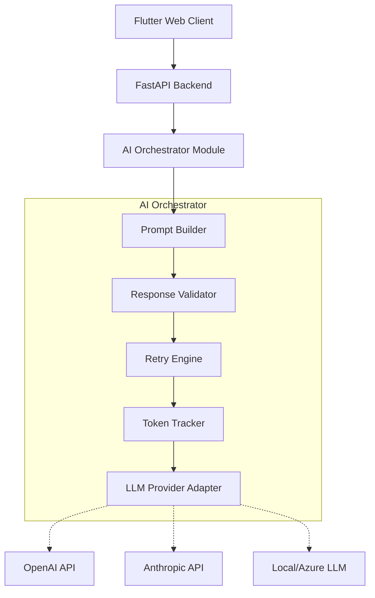
```mermaid
flowchart TD
    A[Flutter Web Client] --> B[FastAPI Backend]
    B --> C[AI Orchestrator Module]
    
    subgraph Orchestrator [AI Orchestrator]
        D[Prompt Builder]
        E[Response Validator]
        F[Retry Engine]
        G[Token Tracker]
        H[LLM Provider Adapter]
    end
    
    C --> D
    D --> E
    E --> F
    F --> G
    G --> H
    
    H -.-> I[OpenAI API]
    H -.-> J[Anthropic API]
    H -.-> K[Local/Azure LLM]
```

---

# 12. Non-Functional Requirements (NFRs)

## 12.1 Purpose
Non-functional requirements (NFRs) define the systemic quality attributes of the AI SOC Copilot. These measurable constraints dictate performance, security, resilience, and operational scalability across the entire platform ecosystem.

## 12.2 NFR Traceability Summary
| Category | ID Range | Priority Focus |
| :--- | :--- | :--- |
| **Performance** | NFR-001 – 007 | High-speed investigations and fluid UI rendering |
| **Reliability** | NFR-008 – 013 | Graceful fault tolerance and state consistency |
| **Availability** | NFR-014 – 017 | Stable uptime and automated recovery mechanisms |
| **Security** | NFR-018 – 027 | Rigid validation, secret isolation, and secure transport |
| **Scalability** | NFR-028 – 033 | Modular decoupling to support horizontal backend growth |
| **Maintainability** | NFR-034 – 040 | Clean architecture, high test coverage, and documentation |
| **Usability** | NFR-041 – 047 | Intuitive, desktop-optimized SOC workflows |
| **Compatibility** | NFR-048 – 052 | Modern browser support and infrastructure portability |
| **Observability** | NFR-053 – 058 | Granular structured logging and telemetry extraction |

### 12.3 Performance Requirements
| ID | Requirement | Description | Priority |
| :--- | :--- | :--- | :--- |
| **NFR-001** | App Load Time | Dashboard must achieve interactivity within 3 seconds under normal network conditions. | Must Have |
| **NFR-002** | Upload Processing | System must initiate backend validation immediately (latency < 500ms) after file upload completion. | Must Have |
| **NFR-003** | AI Response Time| End-to-end investigation processing target is under 60 seconds (subject to external LLM provider latency). | Must Have |
| **NFR-004** | Report Generation | PDF and Markdown generation must execute within 10 seconds post-investigation. | Must Have |
| **NFR-005** | Search Performance| Historical database queries must yield results within 2 seconds for expected MVP data volumes. | Should Have |
| **NFR-006** | UI Responsiveness | The main thread must never block during prolonged API requests; utilize asynchronous calls and loaders. | Must Have |
| **NFR-007** | Resource Efficiency| Mitigate redundant API invocations, duplicate processing loops, and excessive client-side DOM repaints. | Should Have |

### 12.4 Reliability Requirements
| ID | Requirement | Description | Priority |
| :--- | :--- | :--- | :--- |
| **NFR-008** | Error Recovery | Application must seamlessly recover from transient faults without necessitating a full page refresh. | Must Have |
| **NFR-009** | Data Integrity | Persisted alerts and generated investigation results must remain immutable and protected against accidental alteration. | Must Have |
| **NFR-010** | AI Failure Handling| Catastrophic external AI API failures must be isolated, preventing broader application crashes, while prompting user retry. | Must Have |
| **NFR-011** | Parser Robustness | The parsing engine must successfully map Wazuh alerts even when optional schema fields are omitted. | Must Have |
| **NFR-012** | Tx Consistency | Investigations must strictly commit to the database only upon successful completion of the entire processing pipeline. | Must Have |
| **NFR-013** | Logging Reliability| Critical system events, state transitions, and exceptions must be deterministically logged. | Must Have |

### 12.5 Availability Requirements
| ID | Requirement | Description | Priority |
| :--- | :--- | :--- | :--- |
| **NFR-014** | Target Availability | Attain 99% uptime across MVP testing and demonstration deployment environments. | Should Have |
| **NFR-015** | Graceful Degradation| If the AI layer is offline, the system must degrade gracefully, permitting alert upload and syntax validation workflows. | Must Have |
| **NFR-016** | Planned Maintenance | Routing logic must display a friendly intercept notification rather than exposing raw HTTP 502/503 errors during updates. | Could Have |
| **NFR-017** | Startup Recovery | Application pods/services must achieve autonomous cold-start recovery post-crash without manual intervention. | Must Have |

### 12.6 Security Requirements
| ID | Requirement | Description | Priority |
| :--- | :--- | :--- | :--- |
| **NFR-018** | Secure Transport | Mandate TLS 1.2+ (HTTPS) for all client-to-server and inter-service communications in production. | Must Have |
| **NFR-019** | Input Validation | Implement zero-trust server-side validation independently of frontend client checks. | Must Have |
| **NFR-020** | File Validation | Rigorously validate uploaded payload MIME types, file sizes, and JSON structural integrity. | Must Have |
| **NFR-021** | Secret Management | API keys and database credentials must be injected dynamically via secure environment variables or vault services. | Must Have |
| **NFR-022** | SQLi Protection | Database communication must route exclusively through parameterized queries or a secure ORM layer. | Must Have |
| **NFR-023** | Safe Logging | Redact sensitive credentials from all log outputs. Log investigation payloads strictly for temporary diagnostic contexts. | Must Have |
| **NFR-024** | Opaque Errors | Frontend error boundaries must obscure stack traces and backend architectural nuances from the end-user. | Must Have |
| **NFR-025** | Dependency Scanning| Integrate automated SCA (Software Composition Analysis) to actively mitigate vulnerabilities in third-party libraries. | Should Have |
| **NFR-026** | CORS Configuration | Hardcode strict Cross-Origin Resource Sharing rules restricted exclusively to authorized frontend deployment origins. | Must Have |
| **NFR-027** | Security Headers | Deploy comprehensive HTTP response headers (CSP, X-Content-Type-Options, Referrer-Policy, HSTS) in production. | Should Have |

### 12.7 Scalability Requirements
| ID | Requirement | Description | Priority |
| :--- | :--- | :--- | :--- |
| **NFR-028** | Modular Services | Ensure strict domain boundary separation across parsing, AI inference, report rendering, and persistence layers. | Must Have |
| **NFR-029** | Horizontal Growth | Design the FastAPI application layer to be entirely stateless, enabling seamless load-balanced horizontal scaling. | Should Have |
| **NFR-030** | Database Scalability| Architect database schemas (e.g., indexing strategies) to tolerate substantial historical investigation volumes cleanly. | Should Have |
| **NFR-031** | Future Integrations | Construct defined API adapter interfaces to accelerate future ingestion from alternate SIEMs (e.g., Splunk, Sentinel). | Must Have |
| **NFR-032** | AI Provider Abs. | Isolate LLM API interactions behind an abstraction interface to enable rapid pivoting between foundation models. | Must Have |
| **NFR-033** | Background Tasks | Design heavy asynchronous operations (e.g., bulk reporting) to be easily offloaded to dedicated background worker queues (e.g., Celery). | Could Have |

### 12.8 Maintainability Requirements
| ID | Requirement | Description | Priority |
| :--- | :--- | :--- | :--- |
| **NFR-034** | Layered Architecture| Enforce clean separation of concerns among presentation, business logic, data access, and infrastructure logic. | Must Have |
| **NFR-035** | Code Standards | Enforce monolithic consistency in naming conventions, linting rules, and inline documentation via CI/CD pipelines. | Must Have |
| **NFR-036** | API Documentation | Autogenerate and maintain interactive OpenAPI (Swagger) documentation synchronously with code changes. | Must Have |
| **NFR-037** | Testing Strategy | Maintain high automated unit test coverage over mission-critical modules (Parser, AI Orchestrator, Exporter). | Should Have |
| **NFR-038** | Configuration Mgmt| Completely externalize runtime configuration overrides from compiled source code. | Must Have |
| **NFR-039** | Dependency Injection| Maximize the use of Inversion of Control (IoC) to optimize service decoupling and unit testability. | Should Have |
| **NFR-040** | Versioning | Append explicit versioning semantics to API endpoints and LLM prompt templates to ensure backward compatibility. | Should Have |

### 12.9 Usability Requirements
| ID | Requirement | Description | Priority |
| :--- | :--- | :--- | :--- |
| **NFR-041** | Desktop-First | Prioritize UI spatial density and layout configurations heavily for standard large-format SOC monitor arrays. | Must Have |
| **NFR-042** | Responsive Layout | Support functional responsive reflowing for tablet-sized viewports, maintaining core operational viability. | Should Have |
| **NFR-043** | Clear State Feedback| Provide unambiguous deterministic visual states mapping exactly to backend lifecycle events (upload, process, success, fail). | Must Have |
| **NFR-044** | Accessibility | Comply with baseline web accessibility standards (semantic HTML structure, keyboard focus management). | Should Have |
| **NFR-045** | Consistent Nav | Standardize iconography, terminology, and interaction paradigms strictly across all application views. | Must Have |
| **NFR-046** | Learnability | Ensure zero-friction onboarding allowing new analysts to execute end-to-end workflows intuitively. | Must Have |
| **NFR-047** | Minimal Clicks | Optimize the primary incident analysis pipeline to execute with the absolute minimum requisite mouse interactions. | Must Have |

### 12.10 Compatibility Requirements
| ID | Requirement | Description | Priority |
| :--- | :--- | :--- | :--- |
| **NFR-048** | Browser Support | Ensure parity support across current stable channels of Google Chrome, Microsoft Edge, and Mozilla Firefox. | Must Have |
| **NFR-049** | Backend Ecosystem | Standardize on designated stable long-term-support (LTS) versions of Python and FastAPI. | Must Have |
| **NFR-050** | Database Support | Standardize on PostgreSQL as the exclusive canonical relational data store. | Must Have |
| **NFR-051** | API Compatibility | Ensure REST API payloads strictly conform to JSON standards readily parsable by the Flutter web client. | Must Have |
| **NFR-052** | Deployment Port. | Package the full stack using OCI-compliant containerization (Docker) to guarantee agnostic cloud portability. | Should Have |

### 12.11 Observability Requirements
| ID | Requirement | Description | Priority |
| :--- | :--- | :--- | :--- |
| **NFR-053** | Structured Logging | Emit log telemetry strictly in structured JSON format to facilitate immediate ingestion by log aggregators. | Must Have |
| **NFR-054** | Request Tracing | Inject and propagate unique correlation IDs across all service boundaries to trace individual investigation lifecycles. | Should Have |
| **NFR-055** | Error Monitoring | Proactively trap and aggregate unhandled exceptions and fatal service degradations for operational alerting. | Should Have |
| **NFR-056** | Metrics Collection | Instrument and expose deep quantitative metrics (latency histograms, token consumption, error rates). | Should Have |
| **NFR-057** | Health Endpoint | Expose a lightweight, unauthenticated `GET /health` route verifying database and AI upstream connectivity. | Must Have |
| **NFR-058** | Audit Logging | Persist an immutable audit ledger documenting core security actions (authentication, investigation initiation, data export). | Should Have |


---

# 13. Technical Constraints

## 13.1 Overview
Technical constraints establish the architectural and operational boundaries for the AI SOC Copilot MVP. These parameters are dictated by available engineering resources, budget limitations, and core technology selections, ensuring realistic project scoping and preventing over-engineering during initial development.

## 13.2 Development Constraints

| ID | Constraint | Enterprise Impact |
| :--- | :--- | :--- |
| **TC-001** | **Solo Engineering Team** | Architecture must remain modular without over-engineering. Development priorities strictly target core workflows. Complex infrastructure provisioning is deferred unless vital for MVP operations. |
| **TC-002** | **90-Day Delivery Timeline** | Strict scope management is required. Non-critical features are relegated to future iterations. Weekly development milestones govern progression. |
| **TC-003** | **Zero-Cost Budget Baseline** | Solutions must prioritize open-source technologies, free developer tiers, low-cost cloud hosting, and pay-as-you-go API consumption models. Enterprise licenses are strictly avoided. |

## 13.3 Technology Stack Constraints

| ID | Component | Constraint Specification | Architectural Justification |
| :--- | :--- | :--- | :--- |
| **TC-004** | **Frontend Framework** | Must utilize Flutter Web. | Enables a unified codebase, strict UI consistency, and seamless future transitions to native desktop or mobile applications. |
| **TC-005** | **Backend Framework** | Must utilize FastAPI. | Delivers high-performance asynchronous execution, automated OpenAPI documentation generation, and native integration with the Python AI ecosystem. |
| **TC-006** | **Primary Datastore** | Must utilize PostgreSQL. | Provides mature relational storage mechanisms, native JSONB support for unstructured security alerts, and broad community support. |
| **TC-007** | **ORM Layer** | Must utilize SQLAlchemy. | Standardizes data access patterns, automates schema migrations, and integrates optimally with FastAPI endpoints. |
| **TC-008** | **AI Inference Engine** | Must utilize the OpenAI API. | Offloads intensive language processing to a proven external provider, necessitating robust handling of API latency, rate limits, and network availability. |

## 13.4 Infrastructure Constraints

| ID | Constraint | Enterprise Impact |
| :--- | :--- | :--- |
| **TC-009** | **Platform Hosting** | The deployment architecture targets low-cost Platform-as-a-Service (PaaS) providers (e.g., Render, Railway) suitable for rapid MVP deployment. |
| **TC-010** | **Containerization** | Docker support is architecturally planned but not a prerequisite for the initial working prototype. |
| **TC-011** | **Data Storage** | PostgreSQL handles all structured alert data and investigation records. Large binary asset storage (e.g., PCAP files) is strictly out of scope for the MVP. |

## 13.5 AI Operational Constraints

| ID | Constraint | Mitigation Strategy |
| :--- | :--- | :--- |
| **TC-012** | **Probabilistic Inference** | System UI must clearly distinguish between factual evidence and AI-generated inference, reinforcing that AI outputs are strictly advisory. |
| **TC-013** | **Hallucination Mitigation** | Implementation mandates structured prompts, strict JSON schema enforcement for outputs, and logic prioritizing evidence-based reasoning. |
| **TC-014** | **Context Window Limits** | Large SIEM alert payloads may necessitate chunking or pre-summarization mechanisms to prevent token limit exhaustion. |
| **TC-015** | **API Cost Management** | API consumption requires strict optimization, including prompt compression, error retry backoffs, and caching for static analysis components. |

## 13.6 Security Constraints

| ID | Constraint | Enterprise Impact |
| :--- | :--- | :--- |
| **TC-016** | **Cloud Dependency** | The application fundamentally requires active internet connectivity for AI processing; air-gapped or offline operations are unsupported. |
| **TC-017** | **Secret Management** | AI API keys and database credentials must reside exclusively in backend environment variables, strictly prohibiting frontend exposure. |
| **TC-018** | **Data Handling** | Uploaded operational data must be managed with strict retention policies and sanitized from application logs to prevent sensitive data leakage. |

## 13.7 Architectural Constraints

| ID | Constraint | Enterprise Impact |
| :--- | :--- | :--- |
| **TC-019** | **Monorepo Structure** | The frontend, backend, and documentation reside in a single repository, streamlining CI/CD pipelines and developer onboarding for a solo engineer. |
| **TC-020** | **Service Modularity** | Despite monolithic deployment, internal domains (parsers, AI orchestration, persistence) must retain logical boundaries to facilitate future microservice extraction. |
| **TC-021** | **Stateless Communication** | Client-server interactions rely exclusively on synchronous RESTful APIs with JSON payloads. WebSockets and server-sent events are excluded from the MVP. |

## 13.8 Integration Constraints

| ID | Constraint | Enterprise Impact |
| :--- | :--- | :--- |
| **TC-022** | **Wazuh Exclusivity** | The MVP natively parses only Wazuh JSON alert schemas. Support for divergent SIEM schemas necessitates custom parser implementations in future phases. |
| **TC-023** | **External System Isolation** | Intentional exclusion of direct integrations with enterprise platforms (Splunk, Sentinel) and SOAR/Threat Intel feeds to maintain strict MVP scope. |

## 13.9 Operational Constraints

| ID | Constraint | Enterprise Impact |
| :--- | :--- | :--- |
| **TC-024** | **Manual Ingestion** | Alert investigations require manual file uploads. Automated API ingestion and live SIEM webhooks are explicitly deferred. |
| **TC-025** | **Single-Tenant Architecture** | The MVP operates within a single logical workspace, bypassing complex multi-tenant isolation or Role-Based Access Control (RBAC) implementations. |
| **TC-026** | **Web-First Access** | The application interface is exclusively optimized for desktop web browsers, deferring responsive mobile layouts and native binaries. |

## 13.10 Engineering Trade-Off Analysis

| Architectural Decision | Primary Benefit | Acknowledged Trade-Off |
| :--- | :--- | :--- |
| **Flutter Web** | Unified, cross-platform codebase. | Larger initial payload compared to native HTML/JS frameworks. |
| **FastAPI** | Accelerated REST API development. | Interpreted Python performance trails compiled languages (negligible for I/O-bound MVP). |
| **OpenAI API** | Immediate access to state-of-the-art LLMs. | Introduces external latency, reliance on third-party uptime, and variable usage costs. |
| **PostgreSQL** | Industry-standard relational reliability. | Introduces database schema management overhead compared to NoSQL alternatives. |
| **Manual Data Upload** | Drastically simplified ingestion architecture. | Increases user friction compared to automated SIEM integration pipelines. |
| **Monorepo Design** | Streamlines solo development workflows. | Demands strict developer discipline to prevent cross-domain coupling. |

## 13.11 Constraint Summary Matrix

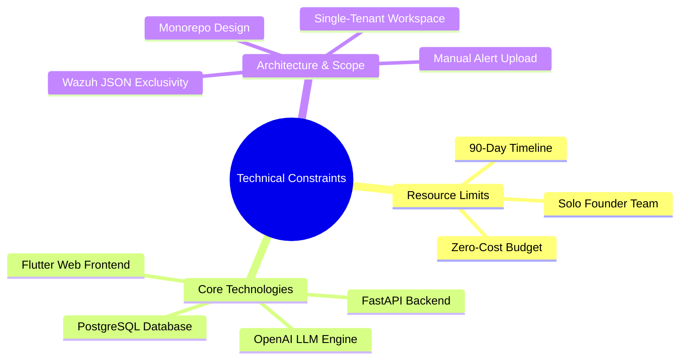
```mermaid
mindmap
  root((Technical Constraints))
    Resource Limits
      Solo Founder Team
      90-Day Timeline
      Zero-Cost Budget
    Core Technologies
      Flutter Web Frontend
      FastAPI Backend
      PostgreSQL Database
      OpenAI LLM Engine
    Architecture & Scope
      Monorepo Design
      Wazuh JSON Exclusivity
      Manual Alert Upload
      Single-Tenant Workspace
```


---

# 14. System Overview

## 14.1 Purpose
The System Overview delineates the high-level architecture of the AI SOC Copilot platform, detailing its core components, operational responsibilities, and systemic interactions. It establishes a foundational understanding of the solution architecture prior to detailing implementation specifics such as APIs and database schemas. The Minimum Viable Product (MVP) employs a modular monolith architecture, ensuring logical component separation while maintaining the deployment simplicity required for rapid delivery within a 90-day timeline.

## 14.2 High-Level System Description
AI SOC Copilot operates as a web-based artificial intelligence investigation platform designed to transform raw Wazuh security alerts into structured, actionable insights. The system executes the following operational sequence:

1. **Ingestion**: Accepts Wazuh JSON alerts via a secure web interface.
2. **Normalization**: Validates and normalizes alert data into a standard internal schema.
3. **Orchestration**: Constructs contextualized AI investigation requests.
4. **Analysis**: Evaluates the alert payload leveraging a Large Language Model (LLM).
5. **Validation**: Verifies and structures the AI-generated response.
6. **Persistence**: Stores structured investigation artifacts securely.
7. **Presentation**: Visualizes findings through an interactive dashboard.
8. **Export**: Facilitates the generation of professional incident reports.

The platform is designed to augment Security Operations Center (SOC) analysts. AI-generated recommendations are strictly advisory and necessitate human review against the original alert evidence.

## 14.3 Core System Components & Responsibilities

| Component | Primary Responsibility |
|---|---|
| **Flutter Web Frontend** | Orchestrates user interface workflows, manages alert uploads, and renders investigation results. Delegates all business processing to the backend layer. |
| **FastAPI Backend** | Serves as the central orchestrator, exposing REST APIs, enforcing request validation, managing business workflows, and handling errors. |
| **Upload Service** | Ingests alert files, validates file integrity (type/size), parses JSON payloads, and rejects malformed inputs. |
| **Parser Service** | Normalizes Wazuh-specific alerts into a consistent internal model while preserving original raw evidence. |
| **AI Orchestrator** | Dynamically constructs LLM prompts, submits investigation requests to the AI provider, validates outputs, and manages prompt versioning and token tracking. |
| **Investigation Service** | Functions as the core workflow engine coordinating the investigation lifecycle, state management, and data exposure to the presentation layer. |
| **Report Service** | Transforms investigation outcomes into standardized, exportable formats (PDF and Markdown) using managed templates. |
| **Database Layer** | Provides persistent storage for uploaded alerts, parsed models, AI investigation outcomes, metadata, and historical records. |

## 14.4 Logical Architecture

The following diagram illustrates the logical separation and interaction between system components.

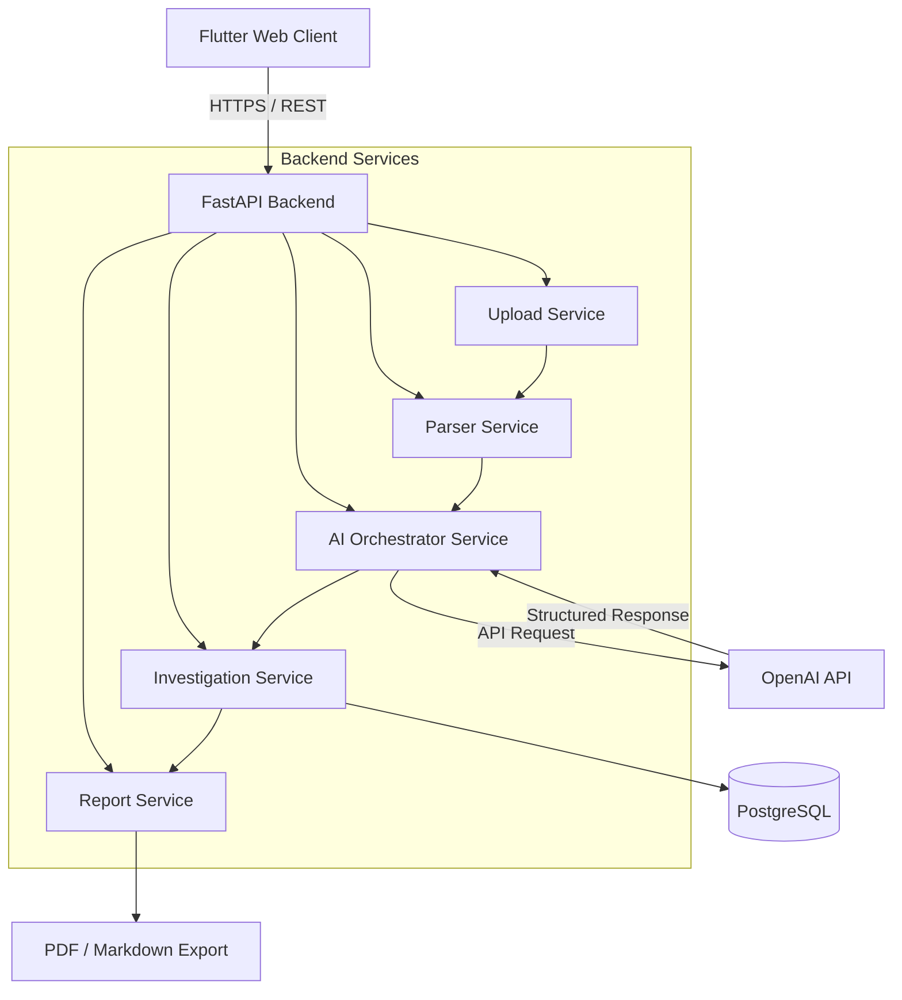
```mermaid
flowchart TD
    Client[Flutter Web Client] -->|HTTPS / REST| API[FastAPI Backend]
    
    subgraph Backend Services
        API --> Upload[Upload Service]
        API --> Parser[Parser Service]
        API --> AI_Orch[AI Orchestrator Service]
        API --> Inv[Investigation Service]
        API --> Rep[Report Service]
    end

    Upload --> Parser
    Parser --> AI_Orch
    AI_Orch -->|API Request| OpenAI[OpenAI API]
    OpenAI -->|Structured Response| AI_Orch
    AI_Orch --> Inv
    Inv --> DB[(PostgreSQL)]
    Inv --> Rep
    Rep --> Export[PDF / Markdown Export]
```

## 14.5 Data Flow

The system employs a unidirectional, pipeline-oriented data flow. Each stage enforces a single responsibility, minimizing coupling and facilitating robust testing.

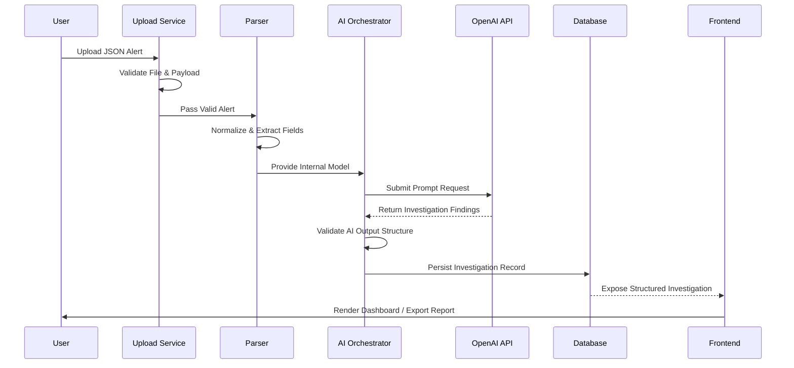
```mermaid
sequenceDiagram
    participant U as User
    participant UL as Upload Service
    participant P as Parser
    participant AI as AI Orchestrator
    participant OAI as OpenAI API
    participant DB as Database
    participant F as Frontend
    
    U->>UL: Upload JSON Alert
    UL->>UL: Validate File & Payload
    UL->>P: Pass Valid Alert
    P->>P: Normalize & Extract Fields
    P->>AI: Provide Internal Model
    AI->>OAI: Submit Prompt Request
    OAI-->>AI: Return Investigation Findings
    AI->>AI: Validate AI Output Structure
    AI->>DB: Persist Investigation Record
    DB-->>F: Expose Structured Investigation
    F->>U: Render Dashboard / Export Report
```

## 14.6 Design Principles
The system architecture adheres to the following core principles:
* **Single Responsibility**: Each service is restricted to a single, well-defined operational function.
* **Modularity**: Components maintain logical independence to support isolated evolution.
* **Separation of Concerns**: Distinct boundaries isolate the user interface, business logic, AI orchestration, and data persistence layers.
* **Extensibility**: Abstraction layers ensure that future integrations (e.g., live SIEM feeds, alternative LLM providers) require minimal refactoring.
* **Evidence Transparency**: The platform strictly preserves original security telemetry alongside AI-generated interpretations to ensure auditability.

## 14.7 External Dependencies

| Dependency | Purpose | Integration Method |
|---|---|---|
| **OpenAI API** | Generates AI-powered security investigations and insights. | REST API (HTTPS) |
| **PostgreSQL** | Provides primary relational data storage. | SQL |
| **Browser** | Executes the client-side user interface application. | HTTP/HTTPS |
| **File System** | Handles temporary artifact storage during the upload process. | Local OS API |

*Note: Integrations with live SIEM APIs and threat intelligence feeds are intentionally deferred beyond the MVP phase.*

## 14.8 Deployment View

All backend components deploy as a consolidated modular monolith within a single FastAPI application environment, minimizing operational overhead while enforcing logical separation.

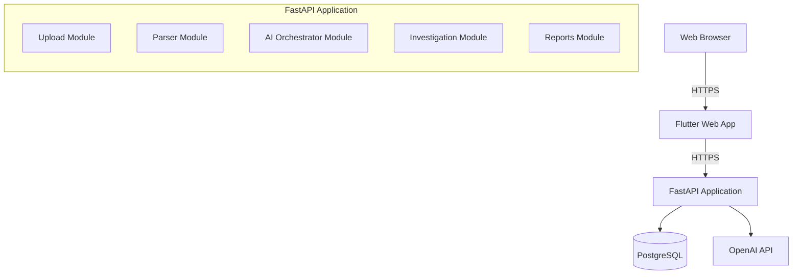
```mermaid
flowchart TD
    Browser[Web Browser] -->|HTTPS| Web[Flutter Web App]
    Web -->|HTTPS| Backend[FastAPI Application]
    
    subgraph FastAPI Application
        direction TB
        Upload[Upload Module]
        Parser[Parser Module]
        AI[AI Orchestrator Module]
        Inv[Investigation Module]
        Rep[Reports Module]
    end
    
    Backend --> DB[(PostgreSQL)]
    Backend --> ExtAPI[OpenAI API]
```

## 14.9 System Boundaries

### In Scope (MVP)
* Manual ingestion of Wazuh JSON alerts.
* Generation of AI-driven security investigations.
* Export of structured investigation reports (PDF/Markdown).
* Maintenance of historical investigation records.
* Responsive desktop web interface.

### Out of Scope (MVP)
* Automated or live SIEM API integrations.
* User authentication, authorization, and multi-tenancy.
* Billing or subscription management logic.
* Automated active response or remediation actions.
* Third-party threat intelligence enrichment.
* Real-time continuous alert monitoring capabilities.

## 14.10 System Overview Summary
AI SOC Copilot is architected as a modular, web-first security investigation platform defined by a strict separation of presentation, business logic, AI orchestration, and persistence layers. This modular monolith approach accelerates MVP delivery while establishing a highly cohesive, loosely coupled foundation capable of seamlessly accommodating future capabilities, such as live SIEM integrations, multi-provider AI orchestration, and collaborative analyst workflows.


---

# 15. High-Level Architecture

## 15.1 Purpose

This section defines the architectural design of AI SOC Copilot, detailing the logical layers, major modules, request workflows, deployment topology, and core architectural decisions. For the MVP phase, the system adopts a **Modular Monolith** architecture. This paradigm minimizes operational overhead while enforcing strict logical boundaries between components, facilitating a seamless transition to a microservices architecture as scalability requirements evolve.

## 15.2 Architectural Style

**Selected Style:** Modular Monolith

**Rationale:** Given the constrained 90-day timeline and solo-founder dynamic, a modular monolith delivers an optimal balance of simplicity, agility, and structural integrity.

**Key Advantages:**
- **Accelerated Development:** Consolidates the codebase for rapid iteration.
- **Simplified Debugging:** Eliminates distributed tracing complexity in the MVP phase.
- **Streamlined Deployment:** Operates as a single deployable artifact.
- **Cost Efficiency:** Minimizes infrastructure overhead.
- **Strict Separation of Concerns:** Enforces clear module boundaries despite shared runtime.
- **Extensibility:** Provides a straightforward refactoring path for future service extraction.

**Styles Not Selected:**
- **Microservices:** Introduces unnecessary operational and deployment complexity for an MVP.
- **Serverless-First:** Risks latency (cold starts), debugging complexity, and tight coupling to specific cloud providers.

## 15.3 Layered Architecture

The architecture follows a standard layered approach to isolate responsibilities.

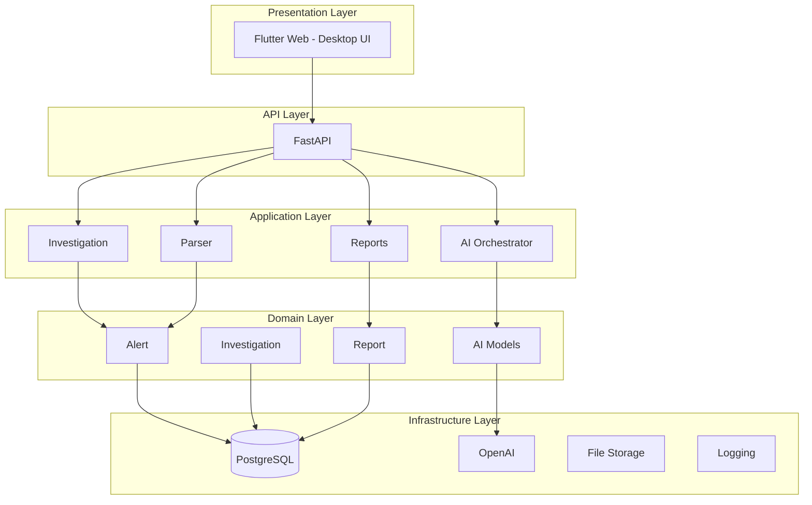
```mermaid
flowchart TD
    subgraph Presentation Layer
        UI[Flutter Web - Desktop UI]
    end

    subgraph API Layer
        API[FastAPI]
    end

    subgraph Application Layer
        App_Investigation[Investigation]
        App_Parser[Parser]
        App_Reports[Reports]
        App_AI[AI Orchestrator]
    end

    subgraph Domain Layer
        Dom_Alert[Alert]
        Dom_Investigation[Investigation]
        Dom_Report[Report]
        Dom_AIModels[AI Models]
    end

    subgraph Infrastructure Layer
        Infra_DB[(PostgreSQL)]
        Infra_AI[OpenAI]
        Infra_Storage[File Storage]
        Infra_Logging[Logging]
    end

    UI --> API
    API --> App_Investigation
    API --> App_Parser
    API --> App_Reports
    API --> App_AI
    
    App_Investigation --> Dom_Alert
    App_Parser --> Dom_Alert
    App_Reports --> Dom_Report
    App_AI --> Dom_AIModels
    
    Dom_Alert --> Infra_DB
    Dom_Investigation --> Infra_DB
    Dom_Report --> Infra_DB
    Dom_AIModels --> Infra_AI
```

## 15.4 Major Architectural Components

### 15.4.1 Presentation Layer
- **Technology:** Flutter Web
- **Responsibilities:**
  - Render a responsive, desktop-optimized user interface.
  - Execute client-side input validation.
  - Manage file uploads.
  - Visualize real-time investigation progress and render results.
  - Facilitate report exportation and display historical data.
  - **Note:** Strict enforcement prevents business logic from residing in this layer.

### 15.4.2 API Layer
- **Technology:** FastAPI
- **Responsibilities:**
  - Route incoming HTTP requests.
  - Validate request payloads using Pydantic models.
  - Standardize API responses and manage HTTP error handling.
  - Auto-generate OpenAPI specifications for self-documenting endpoints.
  - Serve as the exclusive public interface to the backend system.

### 15.4.3 Application Layer
The application layer acts as the workflow coordinator, executing business use cases without direct coupling to UI or infrastructure protocols.
- **Core Services:**
  - **Upload Service:** Handles initial file ingestion and validation.
  - **Parser Service:** Normalizes diverse alert formats (e.g., Wazuh JSON) into a standard schema.
  - **AI Orchestrator:** Manages prompt engineering, LLM interactions, and response parsing.
  - **Investigation Service:** Coordinates the end-to-end alert analysis workflow.
  - **Report Service:** Generates structured exportable artifacts.
  - **History Service:** Manages historical context and persistence retrieval.

### 15.4.4 Domain Layer
The domain layer encapsulates core business rules and concepts, remaining agnostic of external frameworks.
- **Core Entities:** `Alert`, `ParsedAlert`, `Investigation`, `AIAnalysis`, `Report`.

### 15.4.5 Infrastructure Layer
This layer provides concrete implementations for external system interactions.
- **Components:**
  - **PostgreSQL:** Relational data persistence with robust JSON support for flexible alert storage.
  - **OpenAI API:** External LLM execution environment.
  - **File Storage:** Local or object storage abstraction for raw uploads.
  - **Logging & Configuration:** Centralized telemetry and environment management.

## 15.5 Request Lifecycle

The following diagram illustrates the synchronous flow of a typical alert processing request.

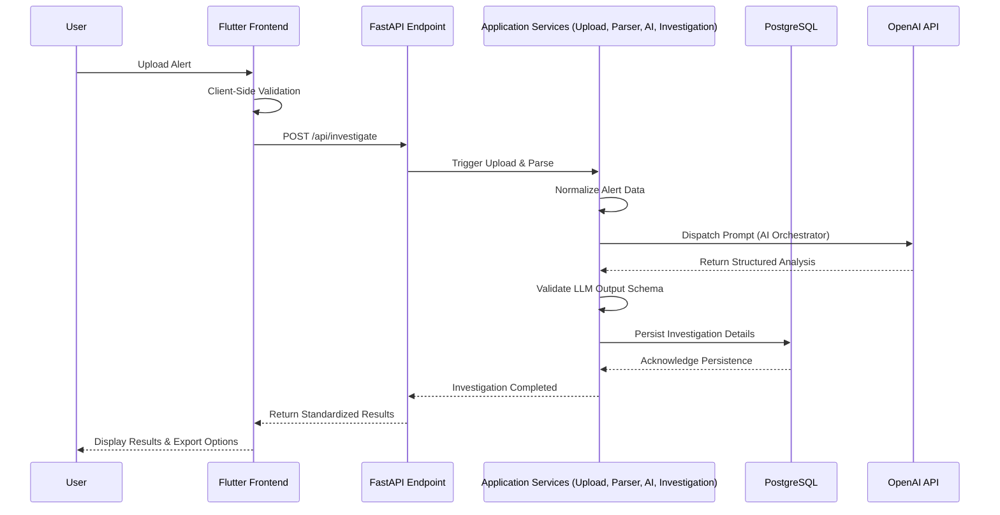
```mermaid
sequenceDiagram
    participant User
    participant Frontend as Flutter Frontend
    participant API as FastAPI Endpoint
    participant Services as Application Services (Upload, Parser, AI, Investigation)
    participant DB as PostgreSQL
    participant ExtAI as OpenAI API

    User->>Frontend: Upload Alert
    Frontend->>Frontend: Client-Side Validation
    Frontend->>API: POST /api/investigate
    API->>Services: Trigger Upload & Parse
    Services->>Services: Normalize Alert Data
    Services->>ExtAI: Dispatch Prompt (AI Orchestrator)
    ExtAI-->>Services: Return Structured Analysis
    Services->>Services: Validate LLM Output Schema
    Services->>DB: Persist Investigation Details
    DB-->>Services: Acknowledge Persistence
    Services-->>API: Investigation Completed
    API-->>Frontend: Return Standardized Results
    Frontend-->>User: Display Results & Export Options
```

## 15.6 Module Boundaries

Inter-module communication is restricted to well-defined interfaces, preventing tight coupling and facilitating future decoupled deployments.

| Module | Core Responsibility |
| :--- | :--- |
| **Upload** | Secure file handling, MIME type verification, and initial validation. |
| **Parser** | Alert normalization (specifically mapping Wazuh structures to internal models). |
| **AI Orchestrator** | Prompt generation, LLM communication, and strict response validation. |
| **Investigation** | Orchestration of the analysis workflow and state management. |
| **Reports** | Generation of exportable threat summaries and operational reports. |
| **History** | Data persistence, retrieval, and historical context management. |
| **Settings** | Configuration and application preference management. |

## 15.7 Directory Structure

The repository is structured to enforce the modular monolith design pattern.

```text
ai-soc-copilot/
├── frontend/                 # Flutter Web Application
│   ├── lib/                  # Main Dart code
│   ├── models/               # Client-side data representations
│   ├── screens/              # Top-level UI views
│   ├── services/             # API client implementations
│   └── widgets/              # Reusable UI components
├── backend/                  # FastAPI Application
│   ├── app/
│   │   ├── api/              # API Layer (Routers)
│   │   ├── core/             # Configuration & Security
│   │   ├── models/           # Domain Layer (SQLAlchemy/Pydantic)
│   │   ├── prompts/          # AI Prompt Templates
│   │   ├── reports/          # Report Generation Logic
│   │   ├── repositories/     # Data Access Layer
│   │   ├── schemas/          # API Validation Schemas
│   │   ├── services/         # Application Layer Logic
│   │   └── utils/            # Shared Utilities
│   ├── migrations/           # Alembic Database Revisions
│   └── tests/                # Unit and Integration Test Suites
├── docker/                   # Containerization Configurations
├── docs/                     # Project Documentation (PRD, Architecture)
├── scripts/                  # Automation and Deployment Scripts
└── README.md
```

## 15.8 Deployment Architecture (MVP)

The MVP deployment topology optimizes for low operational overhead while maintaining a professional, secure execution environment.

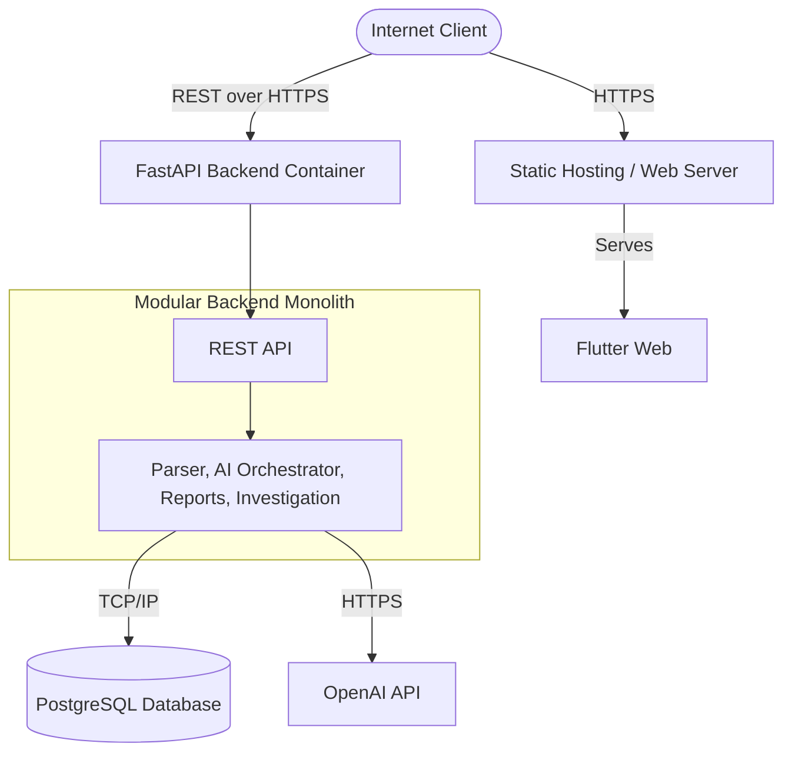
```mermaid
flowchart TD
    Internet([Internet Client]) -->|HTTPS| Host[Static Hosting / Web Server]
    Host -->|Serves| Frontend[Flutter Web]
    
    Internet -->|REST over HTTPS| Backend[FastAPI Backend Container]
    
    subgraph Modular Backend Monolith
        Backend_API[REST API]
        Backend_Services[Parser, AI Orchestrator, Reports, Investigation]
        Backend_API --> Backend_Services
    end
    
    Backend --> Backend_API
    
    Backend_Services -->|TCP/IP| DB[(PostgreSQL Database)]
    Backend_Services -->|HTTPS| Ext_OpenAI[OpenAI API]
```

## 15.9 Architectural Decision Records (ADRs)

| ADR ID | Decision | Rationale |
| :--- | :--- | :--- |
| **ADR-001** | Modular Monolith | Accelerates MVP delivery while enforcing clean boundaries for future scalability. |
| **ADR-002** | Flutter Web | Provides a unified codebase with a path to cross-platform deployment if required later. |
| **ADR-003** | FastAPI | Delivers high performance (async), rapid development, and automatic OpenAPI documentation. |
| **ADR-004** | PostgreSQL | Ensures ACID compliance with robust JSON capabilities for flexible log parsing. |
| **ADR-005** | OpenAI API | Leverages mature LLM capabilities with native support for structured JSON outputs. |
| **ADR-006** | RESTful APIs | Prioritizes simplicity, broad compatibility, and stateless communication. |
| **ADR-007** | AI Provider Adapter | Implements an abstraction layer to decouple the system from OpenAI, enabling future integration with alternative LLMs. |

## 15.10 Error Flow Handling

Robust error management is critical for a security-focused application to prevent silent failures and ensure reliable diagnostics.

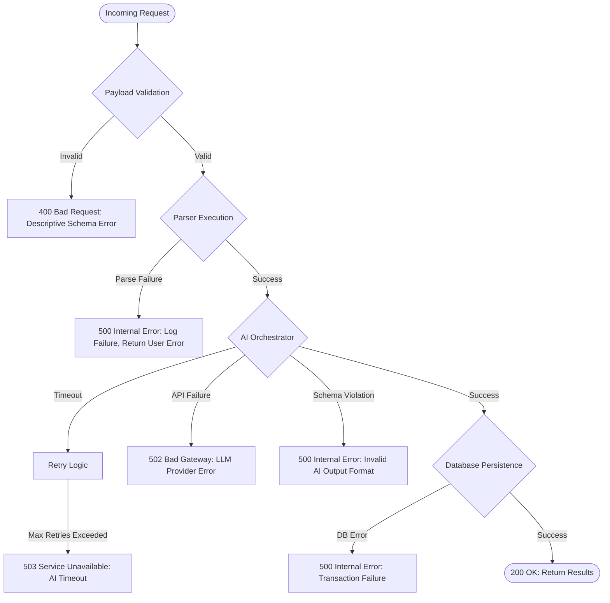
```mermaid
flowchart TD
    Start([Incoming Request]) --> Val{Payload Validation}
    Val -->|Invalid| E1[400 Bad Request: Descriptive Schema Error]
    Val -->|Valid| Parse{Parser Execution}
    Parse -->|Parse Failure| E2[500 Internal Error: Log Failure, Return User Error]
    Parse -->|Success| AI{AI Orchestrator}
    AI -->|Timeout| Retry[Retry Logic]
    Retry -->|Max Retries Exceeded| E3[503 Service Unavailable: AI Timeout]
    AI -->|API Failure| E4[502 Bad Gateway: LLM Provider Error]
    AI -->|Schema Violation| E5[500 Internal Error: Invalid AI Output Format]
    AI -->|Success| Persist{Database Persistence}
    Persist -->|DB Error| E6[500 Internal Error: Transaction Failure]
    Persist -->|Success| Done([200 OK: Return Results])
```

## 15.11 Future Architectural Evolution

The architecture is explicitly engineered to accommodate enterprise-grade enhancements without necessitating a foundational rewrite:
- **Live SIEM Connectors:** Integration via decoupled adapter modules.
- **Threat Intelligence Enrichment:** Extracted into a dedicated microservice.
- **Asynchronous Processing:** Implementation of message queues (e.g., Celery/Redis) for batch investigations and background report generation.
- **Retrieval-Augmented Generation (RAG):** Integration of a vector database for querying organization-specific knowledge bases.
- **Multi-Agent Orchestration:** Transitioning from linear AI flows to complex reasoning frameworks (e.g., LangGraph).
- **Identity & Access Management (IAM):** Introducing robust Authentication and Role-Based Access Control (RBAC) at the API gateway layer.

## 15.12 Architecture Summary

The High-Level Architecture for AI SOC Copilot guarantees:
- **Strict Separation of Concerns** across logical layers.
- **Enforced Modular Boundaries** to isolate domain logic.
- **Minimized Operational Overhead** tailored for a solo founder.
- **High Extensibility** via adapter patterns and clean interfaces.
- **A Seamless Migration Path** toward distributed enterprise architectures (microservices) as usage scales.


---

# 16. API Requirements

## 16.1 Purpose

This section specifies the RESTful API architecture for AI SOC Copilot. The API serves as the primary communication interface between the Flutter Web frontend and the FastAPI backend, delivering a consistent, versioned, and extensible contract for processing cybersecurity investigation workflows. The Minimum Viable Product (MVP) implements a REST-over-HTTPS architecture utilizing JSON payloads.

**Design Principles:**
- **Resource-Oriented:** Strictly RESTful architecture.
- **Stateless Operation:** No server-side session state maintained between requests.
- **Consistent Envelopes:** Standardized response formats across all endpoints.
- **Predictable Status Codes:** Strict adherence to standard HTTP semantics.
- **Day-One Versioning:** API versioning integrated into the URI path.
- **Rigorous Validation:** Comprehensive request validation via Pydantic models.
- **Standardized Error Handling:** Uniform error payloads for simplified frontend consumption.

## 16.2 API Architecture and Conventions

### 16.2.1 Base URLs

| Environment | Base URL |
| :--- | :--- |
| **Development** | `http://localhost:8000/api/v1` |
| **Production** | `https://api.aisoccopilot.com/api/v1` |

### 16.2.2 Versioning Strategy

The MVP utilizes URI-based versioning to ensure backward compatibility as platform capabilities evolve.
- **Current Version:** `/api/v1/`
- **Future Versions:** `/api/v2/`, `/api/v3/`

### 16.2.3 Content Types

Strict content-type negotiation is enforced across all endpoints:
- **Standard Requests/Responses:** `Content-Type: application/json`
- **File Uploads (Wazuh Alerts):** `Content-Type: multipart/form-data`
- **Report Downloads:** `Content-Type: application/pdf` or `text/markdown`

### 16.2.4 Authentication Framework

- **MVP Phase:** User authentication is bypassed to reduce friction for initial testing.
- **Future Architecture:** The API is designed to support seamless integration of JWT Bearer Authentication, OAuth 2.0, and API Keys without requiring endpoint restructuring.

## 16.3 Standard Response Format

To simplify frontend integration, all API responses adhere to a consistent JSON envelope structure.

### 16.3.1 Success Response

```json
{
  "success": true,
  "message": "Operation completed successfully.",
  "data": {
    "key": "value"
  },
  "timestamp": "2026-07-21T12:30:00Z"
}
```

### 16.3.2 Error Response

```json
{
  "success": false,
  "message": "Invalid Wazuh JSON file.",
  "error": {
    "code": "INVALID_JSON",
    "details": "The uploaded file does not conform to valid JSON syntax."
  },
  "timestamp": "2026-07-21T12:31:00Z"
}
```

## 16.4 API Modules Overview

| Module | Purpose |
| :--- | :--- |
| **Investigation API** | Ingest alerts, trigger AI analysis, and retrieve investigation results. |
| **Report API** | Export completed investigations as PDF or Markdown documents. |
| **Health API** | Monitor service availability and subsystem status. |
| **System API** | Expose application versioning and configuration metadata. |

## 16.5 Investigation API

The Investigation API follows an asynchronous processing pattern to accommodate long-running AI operations, ensuring the API remains responsive and scalable.

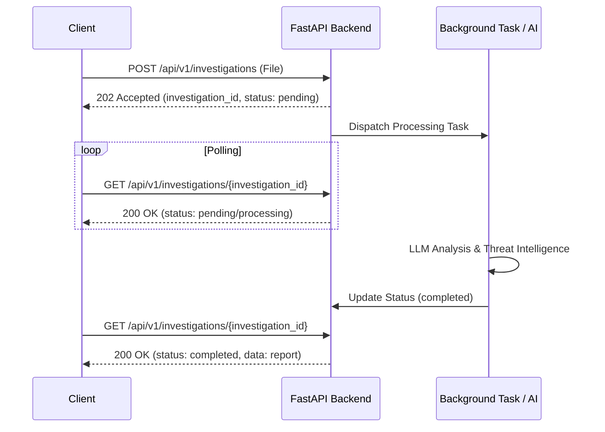
```mermaid
sequenceDiagram
    participant Client
    participant API as FastAPI Backend
    participant Worker as Background Task / AI

    Client->>API: POST /api/v1/investigations (File)
    API-->>Client: 202 Accepted (investigation_id, status: pending)
    API->>Worker: Dispatch Processing Task
    
    loop Polling
        Client->>API: GET /api/v1/investigations/{investigation_id}
        API-->>Client: 200 OK (status: pending/processing)
    end
    
    Worker->>Worker: LLM Analysis & Threat Intelligence
    Worker->>API: Update Status (completed)
    
    Client->>API: GET /api/v1/investigations/{investigation_id}
    API-->>Client: 200 OK (status: completed, data: report)
```

### 16.5.1 Create Investigation

Uploads a Wazuh JSON alert and initializes an asynchronous AI investigation.

- **Endpoint:** `POST /api/v1/investigations`
- **Content-Type:** `multipart/form-data`

**Request Parameters:**

| Field | Type | Required | Description |
| :--- | :--- | :--- | :--- |
| `file` | File | Yes | Wazuh alert JSON document. |

**Validation Constraints:**
- Extension: `.json` only.
- Maximum Size: 10 MB.
- Encoding: UTF-8.
- Schema: Valid JSON conforming to Wazuh alert structures.

**Success Response (HTTP 202 Accepted):**

```json
{
  "success": true,
  "message": "Investigation created and queued for processing.",
  "data": {
    "investigation_id": "inv_123456",
    "status": "pending"
  }
}
```

### 16.5.2 Retrieve Investigation

Retrieves the current status or final results of a specific investigation.

- **Endpoint:** `GET /api/v1/investigations/{investigation_id}`

**Path Parameters:**

| Parameter | Type | Required | Description |
| :--- | :--- | :--- | :--- |
| `investigation_id` | String | Yes | Unique identifier of the investigation. |

**Success Response (HTTP 200 OK):**

```json
{
  "success": true,
  "data": {
    "investigation_id": "inv_123456",
    "status": "completed",
    "severity": "High",
    "summary": "...",
    "mitre_tactics": [],
    "iocs": [],
    "recommendations": []
  }
}
```

### 16.5.3 List Investigations

Retrieves a paginated collection of historical investigations.

- **Endpoint:** `GET /api/v1/investigations`

**Query Parameters:**

| Parameter | Type | Required | Description |
| :--- | :--- | :--- | :--- |
| `page` | Integer | No | Page number (default: 1). |
| `page_size` | Integer | No | Items per page (default: 20). |
| `severity` | String | No | Filter by severity level (e.g., High, Critical). |
| `rule_id` | String | No | Filter by specific Wazuh rule ID. |
| `search` | String | No | Free-text search across investigation summaries. |
| `sort` | String | No | Sort order (e.g., `-created_at`). |

**Success Response (HTTP 200 OK):** 
Returns a paginated envelope containing a list of investigation summaries.

### 16.5.4 Delete Investigation

Removes an investigation record from the system.

- **Endpoint:** `DELETE /api/v1/investigations/{investigation_id}`
- **Success Response:** `HTTP 204 No Content`

## 16.6 Report API

Facilitates the exportation of completed investigations into portable formats.

### 16.6.1 Download PDF Report
- **Endpoint:** `GET /api/v1/reports/{investigation_id}/pdf`
- **Response:** `HTTP 200 OK` (`Content-Type: application/pdf`)

### 16.6.2 Download Markdown Report
- **Endpoint:** `GET /api/v1/reports/{investigation_id}/markdown`
- **Response:** `HTTP 200 OK` (`Content-Type: text/markdown`)

### 16.6.3 Regenerate Report
Reconstructs the report artifacts using the originally stored investigation data, useful if the reporting template is updated.
- **Endpoint:** `POST /api/v1/reports/{investigation_id}/regenerate`
- **Response:** `HTTP 200 OK`

## 16.7 Health API

Provides endpoints for infrastructure monitoring and deployment readiness checks.

### 16.7.1 System Health Check

- **Endpoint:** `GET /api/v1/health`
- **Success Response (HTTP 200 OK):**

```json
{
  "status": "healthy",
  "database": "connected",
  "ai_provider": "available",
  "version": "1.0.0"
}
```

## 16.8 System API

Exposes application metadata for frontend version alignment.

### 16.8.1 Application Metadata

- **Endpoint:** `GET /api/v1/version`
- **Success Response (HTTP 200 OK):**

```json
{
  "name": "AI SOC Copilot",
  "version": "1.0.0",
  "build_date": "2026-07-21",
  "api_version": "v1"
}
```

## 16.9 HTTP Status Codes

The API strictly adheres to standard HTTP status codes to indicate request outcomes.

| Code | Status | Usage |
| :--- | :--- | :--- |
| `200` | OK | Successful synchronous operation (e.g., GET). |
| `202` | Accepted | Asynchronous task accepted and queued (e.g., Investigation creation). |
| `204` | No Content | Successful resource deletion. |
| `400` | Bad Request | Malformed request syntax or invalid parameters. |
| `404` | Not Found | Requested resource (e.g., investigation ID) does not exist. |
| `413` | Payload Too Large | Uploaded file exceeds the 10 MB limit. |
| `415` | Unsupported Media Type | Content-Type is not JSON or file is not `.json`. |
| `422` | Unprocessable Entity | Payload fails schema validation constraints. |
| `429` | Too Many Requests | API or upstream AI provider rate limits exceeded. |
| `500` | Internal Server Error | Unhandled backend exception. |
| `503` | Service Unavailable | Required external service (e.g., LLM provider) is unreachable. |

## 16.10 Error Code Catalog

Application-specific error codes included in the standard error envelope.

| Error Code | Description |
| :--- | :--- |
| `INVALID_JSON` | The uploaded document is malformed or invalid JSON. |
| `INVALID_SCHEMA` | The JSON structure does not conform to the expected Wazuh alert format. |
| `FILE_TOO_LARGE` | The uploaded payload exceeds configured application limits. |
| `UNSUPPORTED_MEDIA_TYPE` | The submitted file type is explicitly rejected. |
| `INVESTIGATION_NOT_FOUND` | The specified investigation ID could not be located in the database. |
| `AI_TIMEOUT` | The external AI provider failed to respond within the configured timeout window. |
| `AI_PROVIDER_ERROR` | The external AI service returned an error or experienced a failure. |
| `REPORT_GENERATION_FAILED` | An internal error occurred while formatting the PDF or Markdown document. |
| `DATABASE_ERROR` | An exception occurred during a database read or write operation. |

## 16.11 Security Considerations

While user authentication is deferred in the MVP, foundational security measures must be implemented to protect the backend infrastructure:

- **Input Validation:** Enforce strict server-side validation against all incoming data via Pydantic schemas.
- **Payload Restrictions:** Strictly limit file upload sizes to prevent resource exhaustion (Denial of Service).
- **CORS Policies:** Restrict Cross-Origin Resource Sharing (CORS) strictly to approved frontend origins.
- **Credential Management:** External AI provider API keys must remain strictly on the backend and injected via secure environment variables.
- **Error Sanitization:** Ensure error responses do not leak stack traces or internal infrastructure details to the client.
- **Audit Logging:** Record significant API events (creation, deletion, external API failures) for diagnostic and security auditing purposes.

## 16.12 OpenAPI Documentation

FastAPI natively generates interactive, OpenAPI-compliant documentation. These interfaces provide self-documenting capabilities critical for frontend-backend alignment.

- **Swagger UI:** `/swagger`
- **ReDoc:** `/redoc`

*Note: These interfaces should remain accessible in development and staging environments to accelerate frontend integration and testing.*

## 16.13 API Design Summary

The AI SOC Copilot API architecture prioritizes robustness, predictability, and extensibility. By enforcing versioned REST paradigms, asynchronous processing workflows, standardized response envelopes, and rigorous input validation, the backend establishes a stable and scalable contract. This foundation effectively supports the MVP frontend while natively accommodating future requirements, including authentication frameworks, live SIEM integrations, and scalable task-queue processing.


---

# 17. Database Requirements

## 17.1 Purpose
This section defines the database architecture for the AI SOC Copilot. It details the logical data model, entity relationships, table specifications, indexing strategy, data constraints, and considerations for future scalability. The Minimum Viable Product (MVP) leverages PostgreSQL as the primary relational database and the SQLAlchemy Object-Relational Mapper (ORM) for data access.

The database architecture is designed to fulfill the following objectives:
*   **Data Ingestion:** Securely store uploaded Wazuh alerts.
*   **Data Processing:** Persist parsed and normalized alert data.
*   **Analysis Storage:** Save comprehensive AI-driven investigation results.
*   **Historical Tracking:** Maintain an immutable history of all investigations.
*   **Reporting:** Support on-demand generation of investigation reports.
*   **Extensibility:** Facilitate future enhancements, such as authentication, multi-tenancy, and live SIEM integrations, with minimal schema refactoring.

## 17.2 Database Technology Stack

| Component | Technology | Description |
| :--- | :--- | :--- |
| **Relational Database** | PostgreSQL 16+ | Primary data store ensuring ACID compliance. |
| **ORM Framework** | SQLAlchemy 2.x | Python SQL toolkit and Object Relational Mapper. |
| **Migration Management** | Alembic | Database migration tool for SQLAlchemy. |
| **Database Driver** | psycopg | PostgreSQL adapter for Python. |
| **Connection Pooling** | SQLAlchemy Engine | Robust connection pooling for efficient resource utilization. |

## 17.3 Database Design Principles
The schema architecture strictly adheres to the following core principles:
*   **Normalization:** Minimize data redundancy while ensuring query optimization and data integrity.
*   **Auditability:** Preserve the original, unaltered uploaded alert payload alongside all derived data and analyses.
*   **Extensibility:** Design loosely coupled entities to permit future additions (e.g., users, organizations, SIEM connectors) without requiring significant architectural redesigns.
*   **Traceability:** Guarantee that every investigation and analytical output can be definitively traced back to its originating alert.
*   **Evidence Preservation:** Enforce a write-once policy for the original alert data and the raw AI output to maintain cryptographic integrity and chain of custody.

## 17.4 Entity Relationship Overview

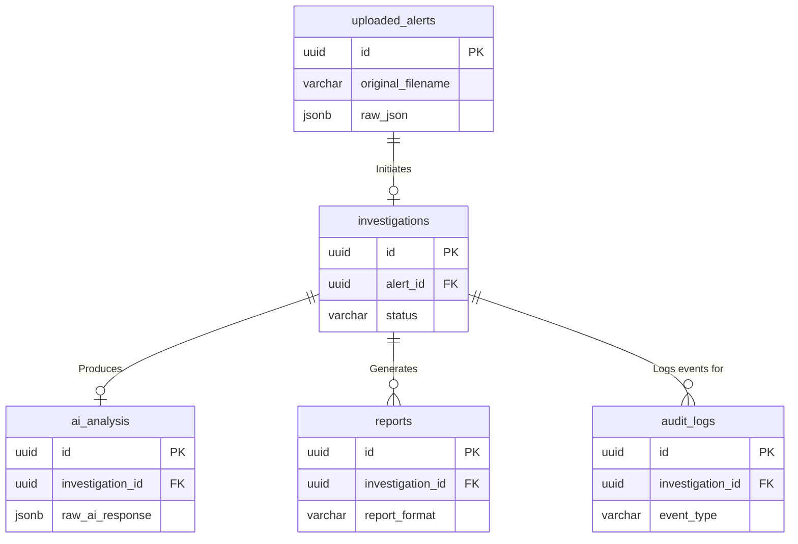
```mermaid
erDiagram
    uploaded_alerts ||--o| investigations : "Initiates"
    investigations ||--o| ai_analysis : "Produces"
    investigations ||--o{ reports : "Generates"
    investigations ||--o{ audit_logs : "Logs events for"

    uploaded_alerts {
        uuid id PK
        varchar original_filename
        jsonb raw_json
    }
    
    investigations {
        uuid id PK
        uuid alert_id FK
        varchar status
    }
    
    ai_analysis {
        uuid id PK
        uuid investigation_id FK
        jsonb raw_ai_response
    }
    
    reports {
        uuid id PK
        uuid investigation_id FK
        varchar report_format
    }
    
    audit_logs {
        uuid id PK
        uuid investigation_id FK
        varchar event_type
    }
```

> **Architecture Decision Record (ADR):** While the MVP could theoretically embed certain AI output fields directly within the `investigations` table, isolating `ai_analysis` ensures future flexibility. This segregation supports complex future requirements, such as iterative AI evaluations, diverse model integrations, and historical comparison of regenerated analyses.

## 17.5 Core Database Tables
The MVP schema comprises five primary relational tables:

| Table Name | Purpose |
| :--- | :--- |
| `uploaded_alerts` | Stores the original, immutable Wazuh alert payloads. |
| `investigations` | Manages the lifecycle, state, and metadata of security investigations. |
| `ai_analysis` | Persists the structured, parsed results generated by the AI models. |
| `reports` | Tracks the metadata and generation history of investigation reports. |
| `audit_logs` | Captures significant application events for security and compliance auditing. |

### 17.5.1 Table: `uploaded_alerts`
Purpose: Stores the original uploaded alert exactly as received from the user or system, serving as the immutable source of truth.

| Column | Type | Constraints | Description |
| :--- | :--- | :--- | :--- |
| `id` | `UUID` | Primary Key | Unique identifier for the uploaded alert. |
| `original_filename` | `VARCHAR(255)` | `NOT NULL` | The original filename of the uploaded payload. |
| `file_size` | `INTEGER` | `NOT NULL` | The payload file size in bytes. |
| `content_type` | `VARCHAR(100)` | `NOT NULL` | The MIME type of the uploaded payload. |
| `raw_json` | `JSONB` | `NOT NULL` | The exact, unmodified Wazuh JSON payload. |
| `upload_timestamp` | `TIMESTAMP WITH TIME ZONE` | `NOT NULL` | The precise timestamp of the initial upload. |
| `parser_status` | `VARCHAR(20)` | `NOT NULL` | The ingestion status (e.g., `Success`, `Failed`). |
| `validation_errors` | `JSONB` | `NULL` | Detailed error logs if the payload fails validation. |

**Indexes:**
*   Primary Key on `id`
*   B-tree index on `upload_timestamp` for chronological sorting and retention queries.

### 17.5.2 Table: `investigations`
Purpose: Tracks the end-to-end lifecycle and execution metadata of a discrete security investigation request.

| Column | Type | Constraints | Description |
| :--- | :--- | :--- | :--- |
| `id` | `UUID` | Primary Key | Unique identifier for the investigation. |
| `alert_id` | `UUID` | Foreign Key → `uploaded_alerts.id` | The source alert prompting the investigation. |
| `status` | `VARCHAR(30)` | `NOT NULL` | Current state (`Pending`, `Processing`, `Completed`, `Failed`). |
| `severity` | `VARCHAR(20)` | `NULL` | The severity rating assigned by the AI model. |
| `started_at` | `TIMESTAMP WITH TIME ZONE` | `NOT NULL` | The initiation timestamp of the investigation. |
| `completed_at` | `TIMESTAMP WITH TIME ZONE` | `NULL` | The completion timestamp of the investigation. |
| `processing_time_ms` | `INTEGER` | `NULL` | The total execution duration in milliseconds. |
| `ai_model` | `VARCHAR(100)` | `NULL` | The specific LLM or AI model utilized. |
| `prompt_version` | `VARCHAR(20)` | `NULL` | The version control identifier of the prompt template used. |
| `owner_id` | `UUID` | `NULL` | Reserved column for future authentication and multi-tenancy support. |

**Indexes:**
*   B-tree index on `status` to optimize queue polling.
*   B-tree index on `severity` for dashboard filtering.
*   B-tree index on `started_at` for chronological queries.

### 17.5.3 Table: `ai_analysis`
Purpose: Stores the structured, parsed intelligence and raw outputs generated by the AI model during an investigation.

| Column | Type | Constraints | Description |
| :--- | :--- | :--- | :--- |
| `id` | `UUID` | Primary Key | Unique identifier for the analysis record. |
| `investigation_id` | `UUID` | Foreign Key → `investigations.id` | The parent investigation context. |
| `executive_summary` | `TEXT` | `NOT NULL` | A high-level, management-focused overview of the findings. |
| `plain_english_explanation`| `TEXT` | `NOT NULL` | An analyst-friendly, narrative explanation of the threat. |
| `mitre_mapping` | `JSONB` | `NULL` | Extracted MITRE ATT&CK tactics and techniques. |
| `indicators_of_compromise` | `JSONB` | `NULL` | Structured list of extracted IOCs (IPs, hashes, domains). |
| `attack_narrative` | `TEXT` | `NULL` | The AI's chronological interpretation of the attack progression. |
| `business_impact` | `TEXT` | `NULL` | The potential operational or security impact to the organization. |
| `recommendations` | `JSONB` | `NULL` | Actionable, prioritized response recommendations. |
| `next_steps` | `JSONB` | `NULL` | Suggested follow-up investigatory actions. |
| `confidence_level` | `VARCHAR(20)` | `NULL` | The AI's confidence rating (`Low`, `Medium`, `High`). |
| `raw_ai_response` | `JSONB` | `NOT NULL` | The complete, unmodified structured response from the LLM. |

**Indexes:**
*   B-tree index on `investigation_id` for efficient joins.
*   *Optional:* GIN index on `mitre_mapping` and `indicators_of_compromise` to support future advanced threat hunting and correlation capabilities.

### 17.5.4 Table: `reports`
Purpose: Tracks the generation metadata of investigation reports.

| Column | Type | Constraints | Description |
| :--- | :--- | :--- | :--- |
| `id` | `UUID` | Primary Key | Unique identifier for the report generation event. |
| `investigation_id` | `UUID` | Foreign Key → `investigations.id` | The parent investigation context. |
| `report_format` | `VARCHAR(20)` | `NOT NULL` | The document format (e.g., `PDF`, `Markdown`). |
| `generated_at` | `TIMESTAMP WITH TIME ZONE` | `NOT NULL` | The precise generation timestamp. |
| `report_version` | `VARCHAR(20)` | `NOT NULL` | The version control identifier of the report template used. |

> **Architecture Decision Record (ADR):** For the MVP, physical report artifacts are generated synchronously on-demand rather than being persisted to long-term storage (e.g., S3 or local disk). This strategy minimizes storage overhead and ensures users always receive the most up-to-date rendering of the investigation data, eliminating the risk of stale report copies.

### 17.5.5 Table: `audit_logs`
Purpose: Captures a chronological, immutable ledger of significant application events for security, auditing, and debugging purposes.

| Column | Type | Constraints | Description |
| :--- | :--- | :--- | :--- |
| `id` | `UUID` | Primary Key | Unique identifier for the audit event. |
| `event_type` | `VARCHAR(100)` | `NOT NULL` | The standardized event category (e.g., `ALERT_UPLOADED`, `INVESTIGATION_STARTED`). |
| `investigation_id` | `UUID` | `NULL` | The related investigation context, if applicable. |
| `event_timestamp` | `TIMESTAMP WITH TIME ZONE` | `NOT NULL` | The exact timestamp of the event occurrence. |
| `details` | `JSONB` | `NULL` | Contextual metadata specific to the event type. |

**Event Type Examples:**
*   `alert_uploaded`
*   `investigation_started`
*   `ai_analysis_completed`
*   `report_generated`
*   `investigation_deleted`

## 17.6 Relationships Overview
The schema enforces strong referential integrity through well-defined cardinality:

| Parent Entity | Child Entity | Relationship | Description |
| :--- | :--- | :--- | :--- |
| `uploaded_alerts` | `investigations` | 1 : 1 | Each uploaded payload triggers exactly one initial investigation. |
| `investigations` | `ai_analysis` | 1 : 1 | The MVP supports a single, definitive AI analysis per investigation. |
| `investigations` | `reports` | 1 : Many | An investigation can generate multiple reports in various formats over time. |
| `investigations` | `audit_logs` | 1 : Many | An investigation will generate multiple lifecycle audit events. |

## 17.7 Indexing Strategy
To ensure optimal query performance and system responsiveness as the dataset scales, the following indexing strategy is implemented:

*   **B-tree Indexes:** Applied to highly selective columns utilized in common `WHERE` clauses and `ORDER BY` operations:
    *   `investigations.status` (Queue management)
    *   `investigations.severity` (Filtering)
    *   `uploaded_alerts.upload_timestamp` (Chronological sorting)
    *   `investigations.started_at` (Chronological sorting)
*   **GIN Indexes (Future Consideration):** Generalized Inverted Indexes on `JSONB` columns (e.g., `ai_analysis.indicators_of_compromise`) are reserved for post-MVP implementation to support advanced text search and complex JSON querying.

## 17.8 Data Retention
The MVP implements a permissive data retention policy to maximize early data collection for model tuning and product analytics:

*   **Uploaded Alerts:** Retained indefinitely.
*   **Investigation History:** Retained indefinitely.
*   **Report Files:** Ephemeral; generated dynamically on demand.
*   **Audit Logs:** Retained indefinitely.

*Future Roadmap:* Post-MVP phases will introduce configurable, policy-driven data retention lifecycle management, including automated archival to cold storage and hard deletion mechanisms for compliance (e.g., GDPR, CCPA).

## 17.9 Backup and Recovery
While the MVP architecture prioritizes a lightweight and cost-effective deployment profile, standard disaster recovery procedures are mandatory:

*   **Automated Backups:** Daily automated snapshots of the PostgreSQL volume.
*   **Point-in-Time Recovery (PITR):** Utilized if supported by the underlying hosting infrastructure (e.g., AWS RDS, Managed PostgreSQL).
*   **Validation:** Routine, documented testing of restoration procedures must be conducted prior to production deployment to ensure RTO/RPO compliance.

## 17.10 Future Schema Extensions
The current schema proactively provisions logical space for future enterprise capabilities without necessitating fundamental architectural refactoring. Anticipated future entities include:

*   `users` and `organizations` (Multi-tenancy)
*   `roles` and `permissions` (RBAC)
*   `api_keys` (Programmatic access)
*   `siem_connectors` (Live data ingestion)
*   `threat_intelligence` (External TI feeds)
*   `cases` (Grouping related investigations)
*   `comments` and `attachments` (Collaboration)
*   `notifications` (Alerting mechanisms)

## 17.11 Database Design Summary
The database architecture for the AI SOC Copilot is fundamentally designed around the principles of evidence preservation, end-to-end traceability, and enterprise extensibility. Original alert payloads are strictly immutable, AI-generated intelligence is decoupled for flexibility, and the `investigation` entity serves as the central relational nexus, unifying ingestion, analysis, reporting, and audit trails into a cohesive security narrative.


---

# 18. AI Workflow

## 18.1 Purpose

This section defines the end-to-end Artificial Intelligence (AI) workflow for the AI SOC Copilot. It details the transformation of raw Wazuh alerts into structured, actionable cybersecurity investigations leveraging a Large Language Model (LLM).

The workflow is architected around the following core principles:
* **Evidence-Based Reasoning**: Conclusions must be directly supported by alert data.
* **Structured Output Generation**: Responses must conform to strict JSON schemas for automated processing.
* **Transparency**: Clear delineation between observed evidence and AI-inferred conclusions.
* **Reliability & Resilience**: Built-in validation, error handling, and retry mechanisms.
* **Extensibility**: Abstracted provider interfaces to support future model integrations.
* **Cost Efficiency**: Optimized token consumption and prompt management.

> [!IMPORTANT]  
> The AI functions strictly as an investigation assistant, not an autonomous decision-maker. All AI-generated conclusions are advisory and require human analyst review.

## 18.2 AI Workflow Overview

The following diagram illustrates the complete data flow from alert ingestion to final report generation:

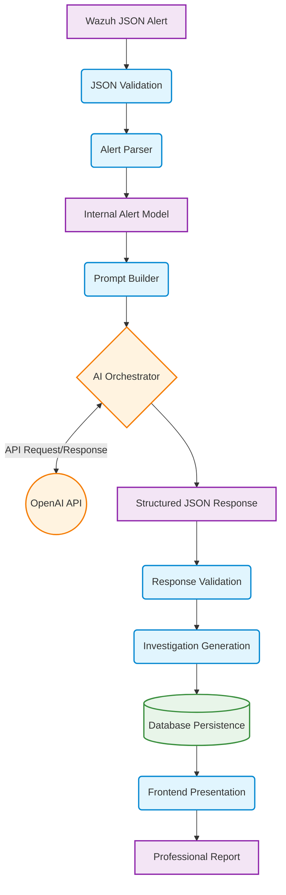
```mermaid
flowchart TD
    A[Wazuh JSON Alert] --> B(JSON Validation)
    B --> C(Alert Parser)
    C --> D[Internal Alert Model]
    D --> E(Prompt Builder)
    E --> F{AI Orchestrator}
    F <-->|API Request/Response| G((OpenAI API))
    F --> H[Structured JSON Response]
    H --> I(Response Validation)
    I --> J(Investigation Generation)
    J --> K[(Database Persistence)]
    K --> L(Frontend Presentation)
    L --> M[Professional Report]

    classDef default fill:#f9f9f9,stroke:#333,stroke-width:2px;
    classDef process fill:#e1f5fe,stroke:#0288d1,stroke-width:2px;
    classDef data fill:#f3e5f5,stroke:#8e24aa,stroke-width:2px;
    classDef external fill:#fff3e0,stroke:#f57c00,stroke-width:2px;
    classDef storage fill:#e8f5e9,stroke:#388e3c,stroke-width:2px;

    class B,C,E,I,J,L process;
    class A,D,H,M data;
    class F,G external;
    class K storage;
```

## 18.3 AI Workflow Objectives

The primary objectives of the AI processing engine are to:
* **Synthesize Explanations**: Translate technical alert telemetry into clear, plain-English summaries.
* **Identify Attack Techniques**: Deduce probable methodologies employed by the threat actor.
* **Map to MITRE ATT&CK**: Align identified behaviors with specific MITRE ATT&CK tactics and techniques.
* **Extract IOCs**: Identify and categorize relevant Indicators of Compromise (e.g., IPs, hashes, domains).
* **Assess Severity**: Provide a contextual severity estimation based on the aggregated evidence.
* **Construct Attack Narratives**: Build a coherent timeline and narrative of the potential incident.
* **Recommend Remediation**: Prescribe specific, actionable response steps for containment and eradication.
* **Guide Investigations**: Suggest logical follow-up actions for analysts to validate findings.
* **Produce Structured Output**: Generate deterministic, schema-validated JSON to drive downstream reporting and UI rendering.

## 18.4 AI Pipeline Stages

The investigation pipeline consists of eight distinct sequential stages, transitioning from raw data ingestion to user presentation.

| Stage | Name | Primary Function |
| :--- | :--- | :--- |
| **1** | **Alert Validation** | Verifies the structural integrity and source schema of the incoming payload. |
| **2** | **Alert Parsing** | Extracts relevant telemetry into a structured internal format. |
| **3** | **Prompt Construction** | Assembles context-aware prompts using predefined templates and parsed data. |
| **4** | **AI Orchestration** | Manages LLM API interactions, including request dispatch, timeouts, and retries. |
| **5** | **AI Investigation** | The LLM processes the prompt and generates the analytical response. |
| **6** | **Response Validation** | Ensures the LLM output strictly adheres to the required JSON schema and business rules. |
| **7** | **Persistence** | Commits the validated investigation record to the database. |
| **8** | **Presentation** | Renders the investigation data within the frontend application for analyst review. |

## 18.5 Stage 1: Alert Validation

**Responsibilities:**
* **Syntax Verification**: Ensure the uploaded payload is well-formed JSON.
* **Schema Conformance**: Validate that the payload aligns with the expected Wazuh alert schema.
* **Error Handling**: Immediately reject malformed or unrecognized payloads, returning appropriate error codes.
* **Evidence Preservation**: Retain the original, unmodified raw payload for audit and forensic purposes.

**Output:** A syntactically and structurally validated JSON alert object.

## 18.6 Stage 2: Alert Parsing

The parser extracts critical security telemetry from the validated JSON to populate the internal data model. Extracted fields include, but are not limited to:
* **Rule Metadata**: `rule.id`, `rule.description`, `rule.level`
* **Agent Context**: `agent.name`, `agent.id`
* **Network Context**: `srcip`, `dstip`, `srcport`, `dstport`
* **Host & Process Context**: `hostname`, `user.name`, `process.name`, `process.command_line`
* **File & Artifact Context**: `file.path`, `file.hash.*`
* **System Context**: `decoder.name`, `timestamp`, `full_log`

**Output:** A normalized, strongly-typed internal alert model, optimized for prompt generation.

## 18.7 Stage 3: Prompt Construction

The Prompt Builder dynamically synthesizes the normalized alert model into a highly structured prompt optimized for LLM comprehension.

**Prompt Components:**
1. **System Instructions**: Defines the persona, role, and operational boundaries of the AI.
2. **Investigation Objective**: Clearly states the goal of analyzing the specific alert.
3. **Contextual Data**: Injects the parsed alert fields (evidence).
4. **Schema Definition**: Explicitly defines the required JSON output structure.
5. **Constraints**: Specifies limitations (e.g., prohibition against hallucinating data).
6. **Reasoning Guidance**: Instructs the model on analytical methodologies (e.g., step-by-step deduction).

**Design Principles:**
* **Deterministic Templates**: Utilize rigid templates to ensure consistent prompt generation.
* **Data Minimization**: Exclude irrelevant alert fields to reduce noise and token consumption.
* **Evidence vs. Inference Separation**: Enforce strict demarcation between provided telemetry and AI-generated hypotheses.
* **Version Control**: Maintain version histories for prompt templates to facilitate A/B testing and iterative refinement.

## 18.8 Stage 4: AI Orchestration

The AI Orchestrator acts as the central control plane for all LLM interactions, abstracting provider complexities from the core business logic.

**Responsibilities:**
* **Provider Routing**: Select and initialize the appropriate AI provider client.
* **Request Lifecycle Management**: Submit API requests, enforce strict timeouts, and implement exponential backoff for transient failures (e.g., rate limits).
* **Telemetry & Accounting**: Accurately track prompt and completion token usage, and record end-to-end processing latency.
* **Response Handling**: Capture the raw provider response for downstream validation.

## 18.9 Stage 5: AI Investigation & Output Schema

During this stage, the LLM processes the prompt and executes the analytical reasoning pipeline. The output **must** strictly conform to a predefined JSON schema representing the investigation object.

**Required JSON Output Schema:**

```json
{
  "executive_summary": "Brief, high-level summary of the incident.",
  "plain_english_explanation": "Detailed explanation of the technical alert in accessible language.",
  "severity": "Critical | High | Medium | Low | Informational",
  "confidence": "High | Medium | Low",
  "mitre": [
    { "tactic": "TA0001", "technique": "T1078", "name": "Valid Accounts" }
  ],
  "iocs": [
    { "type": "ip", "value": "192.168.1.100", "description": "Command and control server" }
  ],
  "attack_narrative": "Chronological description of the suspected attack chain.",
  "business_impact": "Potential consequences if the attack is successful.",
  "recommendations": [
    "Immediate actions for containment and eradication."
  ],
  "next_steps": [
    "Follow-up investigative actions."
  ]
}
```

## 18.10 Stage 6: Response Validation

The backend rigorously validates the LLM's response against the required schema before persistence.

**Validation Criteria:**
* **JSON Integrity**: Ensures the payload is valid, parseable JSON.
* **Schema Adherence**: Verifies the presence of all required fields and absence of extraneous elements.
* **Type Checking**: Confirms correct data types (e.g., arrays for IOCs, strings for narratives).
* **Enum Validation**: Ensures categorical fields (e.g., `severity`, `confidence`) contain only permitted values.
* **Heuristic Checks**: Validates reasonable response lengths to detect truncated or anomalous outputs.

**Failure Handling:**
1. If validation fails, automatically retry the AI request up to a configurable threshold (e.g., 2 retries).
2. Log detailed validation errors for prompt engineering adjustments.
3. If retries are exhausted, gracefully degrade and return a standard error to the user interface, preserving the underlying alert data.

## 18.11 Quality Assurance: Confidence & Hallucination Mitigation

Ensuring the reliability of AI outputs is critical for security operations. The workflow implements specific mechanisms to assess confidence and mitigate hallucinations.

### 18.11.1 Confidence Assessment

The AI must assign a confidence score to its investigation, reflecting the quality and completeness of the provided evidence, not absolute certainty.

| Confidence Level | Definition |
| :--- | :--- |
| **High** | Conclusions are heavily supported by deterministic evidence within the alert (e.g., known bad hashes, direct command execution). |
| **Medium** | Evidence generally supports the findings, but relies on some heuristic or behavioral inferences. |
| **Low** | Evidence is sparse or highly ambiguous. Conclusions are speculative and require significant manual validation. |

### 18.11.2 Hallucination Mitigation Strategies

To prevent the LLM from fabricating data or unsupported narratives, the pipeline enforces the following constraints:
* **Strict Grounding**: Prompts explicitly instruct the model to base conclusions *only* on the provided parsed alert data.
* **Structural Constraints**: The enforced JSON schema limits the model's ability to generate free-form, unconstrained narratives.
* **Evidence vs. Interpretation**: Prompts require the model to distinguish between observed facts and analytical hypotheses.
* **Graceful Degradation**: The model is instructed to output "Insufficient evidence" in relevant fields when data is lacking, rather than inventing details.

## 18.12 Operational Controls

### 18.12.1 Token & Cost Management

To optimize operational expenditure regarding LLM API usage, the system implements several token management strategies:
* **Payload Truncation**: Exclude verbose or low-value fields from the raw alert prior to prompt construction.
* **Usage Telemetry**: Continuously monitor and log prompt and completion token counts per request.
* **Cost Attribution**: Calculate and record the estimated financial cost per investigation based on current provider pricing.
* **Future Optimization**: Architecture supports the future implementation of prompt caching for recurring alert types.

### 18.12.2 Exception & Error Handling

The Orchestrator implements robust handling for common API failure modes:

| Failure Mode | Handling Strategy |
| :--- | :--- |
| **API Timeout** | Execute one immediate retry; if failed, surface a timeout error to the user. |
| **Rate Limit (429)** | Implement exponential backoff for automated retries; notify user if limit persists. |
| **Invalid JSON Schema** | Automatically retry up to the configured validation retry limit. |
| **Provider Outage** | Mark investigation as 'Failed', preserve the parsed alert for manual review or later processing. |

## 18.13 Architecture: Provider Abstraction

To ensure vendor neutrality and facilitate future migrations, the backend communicates with LLMs via a standardized abstraction layer (the AI Orchestrator), rather than direct, hardcoded SDK integrations.

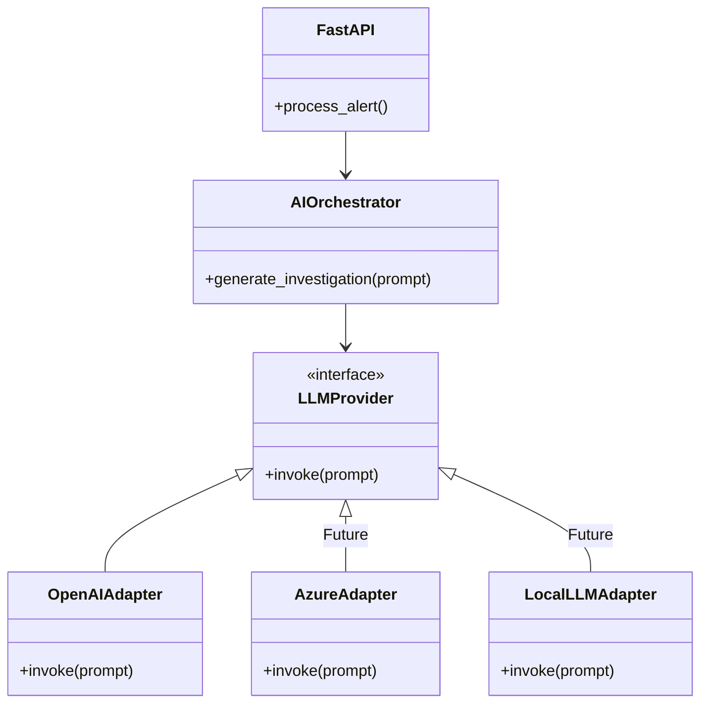
```mermaid
classDiagram
    class FastAPI {
        +process_alert()
    }
    class AIOrchestrator {
        +generate_investigation(prompt)
    }
    class LLMProvider {
        <<interface>>
        +invoke(prompt)
    }
    class OpenAIAdapter {
        +invoke(prompt)
    }
    class AzureAdapter {
        +invoke(prompt)
    }
    class LocalLLMAdapter {
        +invoke(prompt)
    }
    
    FastAPI --> AIOrchestrator
    AIOrchestrator --> LLMProvider
    LLMProvider <|-- OpenAIAdapter
    LLMProvider <|-- AzureAdapter : Future
    LLMProvider <|-- LocalLLMAdapter : Future
```

This adapter pattern minimizes the engineering effort required to switch models or support self-hosted LLM deployments.

## 18.14 Future AI Enhancements

The current architecture establishes a foundation for advanced AI capabilities on the roadmap, including:
* **Retrieval-Augmented Generation (RAG)**: Contextualizing alerts with historical incident data and internal knowledge bases.
* **Automated Threat Intelligence (CTI) Enrichment**: Pre-fetching context for IPs/hashes before prompt construction.
* **Multi-Agent Orchestration**: Utilizing frameworks like LangGraph for complex, multi-step investigation planning.
* **Cross-Alert Correlation**: Analyzing batches of alerts to reconstruct broader attack campaigns.
* **Conversational Interface**: Enabling analysts to query the AI interactively regarding specific investigations.

## 18.15 Summary

The AI workflow provides a controlled, evidence-based pipeline for transforming raw Wazuh alerts into structured, actionable investigations. By strictly decoupling prompt construction, provider orchestration, response validation, and persistence, the architecture ensures reliability, vendor flexibility, and maintainability. Crucially, by enforcing structured output and confidence scoring, the system prioritizes transparency and positions the AI as an auditable assistant to the human analyst.


---

# 19. Incident Investigation Workflow

## 19.1 Purpose

This section defines the end-to-end operational workflow for investigating Wazuh security alerts using AI SOC Copilot. It delineates the sequence of user interactions, backend data processing, AI-driven analysis, report generation, and data persistence mechanisms. 

The workflow is designed to ensure that all incident investigations are repeatable, transparent, traceable, evidence-based, and tailored for professional Security Operations Center (SOC) environments. The Minimum Viable Product (MVP) explicitly supports manual investigation processes initiated via uploaded Wazuh JSON alerts.

## 19.2 Investigation Lifecycle Overview

The investigation lifecycle dictates the state progression of an alert from ingestion to final reporting.

```mermaid
flowchart TD
    A[Upload Alert] --> B[Validate Alert]
    B --> C[Parse Alert]
    C --> D[Create Investigation]
    D --> E[AI Analysis]
    E --> F[Validate AI Output]
    F --> G[Save Investigation]
    G --> H[Display Results]
    H --> I[Generate Report]
    I --> J([Investigation Complete])
```

## 19.3 Workflow Actors

The workflow relies on the interaction between human operators and system components to execute investigations successfully.

| Actor | Responsibility |
| :--- | :--- |
| **SOC Analyst** | Uploads alert data, reviews AI-generated findings, and exports investigation reports. |
| **AI SOC Copilot** | Orchestrates the workflow by parsing alerts, coordinating AI analysis, and generating reports. |
| **OpenAI API** | Processes parsed alert data to produce structured, analytical investigation outputs. |
| **PostgreSQL Database** | Persists alerts, investigation records, and associated system metadata securely. |

## 19.4 Investigation States

Each investigation progresses through a strictly defined state machine. All state transitions are actively logged to maintain an audit trail and facilitate system troubleshooting.

| State | Description |
| :--- | :--- |
| **Uploaded** | The alert payload has been successfully received by the backend. |
| **Validating** | The system is verifying JSON integrity and schema compliance. |
| **Parsing** | The Wazuh alert payload is undergoing data normalization and extraction. |
| **Processing** | The AI Orchestrator is actively analyzing the alert data. |
| **Completed** | The investigation workflow has concluded successfully. |
| **Failed** | The investigation encountered a terminal error and could not proceed. |

## 19.5 Detailed Workflow

### Phase 1: Alert Ingestion (Upload)
- **User Action:** The SOC Analyst selects a valid Wazuh JSON alert file via the UI and initiates the investigation.
- **System Action:** The backend verifies the file type and size constraints, archives the original file metadata, and provisions a unique Investigation ID.

### Phase 2: Alert Validation
The system performs rigorous validation to ensure payload integrity before processing:
- JSON syntax verification.
- Wazuh schema compatibility checks.
- Presence validation for required fields.
- UTF-8 encoding verification.
- Enforced file size limits.

If validation fails, the system immediately transitions the investigation state to **Failed** and returns a descriptive error message to the user.

### Phase 3: Alert Parsing
The parser normalizes the payload, extracting critical evidentiary data while strictly preserving the original JSON alert for forensic integrity. Key extracted fields include:
- Rule information and taxonomy.
- Agent details (ID, name, IP).
- Event timestamps.
- Network routing data (Source/Destination IPs).
- User context.
- Process execution details (Command Line, Process ID).
- Relevant file paths.
- Raw log entries.

### Phase 4: Investigation Instantiation
The system initializes a new database record for the investigation, persisting initial metadata:
- Investigation ID
- Current State
- Start Timestamp
- Wazuh Alert Reference
- Processing Metadata

### Phase 5: AI-Driven Analysis
The AI Orchestrator assumes control of the analytic process:
1. **Prompt Construction:** Compiles the structured prompt utilizing the parsed alert data.
2. **LLM Invocation:** Dispatches the prompt to the OpenAI API for processing.
3. **Response Reception:** Retrieves the generated analysis.
4. **Output Validation:** Verifies the response conforms to the expected JSON schema.

Expected structured outputs include:
- Executive Summary
- Plain-English Technical Explanation
- Assessed Severity Level
- MITRE ATT&CK Framework Mapping
- Indicators of Compromise (IOCs) extraction
- Attack Narrative construction
- Potential Business Impact assessment
- Actionable Remediation Recommendations
- Prescriptive Next Steps

### Phase 6: Investigation Persistence
The backend commits the finalized investigation data to the PostgreSQL database. Persisted elements include:
- Core investigation metadata.
- The complete AI analysis payload.
- The specific prompt version utilized.
- AI processing duration metrics.
- Output confidence levels.
- Comprehensive audit event logs.

### Phase 7: Result Presentation
The frontend application renders the investigation findings in a structured, accessible layout:
- Overview Dashboard
- Alert Details Panel
- AI Explanation & Narrative
- MITRE ATT&CK Matrix Mapping
- IOC Table
- Recommendations & Next Steps

The original, unmodified alert payload remains securely accessible alongside the AI-generated insights.

### Phase 8: Report Generation
The SOC Analyst can trigger on-demand export of the investigation findings. 
- **Formats Supported:** PDF, Markdown.
- **Content Included:** Investigation summary, alert parameters, AI findings, MITRE mappings, IOCs, and recommendations.

## 19.6 Workflow Activity Diagram

```mermaid
sequenceDiagram
    actor Analyst
    participant UI as Frontend UI
    participant API as Backend API
    participant AI as AI Orchestrator
    participant DB as Database

    Analyst->>UI: Upload Wazuh JSON Alert
    UI->>API: POST /api/investigate
    API->>API: Validate Payload
    alt Validation Failed
        API-->>UI: 400 Bad Request (Error Details)
    else Validation Passed
        API->>API: Parse Alert Data
        API->>DB: Create Investigation Record
        API->>AI: Trigger Analysis
        AI->>AI: Build Prompt & Call LLM
        AI->>AI: Validate AI Response
        alt Response Invalid
            AI->>AI: Retry API Call
            alt Retry Failed
                AI-->>API: Analysis Failed
                API->>DB: Update State to Failed
                API-->>UI: 500 Internal Error (AI Failure)
            end
        else Response Valid
            AI-->>API: Structured Analysis Data
            API->>DB: Persist Investigation Results
            API-->>UI: 200 OK (Investigation Data)
            UI-->>Analyst: Display Investigation Dashboard
            Analyst->>UI: Request Report Export
            UI->>API: GET /api/reports/{id}
            API-->>UI: PDF/Markdown Document
        end
    end
```

## 19.7 Error Handling Workflow

The system implements robust error handling to guarantee data integrity and provide actionable feedback to users.

| Failure Point | System Behavior |
| :--- | :--- |
| **Invalid File Type/Size** | Immediately reject the upload and surface a validation error in the UI. |
| **Unsupported Schema** | Halt processing and present an error detailing the schema incompatibility. |
| **Parsing Failure** | Abort processing, mark the investigation state as `Failed`, and log the exact parsing exception. |
| **AI Request Timeout** | Automatically retry the LLM invocation up to a configured threshold before failing. |
| **AI Provider Outage** | Preserve the ingested alert data and present a manual retry option to the analyst. |
| **Database Transaction Failure**| Roll back the current transaction, preventing partial commits, and log the failure. |
| **Report Generation Error** | Return an export failure notification to the UI while ensuring the underlying investigation data remains intact. |

## 19.8 Investigation Timeline Service Level Objectives (SLOs)

The system targets specific latency constraints for a typical investigation workflow to ensure a responsive analyst experience. These targets are subject to variable network conditions and external AI provider latency.

| Processing Stage | Target Latency |
| :--- | :--- |
| Upload & Validation | < 2 seconds |
| Alert Parsing | < 1 second |
| AI Request (LLM Inference) | 5–30 seconds |
| AI Response Validation | < 1 second |
| Database Persistence | < 1 second |
| Report Generation (PDF/Markdown) | < 5 seconds |

## 19.9 Investigation Audit Trail

To ensure strict operational traceability and support potential compliance mandates, the system records distinct lifecycle events within an immutable audit log:

- Alert Payload Uploaded
- Payload Validation Completed
- Alert Data Parsed Successfully
- AI Inference Request Dispatched
- AI Inference Response Received
- Investigation Workflow Completed Successfully
- Investigation Report Generated/Exported
- Investigation Record Deleted (if applicable)

## 19.10 Future Workflow Enhancements

While the MVP focuses on manual, synchronous alert processing, future iterations will extend the workflow capabilities to encompass:

- **Automated Alert Ingestion:** Direct API integration with the Wazuh manager for real-time alert forwarding.
- **Asynchronous Processing:** Implementation of message queues and background workers for handling high-volume investigations.
- **Threat Intelligence (TI) Enrichment:** Automated cross-referencing of IOCs against external TI feeds prior to LLM analysis.
- **Collaborative Workspaces:** Features enabling analyst comments, annotations, and shared case management.
- **SOAR Integration:** Facilitating automated remediation and response actions directly from the platform.
- **Approval Workflows:** Multi-tiered review processes for investigation closure and response authorization.

## 19.11 Investigation Workflow Summary

The AI SOC Copilot investigation workflow establishes a structured, robust pipeline that transforms raw, manually uploaded Wazuh alerts into comprehensive, professional incident investigations. By explicitly decoupling user interaction, backend data processing, AI inference, and report generation, the architecture guarantees that operations remain highly transparent, strictly auditable, and easily extensible for future enterprise integrations.


---

# 20. User Interface (UI) Screens

## 20.1 Purpose
This section defines the User Interface (UI) specifications for the AI SOC Copilot application. Each screen specification details the underlying purpose, layout structure, constituent components, user interactions, and expected system behaviors. 

The Minimum Viable Product (MVP) adheres to the following core User Experience (UX) principles:
* **Simplicity Over Complexity:** Prioritize straightforward workflows.
* **Desktop-First Responsive Web Design:** Optimize for large monitors typically utilized by Security Operations Center (SOC) analysts.
* **Minimal Cognitive Load:** Present data clearly to accelerate threat comprehension.
* **Clear Information Hierarchy:** Ensure critical alerts and findings are immediately identifiable.
* **Consistent Visual Language:** Standardize components across all screens.
* **Accessibility:** Implement baseline accessibility standards where practical.

## 20.2 Application Navigation
The MVP implements an intentionally streamlined primary navigation model to minimize distraction.

| Navigation Item | Destination / Action | Description |
| :--- | :--- | :--- |
| **Dashboard** | `/dashboard` | Landing page providing system overview and metrics. |
| **New Investigation** | `/investigate/new` | Interface for uploading Wazuh alerts and initiating analysis. |
| **Investigation History** | `/history` | Searchable ledger of past AI investigations. |
| **Settings** | *(Future)* | System and user preference configuration. |
| **About** | `/about` | Application metadata and licensing information. |

## 20.3 Screen 1: Dashboard
### Purpose
The Dashboard functions as the primary landing interface, delivering an aggregated view of recent investigations and exposing direct access points to core analytical workflows.

### Components
* **Application Logo & Welcome Message**
* **Primary Call to Action:** "Start New Investigation" button
* **Recent Investigations Data Table**
* **Telemetry & Metrics Widgets:**
  * Total Investigations Processed
  * High Severity Alerts Detected
  * Average AI Investigation Duration

### User Actions
* Initiate a new investigation workflow.
* Open and review a historically processed investigation.
* Execute queries against the investigation history.

### Empty State
If no data exists: *"No investigations yet. Upload your first Wazuh JSON alert to begin."*

## 20.4 Screen 2: New Investigation
### Purpose
Provides a secure ingestion point for analysts to upload Wazuh JSON alerts and trigger the AI-driven investigation pipeline.

### Components
* **Dropzone:** File upload area supporting drag-and-drop and standard OS file picker mechanisms.
* **Constraints Notices:** Clear indicators for supported file formats and maximum upload size limits.
* **Controls:** "Start Investigation" (Submit) and "Cancel" buttons.

### Validation Rules
* **Format Restriction:** Strictly accepts `.json` extensions.
* **Size Restriction:** Imposes a hard limit of 10 MB per file.
* **Feedback:** Surfaces deterministic validation messages upon constraint violations.

### Error States
* Invalid or malformed JSON payload.
* Unsupported or unrecognized alert schema.
* Payload exceeds maximum permissible file size.
* Transport-level upload failure.

## 20.5 Screen 3: Investigation Progress
### Purpose
Delivers real-time, deterministic feedback while the backend AI inference engine processes the uploaded alert, mitigating user uncertainty during asynchronous operations.

### Components
* **Stateful Progress Indicator:** Utilizes a discrete, step-based visualization rather than an arbitrary percentage loader.
* **Contextual Data:** Displays current processing stage, assigned Investigation ID, and estimated completion parameters.

### Example Processing Pipeline Steps
| Stage | Status Indicator | Description |
| :--- | :--- | :--- |
| **Alert Uploaded** | Completed (✓) | Payload successfully transferred to the server. |
| **Validation Complete** | Completed (✓) | Schema verified and payload authenticated. |
| **Parsing Alert** | Completed (✓) | JSON ingested and normalized into system structures. |
| **AI Investigation** | In Progress (⏳) | Large Language Model (LLM) analyzing telemetry data. |
| **Saving Results** | Pending (○) | Persisting analysis output to the database. |
| **Ready** | Pending (○) | Investigation complete and ready for analyst review. |

## 20.6 Screen 4: Investigation Results
### Purpose
Presents the comprehensive, AI-generated threat analysis in a highly structured, scannable format optimized for rapid analyst comprehension.

### Layout Hierarchy
The interface is partitioned into logical investigative modules:
1. **Investigation Summary:** Executive overview of the threat.
2. **Alert Details:** Raw and normalized telemetry from the original Wazuh alert.
3. **Plain-English Explanation:** Analyst-friendly translation of the technical event.
4. **Severity Assessment:** Calculated criticality score and rationale.
5. **MITRE ATT&CK Mapping:** Associated Tactics, Techniques, and Procedures (TTPs).
6. **Indicators of Compromise (IoCs):** Extracted IPs, hashes, domains, etc.
7. **Attack Narrative:** Chronological reconstruction of the threat actor's potential actions.
8. **Business Impact:** Theoretical risk to organizational assets.
9. **Recommendations:** Actionable remediation steps.
10. **Next Steps:** Suggested follow-up investigative actions.

### Action Controls
* Export as Portable Document Format (PDF).
* Export as Markdown (`.md`).
* Delete Investigation.
* Return to Dashboard.

## 20.7 Screen 5: Investigation History
### Purpose
Exposes a comprehensive, searchable ledger enabling analysts to audit, retrieve, and manage historical investigations.

### Components
* **Search Interface:** Text-based querying.
* **Faceted Filtering:** Controls for Severity and Date parameters.
* **Data Grid:** Tabular presentation of historical records.
* **Pagination Controls:** Standard record-set navigation.

### Table Schema
| Column | Description |
| :--- | :--- |
| **Investigation ID** | Unique system identifier (UUID or sequential). |
| **Date** | Timestamp of ingestion (ISO 8601 format localized to the user). |
| **Severity** | Assigned threat level (e.g., Critical, High, Medium, Low). |
| **Status** | Current processing state (e.g., Complete, Failed). |
| **AI Model** | Specific LLM version utilized for the analysis. |
| **Duration** | Total processing time (in seconds). |
| **Actions** | Contextual menu for View, Export, or Delete operations. |

## 20.8 Screen 6: About
### Purpose
Exposes application metadata, build information, and legal disclosures.

### Contents
* Product Name
* Semantic Version Number
* Build Hash / Number
* Application Description
* Core Technologies Stack
* Open-Source License Acknowledgments

## 20.9 Global Components
To ensure UI consistency and reduce maintenance overhead, the following standardized components (implemented as reusable Flutter widgets) are leveraged across all views:
* **Top Navigation Bar:** Persistent primary routing mechanism.
* **Breadcrumbs (Future):** Secondary navigational aids for deep-linked views.
* **Notification/Toast System:** Ephemeral success/warning messaging.
* **Confirmation Dialogs:** Interstitial modals for destructive or high-impact actions.
* **Loading Spinners:** Standardized indeterminate progress indicators.
* **Error Banners:** Persistent, highly visible alerts for system-level failures.
* **Footer:** Contains persistent versioning and copyright data.

## 20.10 Dialogs

### Delete Investigation
Triggered upon attempting to remove an investigation record.
> **Delete Investigation?**
> This action cannot be undone and will permanently remove the analysis and associated artifacts.
> 
> `[ Cancel ]` `[ Delete ]`

### Upload Validation Error
Triggered upon failure to validate an ingested payload.
> **Validation Error**
> The uploaded file is not a valid Wazuh JSON alert. Please ensure the schema matches Wazuh 4.x specifications.

### AI Service Unavailable
Triggered upon failure to establish a connection with the LLM inference provider.
> **Service Unavailable**
> The AI investigation service is temporarily unreachable. Please verify network connectivity or try again later.

## 20.11 Loading States
During synchronous or blocking backend operations, the UI must gracefully degrade to prevent data corruption:
* Disable all primary action controls (e.g., submit buttons).
* Render a contextual progress indicator.
* Surface the current deterministic processing stage.
* Implement debouncing or locking to strictly prevent duplicate form submissions.

## 20.12 Empty States
Empty states must provide clear contextual guidance rather than rendering blank panels.

| Context | Empty State Messaging |
| :--- | :--- |
| **Dashboard** | *No investigations available. Upload an alert to generate your first analysis.* |
| **History Table** | *No matching investigations found. Adjust your date or severity filters.* |
| **Search Query** | *No results match the specified criteria. Try broadening your search terms.* |

## 20.13 Responsive Design Behavior
While optimized for desktop environments, the application framework must gracefully adapt to restricted viewports.

| Viewport Category | Resolution Threshold | Target Layout Behavior |
| :--- | :--- | :--- |
| **Desktop** | `≥ 1280px` | Full multi-column layouts; maximal data density. |
| **Tablet** | `768px - 1279px` | Compressed margins; horizontal scrolling for data tables; potential panel stacking. |
| **Mobile** | `< 768px` | Basic rendering support only; single-column stacking. (Not a primary design target for the MVP). |

## 20.14 Accessibility Standards
Baseline accessibility (a11y) compliance ensures usability for a diverse analyst base:
* **Contrast Ratios:** Maintain sufficient color contrast to meet WCAG AA standards.
* **Keyboard Navigation:** Support full keyboard traversal for all primary interactive elements.
* **Focus States:** Implement highly visible focus indicators for active UI components.
* **ARIA Labels:** Utilize descriptive nomenclature for icon-only buttons and screen-reader context.
* **Typography:** Enforce scalable, highly readable typographic hierarchies.

## 20.15 UI Design Principles
* **Clean, Modern Interface:** Avoid visual clutter; emphasize negative space.
* **Security-Focused Identity:** Utilize authoritative, high-contrast color palettes typical of enterprise security tooling.
* **Consistency:** Enforce rigid spacing (padding/margins) and typographic standards.
* **Progressive Disclosure:** Surface high-level summaries first; reveal deeper technical telemetry only upon user interaction.
* **Evidence Preservation:** Always display original alert evidence alongside the AI-generated interpretations to maintain analytical trust.

## 20.16 Suggested Screen Flow

```mermaid
flowchart TD
    A[Dashboard] --> B[New Investigation]
    B --> C[Investigation Progress]
    C --> D[Investigation Results]
    D -->|Action| E[Export Report]
    D --> F[Investigation History]
    F -->|Select Record| G[Open Previous Investigation]
    G --> D
```

## 20.17 Future Screens (Post-MVP)
The following interfaces are scoped for future iterative releases and are out-of-scope for the MVP:
* User Authentication (Login / SSO)
* User Registration & Role-Based Access Control (RBAC) Management
* Multi-Tenant Organization Management
* Team Collaboration (Notes, Tagging)
* Live Alert Monitoring (Streaming WebSocket ingest)
* Threat Intelligence Dashboard (Global trends)
* Conversational AI Chat Assistant
* SIEM/SOAR Integration Configuration
* Advanced User Settings & Preferences
* Unified Notification Center

## 20.18 UI Screens Summary
The MVP architecture intentionally isolates a minimal set of high-value screens centered entirely around a primary user journey: **ingesting an alert, processing it via AI, reviewing the resultant analysis, and exporting the findings.** This constrained scope minimizes friction for initial adoption while establishing a robust, scalable foundation for future enterprise-grade capability expansion.


---

# 21. Acceptance Criteria

## 21.1 Purpose
This section delineates the measurable conditions that must be satisfied for each Minimum Viable Product (MVP) feature to be considered complete. Acceptance criteria establish a shared understanding across product, development, and testing teams, ensuring alignment on functional expectations. The criteria are structured utilizing the Given-When-Then (Gherkin) format to facilitate direct implementation, manual validation, and subsequent transition into automated test suites.

## 21.2 Functional Acceptance Criteria

### Feature: Upload Wazuh Alert
| ID | Scenario | Given | When | Then |
|---|---|---|---|---|
| **AC-001** | Successful Upload | A valid Wazuh JSON file | The user uploads the file and initiates an investigation | The system shall create a new investigation entity and commence processing. |
| **AC-002** | Invalid File Type | A file that does not conform to the JSON format | The user attempts to upload the file | The system shall reject the upload and render an appropriate validation error message. |
| **AC-003** | Invalid JSON | A malformed JSON document | The user attempts to upload the file | The system shall reject the file and detail the validation parsing failure. |
| **AC-004** | Oversized File | A file exceeding the configured maximum upload payload limit | The user attempts to upload the file | The system shall reject the upload prior to initiating any processing workflows. |

### Feature: Alert Parsing
| ID | Scenario | Given | When | Then |
|---|---|---|---|---|
| **AC-005** | Successful Parsing | A valid, supported Wazuh alert | The parsing operation concludes | Required data fields shall be accurately extracted into the internal alert data model. |
| **AC-006** | Evidence Preservation | A successfully uploaded valid alert | The parsing operation concludes | The original JSON payload shall remain immutable and be retained for forensic integrity. |

### Feature: AI Investigation
| ID | Scenario | Given | When | Then |
|---|---|---|---|---|
| **AC-007** | Investigation Generation | A successfully parsed alert payload | The AI investigation workflow concludes | The response shall encompass: Executive Summary, Plain-English Explanation, Severity Rating, MITRE ATT&CK Mapping, Indicators of Compromise (IoCs), and Remediation Recommendations. |
| **AC-008** | Structured Response | An AI-generated analytical response | The validation phase executes | The response payload shall strictly conform to the predefined internal JSON schema. |
| **AC-009** | AI Failure Handling | The AI service provider experiences an outage, timeout, or returns a malformed response | The investigation payload is dispatched | The system shall gracefully fail, yield a definitive error message, log the telemetry, and preserve the initial alert data. |

### Feature: Investigation Results
| ID | Scenario | Given | When | Then |
|---|---|---|---|---|
| **AC-010** | Display Results | A fully processed investigation | The user accesses the investigation interface | All investigation modules shall render in a structured, hierarchical layout. |
| **AC-011** | Severity Display | A fully processed investigation | The result payload is rendered | The designated severity classification shall be prominently visually indicated. |

### Feature: Investigation History
| ID | Scenario | Given | When | Then |
|---|---|---|---|---|
| **AC-012** | History Listing | One or more persisted investigation records | The user navigates to the history interface | The system shall render a paginated, chronologically ordered list of historical investigations. |
| **AC-013** | Search & Filtering | A populated repository of investigations | The user executes a query utilizing supported filters or keywords | The system shall accurately return the intersecting subset of matching investigation records. |
| **AC-014** | Delete Investigation | An existing investigation record | The user executes and confirms a deletion command | The designated investigation entity shall be permanently expunged from the system repository. |

### Feature: Report Generation
| ID | Scenario | Given | When | Then |
|---|---|---|---|---|
| **AC-015** | PDF Export | A fully processed investigation | The user triggers the "Export PDF" directive | A professionally formatted, comprehensive PDF artifact shall be generated and delivered. |
| **AC-016** | Markdown Export | A fully processed investigation | The user triggers the "Export Markdown" directive | A syntactically valid Markdown artifact encompassing the investigation data shall be generated and delivered. |

## 21.3 Non-Functional Acceptance Criteria

### System Reliability
| ID | Requirement | Description |
|---|---|---|
| **AC-017** | API Availability | The application programming interface shall successfully process valid inbound requests under standard operational loads. |
| **AC-018** | Database Persistence | All finalized investigations must remain intact and retrievable subsequent to a full application lifecycle restart. |
| **AC-019** | Error Logging | Unhandled system exceptions and operational anomalies must be persistently logged to facilitate diagnostic triaging. |

### Performance
| ID | Metric | Threshold Requirement |
|---|---|---|
| **AC-020** | File Upload Latency | Upload operations must conclude within 2 seconds under standard network conditions. |
| **AC-021** | Alert Parsing Latency | Ingestion and parsing workflows must conclude within 1 second. |
| **AC-022** | AI Investigation Latency | The end-to-end AI processing pipeline must conclude within 60 seconds (contingent upon external LLM provider latency). |
| **AC-023** | Result Rendering Latency | The frontend interface must render investigation datasets within 2 seconds post-processing. |
| **AC-024** | Report Generation Latency | PDF/Markdown compilation workflows must conclude within 5 seconds. |

### Security
| ID | Requirement | Description |
|---|---|---|
| **AC-025** | Credential Secrecy | API keys and backend secrets must never be exposed or transmitted to the frontend client. |
| **AC-026** | Input Validation | All invalid or malformed data inputs must be rejected at the boundary prior to internal processing. |
| **AC-027** | Artifact Immutability | The original alert source evidence must remain strictly read-only and unaltered post-ingestion. |
| **AC-028** | Error Sanitization | Internal stack traces and sensitive infrastructure errors must be abstracted and never exposed to the end-user. |

## 21.4 Usability Acceptance Criteria
*   **Intuitive Navigation**: The primary investigation workflow must be navigable and executable without dependency on external documentation.
*   **Actionable Feedback**: System error messages must be semantically clear, prescriptive, and immediately actionable for the user.
*   **Path Efficiency**: Traversal between core operational views (Upload, History, Results) shall require no more than two distinct interactions (clicks).
*   **Responsive Design**: Investigation outputs must maintain legibility and structural integrity across all supported desktop viewport resolutions.

## 21.5 Definition of Done (MVP)
The AI SOC Copilot MVP is formally classified as complete and ready for release when the following criteria are unambiguously met:
- [ ] All stipulated functional requirements are fully implemented.
- [ ] All defined Acceptance Criteria (AC-001 through AC-028) pass validation.
- [ ] Automated unit and integration test suites for critical paths pass successfully.
- [ ] The core investigation pipeline exhibits operational stability under load.
- [ ] Comprehensive API documentation is generated and accessible.
- [ ] Database schemas and associated migration scripts execute idempotently.
- [ ] The application infrastructure can be reliably deployed to the target production-equivalent environment.
- [ ] An end-user can autonomously upload a Wazuh JSON alert, procure an AI-synthesized investigation, evaluate the structured results, and export a finalized report without any manual developer intervention.

## 21.6 Acceptance Criteria Summary
The defined acceptance criteria codify objective, rigorously testable conditions for every foundational capability of the AI SOC Copilot. These criteria function as the definitive baseline for Quality Assurance (QA) initiatives, regression testing frameworks, and the ultimate gateway determination for MVP launch readiness.

---

# 22. Success Metrics (KPIs)

## 22.1 Purpose
This section establishes the Key Performance Indicators (KPIs) necessary to quantify the efficacy and success of the AI SOC Copilot MVP. These metrics systematically evaluate technical infrastructure performance, user experience friction, AI output quality, and foundational business value. By establishing these baselines, the product team can leverage objective telemetry to validate initial hypotheses and strategically prioritize iterative enhancements.

## 22.2 Product Success Goals
The MVP is engineered to deliver the following strategic outcomes:
*   **Accelerated Triage**: Drastically compress the time expenditure required to parse and investigate standard Wazuh alerts.
*   **Analyst Enablement**: Demystify complex security telemetry, lowering the barrier to entry for junior SOC analysts.
*   **Standardized Reporting**: Automatically synthesize structured, executive-ready investigation artifacts.
*   **Analytical Consistency**: Ensure uniform, deterministic AI-generated security analyses across disparate alert types.
*   **Operational Reliability**: Provide a highly responsive, fault-tolerant user experience.

## 22.3 Primary KPIs
| KPI | Target Threshold | Measurement Methodology |
|---|---|---|
| **Investigation Completion Rate** | $\ge$ 95% | Ratio of fully processed investigations to total valid uploads, omitting system-induced failures. |
| **Average Investigation Time** | $\le$ 60 seconds | End-to-end duration measured from initial payload upload to final result rendering. |
| **Report Generation Success Rate** | $\ge$ 99% | Ratio of successfully compiled PDF/Markdown exports to total export requests. |
| **Upload Success Rate** | $\ge$ 98% | Ratio of successfully ingested valid payloads to total upload attempts. |
| **System Availability** | $\ge$ 99% | Aggregate API and frontend uptime during the designated evaluation window. |

## 22.4 AI Performance Metrics
*Note: These metrics evaluate system integration and structural consistency. The qualitative accuracy of AI security analysis requires distinct human-in-the-loop evaluation, which is outside the scope of automated system KPIs.*

| KPI | Target Threshold | Description |
|---|---|---|
| **Structured Output Validity** | $\ge$ 99% | Percentage of AI-generated responses that strictly comply with the internal JSON schema validator. |
| **MITRE Mapping Completeness** | $\ge$ 90% | Percentage of responses correctly attaching relevant ATT&CK framework vectors when contextually applicable. |
| **IOC Extraction Coverage** | $\ge$ 90% | Percentage of accurate Indicator of Compromise extractions from supported, parseable alerts. |
| **AI Retry Rate** | < 5% | Frequency of inference requests necessitating automated retries due to transient provider timeouts or malformed outputs. |
| **AI Failure Rate** | < 2% | Frequency of terminal AI request failures stemming from persistent provider outages or irrecoverable validation faults. |

## 22.5 System Performance Metrics
*Note: Target thresholds assume baseline operational environments and standard Wazuh payload dimensions.*

| Metric | Target Threshold |
|---|---|
| **File Upload Time** | < 2 seconds |
| **Alert Parsing Time** | < 1 second |
| **Database Save Time** | < 1 second |
| **Investigation Result Rendering** | < 2 seconds |
| **Report Generation Time** | < 5 seconds |

## 22.6 Reliability & Security Metrics

### Reliability KPIs
| Metric | Target Threshold |
|---|---|
| **API Error Rate** | < 1% |
| **Database Failure Rate** | < 0.5% |
| **Report Generation Failure Rate** | < 1% |
| **Unhandled Exceptions** | 0 in production |
| **Data Loss Incidents** | 0 incidents |

### Security KPIs
| Metric | Target Threshold |
|---|---|
| **API Key Exposure** | 0 incidents |
| **Invalid Upload Acceptance** | 0 incidents |
| **Sensitive Data Leaks** | 0 incidents |
| **Unauthorized API Access** | 0 (Applicable post-authentication implementation) |
| **Audit Log Coverage** | 100% telemetry capture of critical state-mutating events |

## 22.7 User Experience (UX) Metrics
*Note: Subsequent iterations will incorporate qualitative user satisfaction indices (e.g., NPS, CSAT) via integrated feedback loops.*

| KPI | Target Threshold |
|---|---|
| **Workflow Completion Rate** | $\ge$ 95% |
| **Average Clicks to Start Investigation** | $\le$ 3 interactions |
| **Average Clicks to Export Report** | $\le$ 2 interactions |
| **Critical UI Rendering Errors** | 0 incidents |
| **Navigation Consistency** | 100% adherence across all primary viewport states |

## 22.8 Operational Telemetry
To support robust diagnostic capabilities and strategic capacity planning, the backend infrastructure must continuously emit and aggregate the following operational metrics:
*   Aggregate volume of investigations initiated.
*   Total count of successfully completed investigations.
*   Total count of terminally failed investigations.
*   Mean and P95 AI inference duration.
*   Mean token consumption per investigation cycle.
*   Estimated LLM operational cost per investigation.
*   Mean report generation compilation time.

## 22.9 Future Business & Commercial Metrics
While excluded from the immediate MVP scope, the architectural foundation must anticipate the future tracking of commercial KPIs upon the introduction of multi-tenancy and authentication frameworks:
*   Monthly Active Organizations (MAO) & Monthly Active Users (MAU).
*   Cohort-based customer retention metrics.
*   Trial-to-paid tier conversion rates.
*   Mean investigation volume per distinct organization.
*   Granular API utilization quotas per tenant.
*   Volume and categorization of customer support escalations.

## 22.10 Future KPI Dashboard Capabilities
Future administrative enhancements will introduce dynamic, interactive dashboards encompassing:
*   Time-series visualizations of investigation volumes.
*   Distribution charts detailing aggregate alert severities.
*   Trend analysis of AI processing latencies and token economics.
*   Heatmaps of prevalent MITRE ATT&CK techniques across tenants.
*   Frequency distributions of extracted IOC classifications.

## 22.11 Success Criteria for MVP Release
The AI SOC Copilot MVP will be definitively categorized as a successful launch when all of the following conditions are validated in a production-equivalent environment:
- [ ] An analyst can seamlessly upload a syntactically valid Wazuh JSON alert.
- [ ] The backend orchestrates and concludes an AI-driven investigation devoid of manual intervention.
- [ ] Analytical outputs are rendered in a highly structured, cognitively accessible format.
- [ ] An executive-ready report (PDF/Markdown) can be generated and exported on demand.
- [ ] All foundational performance and latency thresholds are consistently satisfied.
- [ ] Zero critical, workflow-blocking defects exist within the primary application paths.

## 22.12 KPI Summary
The overarching success of the AI SOC Copilot is calibrated against a meticulously balanced matrix of product, technical, operational, and reliability indicators. This multi-faceted KPI framework ensures the MVP not only delivers immediate, tangible utility to end-users but also establishes a rigorously quantified baseline to inform future architectural scaling and feature augmentation.


---

## 22. Success Metrics

To evaluate the efficacy and business value of the AI SOC Copilot, success will be measured across operational efficiency, artificial intelligence (AI) performance, user engagement, and system economics. The following Key Performance Indicators (KPIs) establish the primary evaluation criteria for the platform's production deployment.

### 22.1 Operational Efficiency Metrics

These metrics quantify the core value proposition of the AI SOC Copilot in accelerating security operations and reducing analyst fatigue.

| Metric | Description | Target Objective |
| :--- | :--- | :--- |
| **MTTR Reduction** | Decrease in Mean Time to Respond (MTTR) for incidents handled utilizing the Copilot versus traditional manual workflows. | $\ge$ 40% reduction |
| **MTTD Reduction** | Decrease in Mean Time to Detect (MTTD) facilitated by AI-driven alert triage and automated threat correlation. | $\ge$ 30% reduction |
| **Report Generation Time** | Total duration required to synthesize investigation artifacts and generate comprehensive, compliance-ready incident reports. | $\le$ 2 minutes per report |

### 22.2 AI Performance & System Latency

These metrics ensure the underlying Large Language Model (LLM) integration and system architecture deliver fast, reliable, and actionable intelligence to the security team.

| Metric | Description | Target Objective |
| :--- | :--- | :--- |
| **Response Latency** | End-to-end system latency for processing a natural language query and returning actionable insights (excluding third-party API dependencies). | $\le$ 3 seconds (P95) |
| **Recommendation Accuracy** | The true positive rate of AI-suggested remediation actions, quantitatively measured by the analyst acceptance rate. | $\ge$ 85% acceptance rate |
| **Contextual Accuracy** | The precision of the AI in correctly parsing complex security event data without hallucination or critical data omission. | $\ge$ 98% accuracy |

### 22.3 User Engagement & Satisfaction

These metrics evaluate the adoption rate and perceived operational utility of the tool by the primary end-users (Tier 1-3 SOC analysts).

| Metric | Description | Target Objective |
| :--- | :--- | :--- |
| **User Retention & Adoption** | Percentage of provisioned SOC analysts actively utilizing the Copilot within their daily triage and investigation workflows (DAU/MAU). | $\ge$ 80% adoption within 60 days |
| **User Satisfaction (CSAT)** | Analyst satisfaction score derived from qualitative, in-app feedback mechanisms following the resolution of complex investigations. | $\ge$ 4.2 / 5.0 |

### 22.4 System Economics & Infrastructure Cost

These metrics track the variable operational expenses associated with running the AI infrastructure, ensuring the system remains economically viable at enterprise scale.

| Metric | Description | Target Objective |
| :--- | :--- | :--- |
| **OpenAI Token Efficiency** | Average LLM inference cost incurred (measured in tokens/USD) per resolved security incident. | $\le$ $0.15 per incident |
| **Cost Avoidance** | Estimated operational cost savings derived from automated preliminary triage, alert deduplication, and accelerated MTTR. | Tracked and reported quarterly |


---

# 23. Risks

## 23.1 Purpose
This section identifies key risks associated with the development, deployment, and operation of the AI SOC Copilot. Each risk is evaluated based on its probability of occurrence and potential impact. Mitigation strategies are defined to proactively manage and reduce adverse effects. The objective is to ensure comprehensive risk awareness and establish contingency plans, rather than attempt impossible total risk elimination.

## 23.2 Risk Assessment Scale

### Likelihood
| Level | Description |
| :--- | :--- |
| **Low** | Unlikely to occur during the MVP lifecycle. |
| **Medium** | Possible under specific operational conditions. |
| **High** | Highly probable without proactive mitigation. |

### Impact
| Level | Description |
| :--- | :--- |
| **Low** | Minor inconvenience; negligible effect on core operations. |
| **Medium** | Noticeable effect on functionality, performance, or schedule. |
| **High** | Significant disruption impacting product delivery, security, or usability. |

## 23.3 Technical Risks

| Risk ID | Risk Description | Likelihood | Impact | Mitigation Strategy |
| :--- | :--- | :--- | :--- | :--- |
| **TR-001** | **AI Provider API Unavailability** | Medium | High | Implement exponential backoff retry logic, surface clear user-facing error messages, and preserve investigation state locally. |
| **TR-002** | **Wazuh JSON Schema Mutations** | Medium | Medium | Utilize a strict parser abstraction layer and robust schema validation for incoming telemetry. |
| **TR-003** | **Database Corruption / Data Loss** | Low | High | Enforce automated periodic backups and mandate routine testing of data restoration procedures. |
| **TR-004** | **Latency in AI Responses** | Medium | Medium | Implement asynchronous processing with UI progress indicators; optimize prompt engineering for reduced token generation latency. |
| **TR-005** | **Large File Upload Performance Degradation** | Low | Medium | Enforce strict file size limits and validate payload size prior to processing. |

## 23.4 AI-Specific Risks

| Risk ID | Risk Description | Likelihood | Impact | Mitigation Strategy |
| :--- | :--- | :--- | :--- | :--- |
| **AI-001** | **LLM Hallucinations** | Medium | High | Mandate structured JSON outputs, strictly delineate raw evidence from AI inference, and encourage analyst validation. |
| **AI-002** | **Inaccurate MITRE ATT&CK Mapping** | Medium | Medium | Explicitly label mappings as AI-generated recommendations and provide UI affordances for human review and override. |
| **AI-003** | **Omission of Critical IoCs** | Medium | Medium | Persist the original raw alert alongside the AI summary; prompt analysts to verify extracted Indicators of Compromise. |
| **AI-004** | **Provider Rate Limiting** | Medium | Medium | Implement retry mechanisms with exponential backoff and actively monitor API usage metrics. |
| **AI-005** | **Cost Overruns** | Medium | Medium | Optimize system prompts, strictly cap max tokens, and actively monitor monthly billing dashboards. |

## 23.5 Security Risks

| Risk ID | Risk Description | Likelihood | Impact | Mitigation Strategy |
| :--- | :--- | :--- | :--- | :--- |
| **SR-001** | **API Key Exposure** | Low | High | Restrict secret storage exclusively to backend environment variables; never expose keys in the frontend bundle. |
| **SR-002** | **Malicious Payload Uploads** | Medium | High | Enforce strict file type checking, size limitations, and schema validation before parsing user uploads. |
| **SR-003** | **Sensitive Alert Data Exposure** | Medium | High | Minimize data logging, ensure data-at-rest protection, and sanitize raw error outputs before surfacing to the client. |
| **SR-004** | **Injection Vulnerabilities** | Low | High | Validate and sanitize all external inputs; exclusively utilize parameterized queries or an ORM for database operations. |
| **SR-005** | **CORS Misconfiguration** | Low | Medium | Restrict Cross-Origin Resource Sharing (CORS) to explicitly permitted origins in production environments. |

## 23.6 Project Risks

| Risk ID | Risk Description | Likelihood | Impact | Mitigation Strategy |
| :--- | :--- | :--- | :--- | :--- |
| **PR-001** | **Scope Creep** | High | High | Strictly constrain the MVP to the predefined alert-investigation workflow; defer all enhancements to post-MVP phases. |
| **PR-002** | **Resource Constraints (Solo Founder)** | High | High | Ruthlessly prioritize essential features, leverage iterative milestones, and avoid over-engineering. |
| **PR-003** | **Timeline Overruns** | Medium | High | Enforce weekly sprint planning, timeboxing, and regular progress reviews. |
| **PR-004** | **Technology Adoption Curve** | Medium | Medium | Develop targeted Proof-of-Concepts (PoCs) early; rely heavily on official documentation for new stack components. |
| **PR-005** | **Frontend/Backend Integration Friction** | Medium | Medium | Establish and finalize API contracts (e.g., OpenAPI specs) prior to commencing implementation. |

## 23.7 Operational Risks

| Risk ID | Risk Description | Likelihood | Impact | Mitigation Strategy |
| :--- | :--- | :--- | :--- | :--- |
| **OR-001** | **Hosting Infrastructure Downtime** | Low | Medium | Deploy on highly available managed services and implement synthetic availability monitoring. |
| **OR-002** | **Unbounded Storage Growth** | Low | Medium | Monitor database utilization; plan data retention and automated pruning policies for future iterations. |
| **OR-003** | **Report Generation Failures** | Low | Medium | Ensure report generation is idempotent and can be regenerated from persisted investigation state. |
| **OR-004** | **Insufficient Telemetry & Monitoring** | Medium | Medium | Log critical operational events, implement centralized logging, and expose application health endpoints. |

## 23.8 Product & UX Risks

| Risk ID | Risk Description | Likelihood | Impact | Mitigation Strategy |
| :--- | :--- | :--- | :--- | :--- |
| **PD-001** | **Over-Reliance on AI Autonomy** | Medium | High | Clearly position the product as a "Copilot" (assistant) requiring human-in-the-loop, rather than an autonomous SOC analyst. |
| **PD-002** | **Unsupported Alert Format Ingestion** | Medium | Medium | Document supported input schemas clearly in the UI and gracefully reject malformed or unsupported uploads. |
| **PD-003** | **Low Adoption via Friction** | Medium | High | Prioritize a frictionless, intuitive UX; solicit early feedback from target users to refine workflows. |

## 23.9 External Risks

| Risk ID | Risk Description | Likelihood | Impact | Mitigation Strategy |
| :--- | :--- | :--- | :--- | :--- |
| **EX-001** | **LLM API Pricing Volatility** | Medium | Medium | Abstract the LLM integration layer to facilitate seamless swapping of AI providers (e.g., Anthropic, local models) if required. |
| **EX-002** | **Third-Party Dependency Breaking Changes** | Medium | Low | Implement strict dependency pinning (`package-lock.json`) and schedule routine update audits. |
| **EX-003** | **Hosting Provider Policy Shifts** | Low | Medium | Maintain a portable architecture utilizing Infrastructure-as-Code (IaC) and containerization where practical. |

## 23.10 Priority Risk Mitigation Matrix

The following matrix highlights the most critical risks demanding active management during the MVP lifecycle.

```mermaid
quadrantChart
    title Risk Priority Matrix
    x-axis Low Impact --> High Impact
    y-axis Low Likelihood --> High Likelihood
    quadrant-1 Monitor Closely
    quadrant-2 Immediate Action Required
    quadrant-3 Accept & Monitor
    quadrant-4 Plan Mitigation
    "Scope Creep (PR-001)": [0.9, 0.9]
    "Resource Constraints (PR-002)": [0.85, 0.9]
    "LLM Hallucinations (AI-001)": [0.8, 0.7]
    "API Unavailability (TR-001)": [0.9, 0.5]
    "Sensitive Data Exposure (SR-003)": [0.9, 0.4]
    "Database Corruption (TR-003)": [0.85, 0.1]
```

## 23.11 Operational Risk Monitoring

To preemptively identify issues, the following telemetry must be continuously monitored during development and operation:
- **AI Integration**: Request failure rates, inference latency, and API token consumption versus budget.
- **Application Health**: Unexpected exceptions (5xx errors) and hosting uptime/availability.
- **User Engagement**: End-to-end investigation completion rates and file upload success rates.

## 23.12 Accepted Risks for MVP

To ensure delivery within time and resource constraints, the following risks are explicitly accepted for the MVP phase:
- **Single AI Provider Dependency**: Exclusively relying on one provider initially, with architectural abstraction for future expansion.
- **Manual Data Ingestion**: Alert data must be manually uploaded, deferring live API/webhook integrations.
- **Absence of Authentication**: Operating as a single-tenant, local-first application without user authentication.
- **Desktop-Optimized UX**: Forgoing mobile responsiveness to focus on complex desktop workflows.

## 23.13 Risk Summary

The AI SOC Copilot inherently carries technical, operational, and AI-specific risks typical of early-stage, AI-integrated SaaS products. By formally cataloging these risks and implementing pragmatic mitigation strategies—while consciously accepting scope-limiting trade-offs—the project is strategically positioned to deliver a stable, focused MVP.


---

# 24. Assumptions

## 24.1 Purpose
This section documents the foundational assumptions underpinning the architecture, design, and deployment of the AI SOC Copilot platform. These assumptions establish the operational environment boundaries, user competency expectations, infrastructure dependencies, and project constraints. Invalidation of these assumptions during the product lifecycle will necessitate a reassessment of scope, architecture, or deployment strategy.

## 24.2 User Assumptions

| ID | Assumption | Rationale / Impact |
|:---|:---|:---|
| **UA-001** | Users possess a fundamental understanding of cybersecurity concepts and SOC operations. | Ensures the UI/UX can focus on investigation acceleration rather than foundational education. |
| **UA-002** | Users are familiar with the Wazuh SIEM ecosystem and its alert schema. | Minimizes the need for extensive in-app documentation on parsing alert semantics. |
| **UA-003** | Users can independently extract and export Wazuh alerts in JSON format. | Required for the manual upload workflow mandated by the MVP scope. |
| **UA-004** | The application will be accessed primarily via desktop or laptop environments. | Guides responsive design priorities toward large-screen, data-dense layouts. |
| **UA-005** | Users recognize that LLM-generated insights are advisory and mandate human validation. | Mitigates liability and reinforces the "human-in-the-loop" operational model. |

## 24.3 Technical Assumptions

| ID | Assumption | Rationale / Impact |
|:---|:---|:---|
| **TA-001** | Ingested alert payloads conform strictly to the supported Wazuh JSON schema. | Simplifies initial validation logic and prevents unhandled parsing exceptions. |
| **TA-002** | Continuous, low-latency internet connectivity is maintained during application use. | Critical for synchronous communication with external LLM APIs (OpenAI). |
| **TA-003** | The PostgreSQL datastore maintains high availability during stateful investigation processing. | Ensures persistence of uploaded artifacts, analysis context, and generated reports. |
| **TA-004** | The selected technology stack (FastAPI, Flutter Web) remains stable and compatible with target dependencies. | Reduces maintenance overhead and mitigates technical debt during the MVP lifecycle. |
| **TA-005** | The OpenAI API guarantees sufficient availability, throughput, and rate limits to support MVP workloads. | Direct dependency for core product functionality; SLA degradation directly impacts application utility. |

## 24.4 AI and Machine Learning Assumptions

| ID | Assumption | Rationale / Impact |
|:---|:---|:---|
| **AIA-001** | The integrated LLM consistently adheres to structured output schemas (e.g., JSON) when prompted. | Crucial for deterministic parsing and rendering of AI-generated insights in the UI. |
| **AIA-002** | Rigorous prompt engineering and post-generation validation significantly mitigate, though do not eliminate, model hallucinations. | Sets realistic expectations for accuracy and mandates user review mechanisms. |
| **AIA-003** | A singular Wazuh alert payload provides sufficient contextual breadth for the LLM to synthesize a valuable preliminary investigation. | Validates the stateless analysis approach prior to implementing multi-alert correlation. |
| **AIA-004** | AI-generated recommendations function as an accelerator for analyst workflows rather than a substitute for domain expertise. | Aligns product positioning with operational realities of enterprise security. |

## 24.5 Operational Assumptions

| ID | Assumption | Rationale / Impact |
|:---|:---|:---|
| **OA-001** | The manual file upload mechanism is a viable and acceptable ingestion workflow for MVP users. | Defers the complexity of real-time API integrations and agent-based forwarders. |
| **OA-002** | Analysts will process and investigate a single security alert at any given time. | Simplifies state management and UI complexity for the initial release. |
| **OA-003** | Report compilation and export are executed on-demand, not asynchronously or continuously. | Optimizes compute resources and simplifies the backend job processing architecture. |
| **OA-004** | The application operates within a trusted, isolated environment without enterprise-grade Role-Based Access Control (RBAC). | Reduces initial authentication and authorization complexity (single-tenant model). |

## 24.6 Infrastructure Assumptions

| ID | Assumption | Rationale / Impact |
|:---|:---|:---|
| **IA-001** | Cost-effective cloud hosting platforms (e.g., PaaS providers) provide sufficient compute and memory for MVP usage patterns. | Controls operational expenditure while validating product-market fit. |
| **IA-002** | The application is architected and deployed as a modular monolith. | Balances separation of concerns with deployment simplicity, avoiding premature microservice complexity. |
| **IA-003** | Automated daily database backups are native capabilities provided by the hosting infrastructure. | Offloads backup orchestration and disaster recovery baseline to the platform provider. |
| **IA-004** | The hosting environment provides native support for TLS/HTTPS termination. | Ensures encrypted transit of sensitive security data without manual certificate management. |

## 24.7 Project and Business Assumptions

| ID | Assumption | Rationale / Impact |
|:---|:---|:---|
| **PBA-001** | Development and deployment will be executed by a solo founder within a 90-day timebox. | Dictates aggressive scope containment and prioritization of core features. |
| **PBA-002** | The MVP scope is strictly confined to the single-alert investigation workflow. | Prevents scope creep and ensures timely market delivery. |
| **PBA-003** | Out-of-scope enhancements (e.g., multi-tenant RBAC, real-time ingestion) are explicitly deferred to post-MVP iterations. | Maintains focus on immediate value delivery and validation. |
| **PBA-004** | Target demographics (SMBs, educational institutions, junior analysts) require accessible, low-barrier AI SOC capabilities. | Validates the business model against complex, high-cost enterprise SIEM alternatives. |
| **PBA-005** | Utilizing a lightweight web application architecture significantly accelerates user adoption compared to heavy enterprise platforms. | Informs the technology choice (Flutter Web) for rapid, cross-platform accessibility. |

## 24.8 Core Dependency Assumptions

The operational viability of the AI SOC Copilot MVP is strictly dependent on the following external and internal dependencies:

*   **OpenAI API:** Uninterrupted access for core LLM inference and reasoning.
*   **PostgreSQL:** Stable and available relational data persistence.
*   **FastAPI Framework:** Continued maintenance and compatibility for backend orchestration.
*   **Flutter Web:** Viable performance and rendering fidelity for the frontend SPA.
*   **Wazuh SIEM:** Continued support for structured JSON alert exports.

*Note: Architectural or schema modifications to any of the above dependencies may mandate immediate refactoring of the Copilot integration layers.*

## 24.9 Post-MVP Validation Criteria

Following MVP deployment, the validity of the aforementioned assumptions will be measured against empirical user feedback and system telemetry:

1.  **Ingestion Viability:** Is the manual JSON upload workflow sufficiently frictionless for initial target users?
2.  **Comprehensibility:** Are LLM-generated analyses and remediation steps clear and actionable for Tier 1 analysts?
3.  **Reporting Efficacy:** Do the exported PDF reports adhere to professional SOC documentation standards?
4.  **Efficiency Gains:** Is the Mean Time to Investigate (MTTI) measurably reduced for users?
5.  **Interface Suitability:** Does the desktop-optimized web interface align with actual analyst workstation setups?

These validation outcomes will serve as primary inputs for subsequent product roadmap planning and architectural evolution.


---

# 25. Future Enhancements

## 25.1 Purpose

This section delineates planned capability expansions beyond the Minimum Viable Product (MVP). These features are intentionally excluded from the initial release to maintain strict scope control, but they represent the strategic long-term vision for the AI SOC Copilot platform. The roadmap is structured into phased deployments to ensure sustainable architectural scaling while systematically minimizing technical debt.

## 25.2 Product Evolution Trajectory

```mermaid
flowchart TD
    A[Phase 1: MVP] --> B[Phase 2: AI Investigation Platform]
    B --> C[Phase 3: AI SOC Assistant]
    C --> D[Phase 4: AI Security Platform]
    D --> E[Phase 5: Autonomous Security Operations Platform]
    
    classDef default fill:#f9f9f9,stroke:#333,stroke-width:2px;
    class A,B,C,D,E default;
```

## 25.3 Phase 2: Post-MVP Enhancements (3–6 Months)

This phase focuses on transitioning the MVP into a production-ready AI Investigation Platform by integrating live data feeds and enterprise user management.

| Capability Domain | Planned Features | Technical Focus |
| :--- | :--- | :--- |
| **Live SIEM Integration** | Direct Wazuh API integration, automatic alert ingestion, continuous bi-directional synchronization, and background investigation queuing. | Establish robust polling/webhook mechanisms for real-time alert processing. |
| **Identity & Access Management** | Robust user authentication, Role-Based Access Control (RBAC), secure password reset workflows, and user profile management. | Implement secure session management and granular permission models. |
| **Organizational Tenancy** | Multi-user workspaces, team collaboration features, and centralized organizational configurations. | Introduce foundational multi-tenant data structures. |
| **Investigation Lifecycle** | Full-text investigation search, saved query filters, dynamic tagging, inline investigation notes, and case bookmarking. | Enhance database indexing and query optimization for search capabilities. |

## 25.4 Phase 3: Advanced AI Capabilities (6–12 Months)

This phase evolves the platform into an interactive AI SOC Assistant by introducing contextual awareness and advanced conversational capabilities.

| Capability Domain | Planned Features | Technical Focus |
| :--- | :--- | :--- |
| **Retrieval-Augmented Generation (RAG)** | Ingestion of the MITRE ATT&CK framework, internal SOC playbooks, historical investigations, and security documentation to contextualize LLM responses. | Deploy vector databases (e.g., pgvector) and semantic search pipelines. |
| **Automated Threat Enrichment** | Integration with VirusTotal, AbuseIPDB, AlienVault OTX, URLhaus, and CISA Known Exploited Vulnerabilities (KEV). | Develop asynchronous API orchestration for external threat intelligence feeds. |
| **Conversational AI Assistant** | Natural language queries for alert explanations, severity justifications, MITRE technique mapping, and containment recommendations. | Implement conversational state management and context window optimization. |
| **Multi-Alert Correlation** | Identification of related alerts, investigation grouping, attack timeline reconstruction, and recurring threat actor behavior highlighting. | Utilize graph-based analytics or heuristic correlation engines. |

## 25.5 Phase 4: Enterprise Scaling (12–24 Months)

This phase scales the product into a comprehensive AI Security Platform suitable for large enterprises and Managed Security Service Providers (MSSPs).

| Capability Domain | Planned Features | Technical Focus |
| :--- | :--- | :--- |
| **Advanced Multi-Tenancy** | Strict data isolation across multiple organizations, tenant-specific configurations, and granular usage metering. | Enforce row-level security (RLS) and strict data partitioning. |
| **Expanded SIEM Ecosystem** | Native integrations for Splunk, Microsoft Sentinel, Elastic Security, IBM QRadar, and Google SecOps. | Develop a modular, adapter-based integration framework. |
| **Compliance & Auditing** | Automated reporting aligned with ISO 27001, NIST CSF, CIS Controls, and PCI DSS. | Implement immutable audit logs and specialized reporting templates. |
| **Workflow Automation** | Standardized investigation templates, automated approval routing, scheduled reporting, and custom notification rules. | Introduce a scalable task scheduling and orchestration engine. |

## 25.6 Phase 5: Autonomous Security Operations (24+ Months)

This phase represents the pinnacle of the roadmap, transitioning the platform toward highly autonomous security operations with human-in-the-loop oversight.

| Capability Domain | Planned Features | Technical Focus |
| :--- | :--- | :--- |
| **AI-Driven Threat Hunting** | Natural language translation to hunting queries, behavioral pattern detection, and cross-investigation anomaly analysis. | Leverage predictive modeling and advanced behavioral analytics. |
| **Automated Incident Response** | Prescriptive containment recommendations, approval-gated automated playbook execution, and deep SOAR integrations. | Ensure deterministic execution of high-privilege remediation actions. |
| **Vulnerability Intelligence** | Ingestion of vulnerability scan results, dynamic risk scoring, and AI-prioritized remediation strategies. | Correlate threat intelligence with internal asset exposure data. |
| **Secure Code Analysis** | Source code repository scanning, AI-assisted vulnerability contextualization, and secure coding remediation guidance. | Integrate static application security testing (SAST) paradigms. |

## 25.7 Architectural Evolution Strategy

To support the expanded feature set, the monolithic MVP architecture will systematically transition into a microservices-based, event-driven architecture. This evolution will only be executed when operational complexity and scaling requirements mandate it.

### Current MVP Architecture
```mermaid
flowchart LR
    A[Flutter Web UI] <--> B[FastAPI Backend]
    B <--> C[(PostgreSQL)]
    B <--> D[OpenAI API]
```

### Target Enterprise Architecture
```mermaid
flowchart TD
    UI[Flutter Web UI] --> Gateway[API Gateway]
    
    subgraph Microservices
        IS[Investigation Service]
        AS[AI Service]
        RS[Report Service]
        US[User Service]
        NS[Notification Service]
        IntS[Integration Service]
    end
    
    Gateway --> Microservices
    
    Microservices --> MQ[Message Queue / Event Bus]
    
    MQ <--> AI[Multiple AI Providers]
    MQ <--> RAG[(Vector DB / RAG)]
    MQ <--> DB[(Distributed Database)]
    MQ <--> TI[Threat Intelligence APIs]
```

## 25.8 Advanced AI Research & Development

Future platform iterations will explore cutting-edge AI methodologies to enhance investigative depth and operational efficiency:
- **Multi-Agent Reasoning:** Utilizing frameworks like LangGraph to orchestrate specialized AI agents for distinct analytical tasks (e.g., a dedicated malware analysis agent collaborating with a network traffic agent).
- **Automated Attack Chain Reconstruction:** Dynamically mapping disparate telemetry points to complete kill-chain narratives.
- **Root Cause Analysis (RCA):** Deep introspection of systemic vulnerabilities leading to security incidents.
- **Dynamic Detection Engineering:** AI-assisted generation and refinement of SIEM detection rules (e.g., Sigma, YARA) based on emerging threat profiles.
- **Adaptive Prompt Optimization:** Continuous self-tuning of system prompts based on analyst feedback and investigation outcomes.

## 25.9 Reporting, Analytics, and Security Expansions

As the platform scales, administrative and reporting capabilities must meet stringent enterprise requirements.

### Advanced Reporting & Analytics
- **Executive Dashboards:** High-level metrics encompassing alert trends, MITRE ATT&CK coverage, and analyst productivity.
- **Interactive Timelines:** Dynamic, visual reconstructions of investigations for post-incident reviews.
- **Compliance Automation:** Turnkey generation of compliance-ready reports with comprehensive version history and scheduled delivery.

### Enterprise Security Posture
- **Identity Federation:** Native support for Single Sign-On (SSO) via SAML/OIDC and mandatory Multi-Factor Authentication (MFA).
- **Cryptographic Controls:** Advanced encryption at rest with support for Customer-Managed Keys (CMK) and centralized secrets management.
- **Comprehensive Auditing:** Immutable audit trails for all user interactions, AI generations, and system configuration modifications.

## 25.10 Feature Prioritization Matrix

The strategic rollout is prioritized based on immediate operational impact versus implementation complexity. This matrix will be continuously recalibrated based on user telemetry, customer feedback, and market demands.

| Priority Level | Strategic Initiatives | Business Justification |
| :--- | :--- | :--- |
| **High** | Live Wazuh Integration, Identity Management (Auth/RBAC), RAG Integration, Threat Intelligence Enrichment. | Essential for transitioning from a static tool to a dynamic, daily-use SOC operational platform. |
| **Medium** | Multi-Alert Correlation, Conversational AI Chat, Additional SIEM Connectors (Splunk, Sentinel). | Drives workflow efficiency and expands Total Addressable Market (TAM) through broader ecosystem compatibility. |
| **Low** | Microservices Migration, Compliance Automation, Automated Incident Response. | Highly complex initiatives requiring significant maturity in underlying platform stability and user trust. |

## 25.11 Strategic Long-Term Vision

The ultimate trajectory for AI SOC Copilot is to evolve from a targeted alert investigation utility into a holistic, AI-native Security Operations Platform. This platform will autonomously enrich data, coordinate incident response, accelerate threat hunting, and support stringent compliance mandates. 

Throughout this evolution, the platform will rigorously adhere to its foundational design philosophy: **AI must augment security professionals by eliminating repetitive analytical labor, while strictly reserving critical, high-risk security decisions for human operators.**

The phased roadmap ensures the platform scales robustly—expanding its capabilities to meet complex enterprise demands without compromising the intuitive simplicity and focused utility established in the MVP.


---

# 26. Glossary

## 26.1. Purpose

This glossary defines key terms, acronyms, and concepts utilized throughout the AI SOC Copilot Product Requirements Document (PRD). It establishes a standardized vocabulary for product managers, developers, cybersecurity analysts, QA engineers, and stakeholders to ensure consistent communication and alignment.

## 26.2. Product and Software Terminology

| Term | Definition |
| :--- | :--- |
| **API (Application Programming Interface)** | A set of protocols for communication between software components. |
| **Backend** | The server-side application built with FastAPI that manages business logic, data persistence, and AI orchestration. |
| **Database** | The PostgreSQL system utilized for persistent storage of alerts, investigations, configurations, and analytical reports. |
| **Frontend** | The client-facing web interface developed using Flutter Web. |
| **Modular Monolith** | A software architecture structured into independent, logical modules while deployed and scaled as a single cohesive unit. |
| **MVP (Minimum Viable Product)** | The foundational version of the product delivering core value and functionality required for early adoption and validation. |
| **ORM (Object-Relational Mapping)** | A technique (implemented via SQLAlchemy) for interacting with relational databases using object-oriented paradigms. |
| **PRD (Product Requirements Document)** | A comprehensive document outlining product vision, functional scope, feature specifications, and technical requirements. |
| **REST API** | A web architecture adhering to Representational State Transfer constraints for scalable and stateless communication. |

## 26.3. Artificial Intelligence Terminology

| Term | Definition |
| :--- | :--- |
| **AI (Artificial Intelligence)** | Computational systems leveraged to automate the analysis of security alerts and synthesize investigation findings. |
| **AI Orchestrator** | A dedicated backend component responsible for prompt construction, AI provider communication, payload validation, and retry logic execution. |
| **Confidence Level** | A calculated metric representing the AI's certainty regarding its analytical conclusions, derived from available evidence. |
| **Hallucination** | The generation of plausible but factually incorrect or unsupported information by an AI model. |
| **LLM (Large Language Model)** | An advanced neural network architecture trained to comprehend, process, and generate natural language text. |
| **Prompt Engineering** | The iterative process of designing and optimizing structured input prompts to reliably guide LLM generation. |
| **RAG (Retrieval-Augmented Generation)** | An AI framework that supplements generation capabilities by querying external, trusted data sources prior to formulating responses. |
| **Structured Output** | AI-generated responses strictly adhering to a predefined data schema (e.g., JSON) to facilitate programmatic processing. |

## 26.4. Cybersecurity Terminology

| Term | Definition |
| :--- | :--- |
| **Alert** | A discrete security event or anomaly generated by monitoring systems (e.g., Wazuh) indicating potential unauthorized activity. |
| **Attack Chain** | The chronological sequence of tactics and techniques executed by an adversary during a cyber intrusion. |
| **Blue Team** | Defensive cybersecurity personnel tasked with network monitoring, threat detection, incident investigation, and response operations. |
| **Incident** | A confirmed security event necessitating formal investigation, containment, and remediation protocols. |
| **IOC (Indicator of Compromise)** | Forensic artifacts—such as IP addresses, file hashes, or domains—identifying malicious network or host activity. |
| **MITRE ATT&CK** | A globally accessible knowledge base documenting adversarial tactics, techniques, and common knowledge based on real-world observations. |
| **MSSP (Managed Security Service Provider)** | An external organization contracted to deliver continuous security monitoring, management, and incident response services. |
| **SIEM (Security Information and Event Management)** | A centralized platform that aggregates, correlates, and analyzes security telemetry and log data across an enterprise. |
| **SOC (Security Operations Center)** | A centralized command facility responsible for continuously monitoring organizational security posture and defending against cyber threats. |
| **Threat Hunting** | Proactive, hypothesis-driven operations designed to identify advanced threats evading automated detection systems. |
| **Threat Intelligence** | Curated data and insights concerning threat actors, campaigns, and vulnerabilities utilized to enrich investigations and defenses. |
| **Wazuh** | An open-source SIEM and XDR platform serving as the primary alert ingestion source for the AI SOC Copilot MVP. |

## 26.5. Infrastructure Terminology

| Term | Definition |
| :--- | :--- |
| **Alembic** | A lightweight database migration tool utilized in conjunction with SQLAlchemy for schema version control. |
| **Docker** | A containerization platform employed to package, distribute, and execute applications consistently across environments. |
| **JSON (JavaScript Object Notation)** | A lightweight data-interchange format utilized for API payloads and Wazuh alert structures. |
| **JSON Schema** | A declarative vocabulary used to validate the structure, format, and data types of JSON documents. |
| **PostgreSQL** | An advanced, open-source relational database management system providing persistent data storage. |
| **UUID (Universally Unique Identifier)** | A 128-bit label used as a standardized primary key for universally distinct database entity identification. |

## 26.6. User Experience (UX) and Product Terminology

| Term | Definition |
| :--- | :--- |
| **Dashboard** | The primary user interface aggregating investigations, operational metrics, and system status indicators. |
| **Executive Summary** | A highly synthesized, high-level overview of investigation outcomes designed for rapid comprehension by stakeholders. |
| **Investigation** | The comprehensive, AI-assisted analytical workflow executed against an ingested security alert. |
| **Investigation Report** | A structured, exportable document detailing analytical findings, supporting evidence, and actionable remediation recommendations. |
| **Severity** | A qualitative or quantitative classification metric indicating the potential operational impact of a security alert (e.g., Low, Medium, High, Critical). |

## 26.7. Project Management Terminology

| Term | Definition |
| :--- | :--- |
| **Acceptance Criteria** | Explicit, measurable conditions that must be satisfied for a feature or user story to be considered functionally complete. |
| **KPI (Key Performance Indicator)** | Quantifiable metrics utilized to evaluate the operational effectiveness and strategic success of the product. |
| **Risk Register** | A formal repository documenting identified project risks, impact assessments, and corresponding mitigation strategies. |
| **Roadmap** | A strategic timeline detailing planned product iterations, feature enhancements, and release schedules. |
| **Scope Creep** | The uncontrolled expansion of project requirements beyond initial specifications without corresponding schedule or resource adjustments. |

## 26.8. Acronym Index

| Acronym | Meaning |
| :--- | :--- |
| **AI** | Artificial Intelligence |
| **API** | Application Programming Interface |
| **ATT&CK** | Adversarial Tactics, Techniques, and Common Knowledge |
| **CI/CD** | Continuous Integration / Continuous Deployment |
| **CVE** | Common Vulnerabilities and Exposures |
| **CVSS** | Common Vulnerability Scoring System |
| **EDR** | Endpoint Detection and Response |
| **IOA** | Indicator of Attack |
| **IOC** | Indicator of Compromise |
| **JSON** | JavaScript Object Notation |
| **LLM** | Large Language Model |
| **MSSP** | Managed Security Service Provider |
| **MVP** | Minimum Viable Product |
| **ORM** | Object-Relational Mapping |
| **PRD** | Product Requirements Document |
| **RAG** | Retrieval-Augmented Generation |
| **RBAC** | Role-Based Access Control |
| **REST** | Representational State Transfer |
| **SIEM** | Security Information and Event Management |
| **Sigma** | Generic Signature Format for SIEM Systems |
| **SOC** | Security Operations Center |
| **TTP** | Tactics, Techniques, and Procedures |
| **UUID** | Universally Unique Identifier |
| **XDR** | Extended Detection and Response |
| **YARA** | Yet Another Recursive Acronym (Pattern matching rules for malware) |

## 26.9. Glossary Summary

This glossary establishes a consistent technical vocabulary for all personnel involved in the AI SOC Copilot lifecycle. Standardizing terminology minimizes ambiguity, facilitates efficient cross-functional communication, and ensures precise implementation of product requirements.


---

# 27. Release Plan

## 27.1 Purpose
This section outlines the implementation and release strategy for the AI SOC Copilot Minimum Viable Product (MVP). The 90-day development timeline is segmented into structured phases, each defining explicit objectives, deliverables, and milestones. The strategy prioritizes the rapid delivery of a functional, stable, and demonstrable application while strictly mitigating technical debt and preventing scope creep.

## 27.2 Release Strategy
The MVP leverages an iterative development methodology, ensuring each phase yields a viable product increment. 

**Core Principles:**
- **Incremental Value:** Develop and release the most critical features first.
- **Continuous Validation:** Verify functionality iteratively throughout the development lifecycle.
- **Milestone-Driven Testing:** Execute comprehensive testing at each major project milestone.
- **Scope Containment:** Defer non-essential features until the core investigative workflow is fully operational.

## 27.3 90-Day Development Roadmap

The development lifecycle is divided into six two-week phases:

| Phase | Duration | Primary Objective |
| :--- | :--- | :--- |
| **Phase 1: Foundation** | Weeks 1–2 | Project architecture, repository initialization, and environment configuration. |
| **Phase 2: Backend Development** | Weeks 3–4 | Core REST APIs, database persistence, and Wazuh alert parsing. |
| **Phase 3: AI Integration** | Weeks 5–6 | LLM orchestration, prompt engineering, and response validation. |
| **Phase 4: Frontend Development** | Weeks 7–8 | Flutter Web user interface and investigative workflow implementation. |
| **Phase 5: Reporting** | Weeks 9–10 | Export functionality (PDF/Markdown) and UI/UX refinement. |
| **Phase 6: Testing & Release** | Weeks 11–12 | End-to-end testing, performance optimization, and production deployment. |

```mermaid
gantt
    title AI SOC Copilot 90-Day MVP Timeline
    dateFormat  w
    axisFormat %W
    section Infrastructure
    Phase 1: Foundation           :a1, 1, 2w
    section Backend & AI
    Phase 2: Backend Development  :a2, after a1, 2w
    Phase 3: AI Integration       :a3, after a2, 2w
    section Frontend & Polish
    Phase 4: Frontend Development :a4, after a3, 2w
    Phase 5: Reporting            :a5, after a4, 2w
    section QA & Launch
    Phase 6: Testing & Release    :a6, after a5, 2w
```

## 27.4 Phase Details

### 27.4.1 Phase 1 – Foundation (Weeks 1–2)
**Objectives:**
- Finalize the Product Requirements Document (PRD).
- Design the overarching system architecture.
- Initialize the Git repository with branch protection rules.
- Configure local development environments and CI-ready coding standards.
- Scaffold the project structure and configure the PostgreSQL database instance.

**Deliverables:**
- Approved PRD and technical architecture diagrams.
- Initialized source control repository.
- Scaffolded FastAPI (backend) and Flutter Web (frontend) projects.
- Baseline PostgreSQL database schema.
- Verified local development environments.

### 27.4.2 Phase 2 – Backend Development (Weeks 3–4)
**Objectives:**
- Implement foundational REST APIs using FastAPI.
- Build the secure file upload module for alert ingestion.
- Develop the core Wazuh alert parsing logic.
- Configure SQLAlchemy ORM models and Alembic database migrations.
- Implement the backend logic for the investigation lifecycle.

**Deliverables:**
- Functional file upload and alert validation endpoints.
- Robust Wazuh alert parser.
- Core Investigation API for managing state.
- Database persistence layer.

### 27.4.3 Phase 3 – AI Integration (Weeks 5–6)
**Objectives:**
- Implement the AI Orchestrator service.
- Integrate the OpenAI API for intelligence processing.
- Engineer and version prompt templates.
- Validate and parse structured AI responses.
- Persist structured investigation results to the database.

**Deliverables:**
- Dynamic prompt builder utility.
- Resilient AI API adapter with error handling and retry mechanisms.
- Response validation schemas.
- End-to-end AI investigation generation pipeline.

### 27.4.4 Phase 4 – Frontend Development (Weeks 7–8)
**Objectives:**
- Construct the Flutter Web user interface.
- Implement the primary analyst dashboard.
- Build the alert upload and processing workflows.
- Render investigation results dynamically.
- Develop the historical investigation index.

**Deliverables:**
- Analyst dashboard interface.
- Alert upload and processing progress screens.
- Detailed investigation results view.
- Searchable investigation history ledger.

### 27.4.5 Phase 5 – Reporting (Weeks 9–10)
**Objectives:**
- Implement robust PDF and Markdown report generation engines.
- Refine UI/UX elements for professional polish.
- Optimize the end-to-end investigation workflow for performance.
- Harden application-wide error handling and user feedback mechanisms.

**Deliverables:**
- Standardized PDF and Markdown export functionalities.
- Branded report templates.
- Polished UI interactions.
- Optimized application workflows.

### 27.4.6 Phase 6 – Testing & Release (Weeks 11–12)
**Objectives:**
- Execute comprehensive functional and non-functional testing.
- Remediate all identified high-severity defects.
- Optimize frontend and backend performance.
- Complete the production deployment pipeline.
- Finalize all user and technical documentation.
- Prepare the MVP demonstration.

**Deliverables:**
- Stable, production-ready MVP release.
- Comprehensive test execution reports.
- Automated deployment packages.
- Finalized user and API documentation.
- MVP stakeholder presentation and demonstration.

## 27.5 Key Milestones

| Milestone | Description | Expected Outcome |
| :--- | :--- | :--- |
| **M1** | Project Foundation | Architecture finalized; repositories and environments scaffolded. |
| **M2** | Backend APIs Operational | REST APIs capable of handling uploads and database persistence. |
| **M3** | AI Pipeline Functional | End-to-end processing of alerts into structured AI responses. |
| **M4** | Frontend Workflow Complete | UI capable of driving the full investigative lifecycle. |
| **M5** | Reporting Implemented | Users can export investigations to PDF and Markdown. |
| **M6** | MVP Release | Stable application deployed and demonstrated to stakeholders. |

## 27.6 Testing Strategy

The QA strategy enforces quality across multiple layers of the application stack:

- **Unit Testing:** Isolated testing of the Wazuh alert parser, prompt builder, AI response validators, and ORM database models.
- **Integration Testing:** Verification of API endpoints, database transaction integrity, the complete AI workflow orchestration, and report generation engines.
- **Manual Testing:** Exploratory and functional testing of the complete investigation workflow, error handling resiliency, file upload constraints, and UI interactivity.
- **User Acceptance Testing (UAT):** Product validation sessions with cybersecurity students or active SOC practitioners to collect usability feedback and verify the MVP effectively addresses the targeted problem space.

## 27.7 Deployment Strategy

The infrastructure pipeline supports continuous delivery across distinct environments:

- **Development Environment:** Local development leveraging FastAPI, PostgreSQL, and Flutter Web natively.
- **Staging Environment:** A mirror of production for full end-to-end validation prior to live deployment.
- **Production Environment:** 
  - Backend API and frontend assets deployed to a managed cloud hosting platform.
  - TLS/SSL configured for secure HTTPS transit.
  - Secrets and credentials injected securely via environment variables.
  - Application logging and health monitoring enabled.

## 27.8 Release Readiness Checklist

The MVP is authorized for production release only when the following criteria are met:

- [ ] All critical acceptance criteria defined in the PRD are fulfilled.
- [ ] Zero unresolved critical or high-severity defects remain in the backlog.
- [ ] Database migrations execute flawlessly in a staging environment.
- [ ] The core AI investigation workflow operates with high stability and reliability.
- [ ] PDF and Markdown reports generate accurately with correct formatting.
- [ ] All core REST APIs are thoroughly documented (e.g., via Swagger/OpenAPI).
- [ ] Application latency and performance targets are satisfied.
- [ ] The deployment process is fully documented and reliably repeatable.
- [ ] End-user documentation and operational runbooks are finalized.

## 27.9 Post-Release Activities

Following the successful launch of the MVP, the operational focus will transition to:

- **System Monitoring:** Continuously monitor application health, uptime, and performance metrics.
- **Log Auditing:** Review application and investigation logs for anomalies or unexpected behavior.
- **Financial Tracking:** Closely track OpenAI API token consumption to forecast operational costs.
- **Feedback Aggregation:** Collect and synthesize qualitative user feedback from early adopters.
- **Roadmap Planning:** Prioritize backlog enhancements based on empirical usage data and initiate Phase 2 scope definition.

## 27.10 Release Summary

This release plan establishes a rigorous, 90-day roadmap for delivering the AI SOC Copilot MVP. By adhering to clearly delineated phases—ranging from foundational architecture to AI integration and final production deployment—the engineering team maintains absolute focus on the core objective: transforming raw Wazuh alerts into actionable, AI-assisted cybersecurity investigations efficiently and reliably.


---

