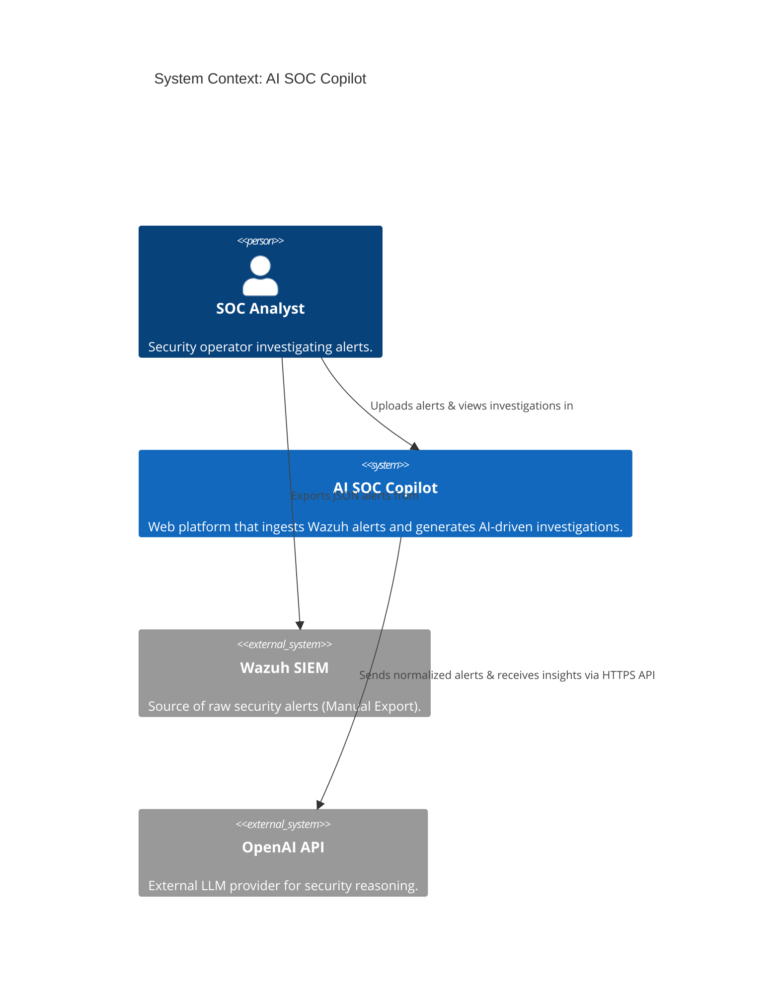
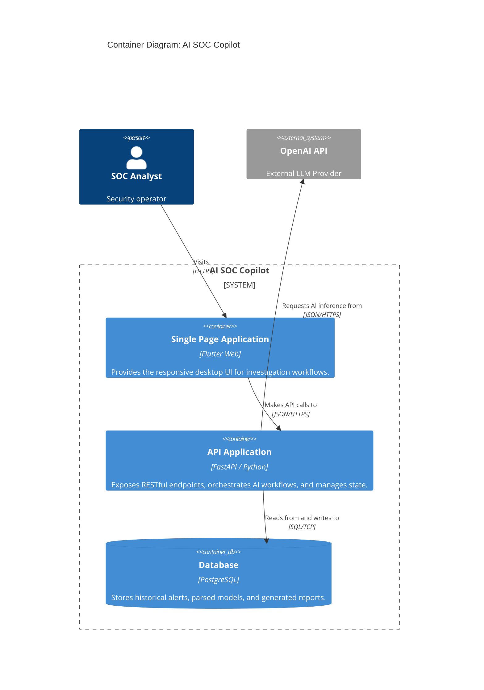
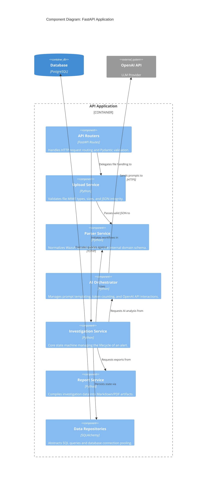
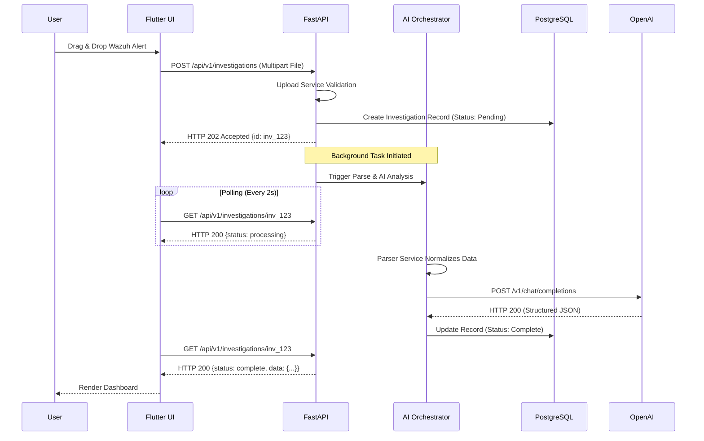
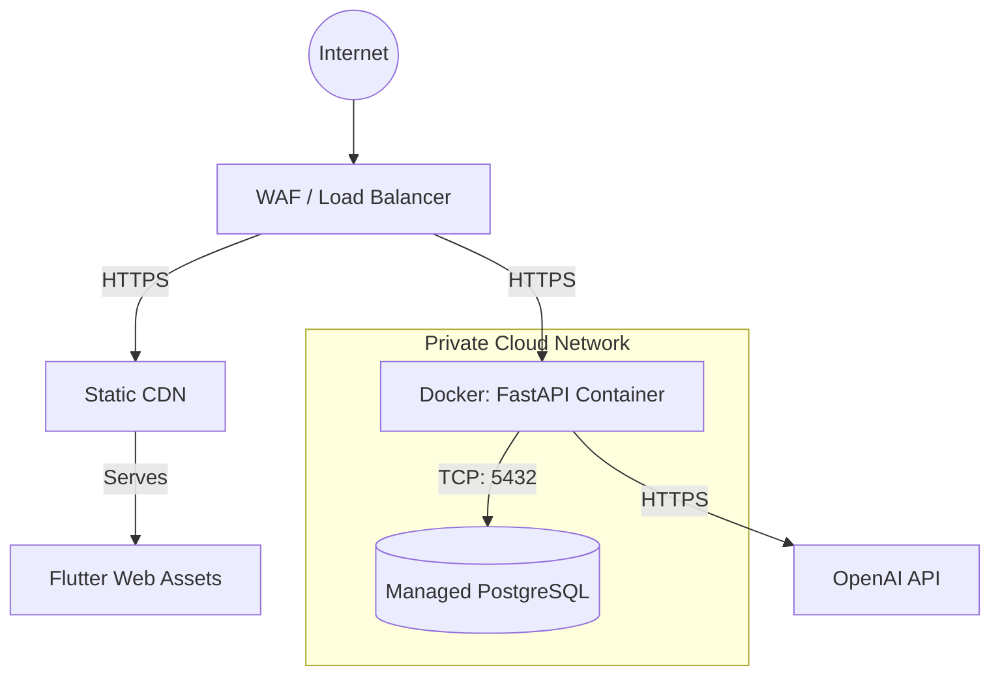

# Software Architecture Document: AI SOC Copilot

## 1. Executive Summary
This document outlines the software architecture for the AI SOC Copilot platform. It defines the structural layout, component boundaries, data flows, and design decisions necessary to satisfy both functional requirements (processing Wazuh JSON alerts via AI) and rigorous non-functional requirements (security, scalability, reliability). 

The system adopts a **Modular Monolith** architecture for the Minimum Viable Product (MVP), prioritizing rapid delivery and operational simplicity for a solo-engineering team, while enforcing strict logical boundaries that enable a seamless future transition to microservices.

---

## 2. Architectural Style & Design Decisions

### 2.1 Architectural Style: Modular Monolith
The MVP leverages a **Modular Monolith** backend pattern.
- **Why?** It accelerates MVP delivery, eliminates the complexity of distributed tracing/networking, and keeps infrastructure costs near zero.
- **How?** All backend services (Upload, Parser, AI Orchestrator, Reports) run within a single FastAPI process, but they are strictly decoupled via interfaces and dependency injection. They share a single PostgreSQL database but maintain isolated schemas or logical table separations.

### 2.2 Key Architectural Decision Records (ADRs)
| ADR ID | Decision | Justification | Trade-offs |
|---|---|---|---|
| **ADR-01** | **Flutter Web Frontend** | Unified codebase, strict UI consistency, future native compilation path. | Larger initial JS bundle size compared to raw React/Vue. |
| **ADR-02** | **FastAPI Backend** | High-performance asynchronous processing, native Python AI ecosystem integration. | Python GIL can limit CPU-bound parallelism (mitigated by I/O bound nature of LLM calls). |
| **ADR-03** | **PostgreSQL (JSONB)** | ACID compliance combined with NoSQL-like flexibility for storing unstructured Wazuh alerts. | Requires active schema migration management (Alembic). |
| **ADR-04** | **OpenAI API** | Immediate access to state-of-the-art LLMs (GPT-4o) with structured JSON output enforcement. | Introduces external API dependency, latency, and operational cost. |
| **ADR-05** | **Async Polling Pattern** | The Investigation API uses HTTP 202 (Accepted) and client-side polling rather than WebSockets. | Simpler proxy/load-balancer configuration; slight delay in status updates vs WebSockets. |

---

## 3. C4 Architecture Diagrams

The system architecture is visualized using the C4 model to provide abstractions at varying levels of detail.

### 3.1 Level 1: System Context Diagram
Illustrates how the AI SOC Copilot fits into the broader operational environment.

### 3.2 Level 2: Container Diagram
Breaks down the AI SOC Copilot into its deployable containers.

### 3.3 Level 3: Component Diagram (API Application)
Details the internal modules within the FastAPI container, verifying strict component boundaries.

---

## 4. Component Boundaries & Responsibilities

Every component in the modular monolith has a strictly defined, single responsibility to prevent "spaghetti code" and enable future microservice extraction.

| Component | Responsibility & Boundary |
|---|---|
| **API Routers** | **Boundary:** HTTP Layer. **Responsibility:** Terminate HTTP requests, enforce auth/CORS, validate inbound JSON payloads via Pydantic, and format outbound HTTP responses. No business logic resides here. |
| **Upload Service** | **Boundary:** File I/O. **Responsibility:** Memory-safe file buffering, MIME verification, and gross JSON syntax validation. Rejects malicious or oversized payloads. |
| **Parser Service** | **Boundary:** Data Normalization. **Responsibility:** Translates vendor-specific formats (Wazuh) into the Copilot's agnostic internal `Alert` entity. Discards irrelevant noise while preserving forensic evidence. |
| **AI Orchestrator** | **Boundary:** External AI Integration. **Responsibility:** Decouples the system from OpenAI. Constructs prompts, handles API retries/backoffs, enforces JSON schema responses from the LLM, and calculates token costs. |
| **Investigation Service**| **Boundary:** Core Business Logic. **Responsibility:** Manages the state machine (Pending -> Parsing -> Analyzing -> Complete). Coordinates all other services to fulfill a user request. |
| **Report Service** | **Boundary:** Artifact Generation. **Responsibility:** Uses Jinja2 templates to convert structured data into human-readable Markdown and PDF files. |
| **Data Repositories** | **Boundary:** Persistence. **Responsibility:** Encapsulates SQLAlchemy ORM logic. Isolates SQL syntax from business logic. |

---

## 5. Sequence & Data Flow Diagrams

### 5.1 Primary Workflow: Alert Investigation (Async Polling)

To prevent HTTP timeout drops during long LLM inference times, the system uses an asynchronous job processing flow.

---

## 6. Deployment Architecture

The MVP deployment topology utilizes containerized workloads to guarantee environment parity and ease of deployment on PaaS providers (e.g., Render, Railway, AWS AppRunner).

---

## 7. Non-Functional Requirements (NFR) Evaluation

### 7.1 Scalability
- **Horizontal Scalability:** The FastAPI backend is **100% stateless**. User sessions (if implemented) use JWTs, and background tasks do not hold local memory states. The API container can scale horizontally $(N \to \infty)$ behind a load balancer.
- **Database Scalability:** PostgreSQL utilizes `JSONB` indexing (GIN indexes) for rapid querying of alert telemetry, preventing full table scans as historical data grows.

### 7.2 Availability & Reliability
- **Fault Isolation:** The system implements the **Bulkhead Pattern** via the AI Orchestrator. If OpenAI experiences a catastrophic outage, the API handles the timeout gracefully (HTTP 502/503) without crashing the FastAPI event loop, ensuring the UI remains active for historical review.
- **Transaction Consistency:** The Investigation Service uses strict SQLAlchemy transaction blocks. If the AI parsing fails, the database rolls back, preventing "zombie" half-completed investigation states.

### 7.3 Security
- **Data Protection:** 
  - TLS 1.2+ is enforced at the edge. 
  - Cross-Origin Resource Sharing (CORS) is hardcoded to the specific Flutter CDN domain.
- **Injection Prevention:** SQLAlchemy ORM natively sanitizes all inputs, negating SQL injection vectors.
- **Secret Management:** LLM API keys are injected at runtime via environment variables (e.g., GitHub Secrets / AWS Parameter Store) and never committed to source control.

### 7.4 Logging & Monitoring
- **Structured Logging:** FastAPI utilizes the `structlog` library to emit logs as JSON. This enables seamless ingestion into aggregators like Datadog or ELK.
- **Correlation IDs:** Every incoming HTTP request is assigned a `X-Request-ID`. This ID is injected into the context local storage and appended to every log line, database query, and external API call, enabling end-to-end distributed tracing even within the monolith.
- **Health Probes:** A lightweight `GET /health` endpoint is exposed for load balancers to verify database connectivity.

---

## 8. Error Handling Strategy

The system mandates opaque, safe error handling to prevent architectural leakage to end users.

| Scenario | Backend Action | Frontend Action | HTTP Code |
|---|---|---|---|
| Malformed Wazuh JSON | Log warning; reject upload. | Highlight dropzone in red; show "Invalid JSON format." | `400 Bad Request` |
| OpenAI API Timeout | Retry with exponential backoff (3x). Log error. | Show "AI Service temporarily unavailable. Please retry." | `502 Bad Gateway` |
| Unhandled Exception | Catch via global exception handler. Log full stack trace. | Show generic "An unexpected error occurred." | `500 Internal Error` |
| Invalid LLM Output | AI Orchestrator rejects schema. Retry prompt. | Show "Investigation failed validation. Retrying." | `500 Internal Error` |

> [!IMPORTANT]
> **Zero Stack Trace Policy**: Under no circumstances will the production API return raw stack traces or internal database schema errors in the HTTP response body. All errors are sanitized through standard exception handlers.
