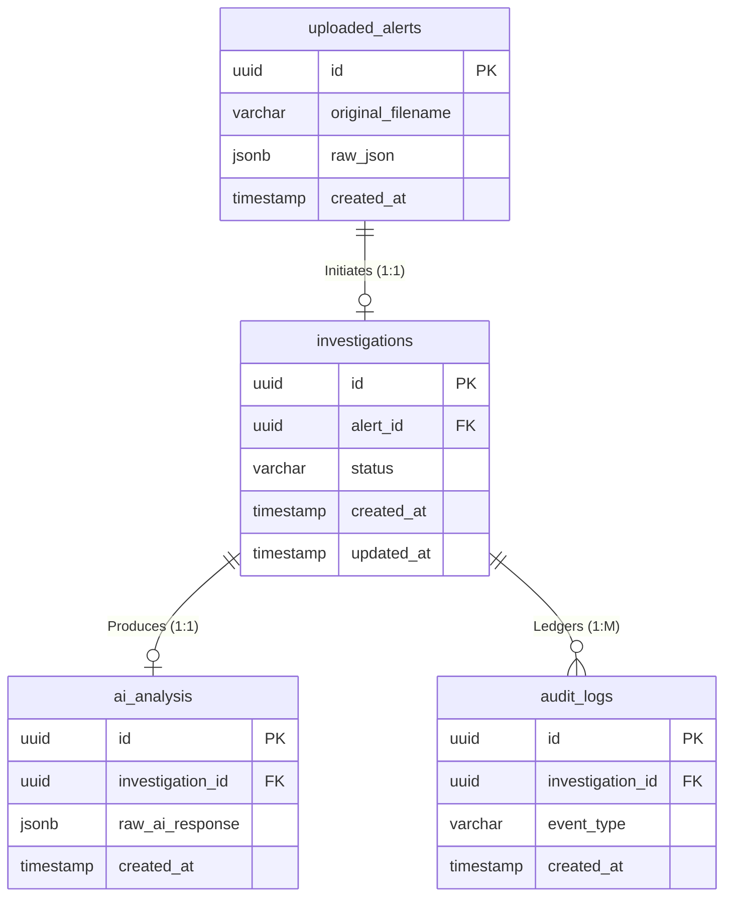

# Database Design Document: AI SOC Copilot

## 1. Executive Summary
This document defines the enterprise database architecture for the AI SOC Copilot MVP. It details the logical data model, entity-relationship mappings, normalization strategies, constraints, indexing, and migration procedures. 

The primary data store is **PostgreSQL (16+)**, leveraging its robust relational capabilities alongside `JSONB` for flexible storage of unstructured security telemetry and AI inference outputs. The Object-Relational Mapping (ORM) layer is implemented via **SQLAlchemy**.

---

## 2. Design Principles & Naming Conventions

### 2.1 Core Principles
- **Evidence Preservation (Write-Once):** Raw Wazuh alerts and raw LLM responses are immutable. They form a cryptographically sound chain of custody.
- **Normalization vs. Flexibility:** Standard relational data (states, metadata, ownership) is stored in strictly typed columns (3NF). Highly variable, schema-less data (threat intelligence, raw alerts) utilizes `JSONB`.
- **Traceability:** Every row must trace back to a specific `investigation_id`.
- **Auditability:** Core tables include standard timestamp audit fields, supplemented by a dedicated `audit_logs` ledger for state transitions.

### 2.2 Naming Conventions
To ensure consistency across the data layer, the following enterprise naming conventions are enforced:
- **Tables:** `snake_case`, pluralized (e.g., `uploaded_alerts`, `investigations`).
- **Columns:** `snake_case`, descriptive (e.g., `processing_time_ms`).
- **Primary Keys:** Always named `id` (UUIDv4).
- **Foreign Keys:** Named `{singular_table_name}_id` (e.g., `investigation_id`).
- **Timestamps:** Suffixed with `_at` (e.g., `created_at`, `updated_at`, `completed_at`), stored exclusively in UTC (`TIMESTAMP WITH TIME ZONE`).

---

## 3. Entity Relationship (ER) Diagram

*Note: The originally proposed `reports` table has been removed to eliminate redundancy. Since the MVP dynamically generates reports on demand without persisting the physical files, report generation events are now correctly logged as standard events within the `audit_logs` table.*

---

## 4. Schema Specifications

All tables natively include UUID primary keys for secure, decentralized ID generation, preventing enumeration attacks.

### 4.1 Table: `uploaded_alerts`
Serves as the immutable source of truth for the incoming SIEM payload.

| Column | Type | Constraints | Description |
|---|---|---|---|
| `id` | `UUID` | PK | Unique identifier (UUIDv4). |
| `original_filename` | `VARCHAR(255)`| `NOT NULL` | The file name uploaded by the analyst. |
| `file_size_bytes` | `INTEGER` | `NOT NULL`, `> 0` | File size for storage quota metrics. |
| `raw_json` | `JSONB` | `NOT NULL` | The immutable, exact Wazuh payload. |
| `parser_status` | `VARCHAR(50)` | `NOT NULL` | Processing state (`pending`, `success`, `failed`). |
| `validation_errors`| `JSONB` | `NULL` | Validation error stack traces, if rejected. |
| `created_at` | `TIMESTAMPTZ` | `NOT NULL`, Default `NOW()` | Timestamp of ingestion. |

### 4.2 Table: `investigations`
The central relational hub tracking the state machine of a security analysis.

| Column | Type | Constraints | Description |
|---|---|---|---|
| `id` | `UUID` | PK | Unique identifier (UUIDv4). |
| `alert_id` | `UUID` | FK `UNIQUE`, `NOT NULL` | Source alert (1:1 relationship enforcement). |
| `status` | `VARCHAR(50)` | `NOT NULL` | State (`pending`, `analyzing`, `completed`, `failed`). |
| `severity` | `VARCHAR(20)` | `NULL` | AI-determined severity (`critical`, `high`, `medium`, `low`). |
| `processing_time_ms`| `INTEGER` | `NULL` | Analytics metric for AI latency tracking. |
| `owner_id` | `UUID` | `NULL` | Reserved for upcoming Multi-Tenant/RBAC integration. |
| `created_at` | `TIMESTAMPTZ` | `NOT NULL`, Default `NOW()` | Start of investigation. |
| `updated_at` | `TIMESTAMPTZ` | `NOT NULL`, Auto-Update | Tracks state changes. |

### 4.3 Table: `ai_analysis`
Decoupled from `investigations` to allow future iterative or multi-model analyses.

| Column | Type | Constraints | Description |
|---|---|---|---|
| `id` | `UUID` | PK | Unique identifier (UUIDv4). |
| `investigation_id` | `UUID` | FK `UNIQUE`, `NOT NULL` | Parent context (1:1 relationship). |
| `executive_summary`| `TEXT` | `NOT NULL` | High-level summary of findings. |
| `mitre_mapping` | `JSONB` | `NULL` | Array of MITRE ATT&CK TTPs. |
| `indicators_of_compromise` | `JSONB` | `NULL` | Array of extracted IP addresses, hashes, domains. |
| `recommendations` | `JSONB` | `NULL` | Actionable remediation steps. |
| `raw_ai_response` | `JSONB` | `NOT NULL` | The exact LLM JSON output for auditability. |
| `model_version` | `VARCHAR(50)` | `NOT NULL` | e.g., `gpt-4o-2024-05-13`. |
| `created_at` | `TIMESTAMPTZ` | `NOT NULL`, Default `NOW()` | Timestamp of AI completion. |

### 4.4 Table: `audit_logs`
An append-only ledger for tracking operational and security events. Captures report generation without needing a redundant `reports` table.

| Column | Type | Constraints | Description |
|---|---|---|---|
| `id` | `UUID` | PK | Unique identifier (UUIDv4). |
| `investigation_id` | `UUID` | FK, `NULL` | Contextual linkage (NULL for system events). |
| `event_type` | `VARCHAR(100)`| `NOT NULL` | e.g., `upload_success`, `ai_analysis_failed`, `report_exported`. |
| `details` | `JSONB` | `NULL` | Event metadata (e.g., `{"format": "pdf", "user_agent": "Mozilla..."}`). |
| `created_at` | `TIMESTAMPTZ` | `NOT NULL`, Default `NOW()` | Immutable timestamp. |

---

## 5. Indexing & Performance Strategy

### 5.1 B-Tree Indexes
Applied for exact match and sort operations.
- `investigations (status, created_at)`: Optimizes polling for active background jobs.
- `audit_logs (investigation_id, created_at)`: Speeds up ledger retrieval for UI timelines.

### 5.2 GIN (Generalized Inverted Index)
Utilized for advanced querying within unstructured data.
- `ai_analysis (indicators_of_compromise)`: (Future) Enables global Threat Hunting across historical investigations using `JSONB` path operators (e.g., `WHERE indicators_of_compromise @> '{"ip": "1.1.1.1"}'`).

---

## 6. Constraints & Data Integrity

- **Foreign Key Cascades:** `ON DELETE CASCADE` is explicitly disabled to prevent accidental mass deletion of compliance data. Deletions must be handled logically via a future `is_deleted` flag (Soft Deletes).
- **Uniqueness:** The 1:1 relationships (`investigations.alert_id`, `ai_analysis.investigation_id`) are enforced at the database level via `UNIQUE` constraints to prevent race conditions during async task execution.
- **Check Constraints:** 
  - `investigations.status IN ('pending', 'analyzing', 'completed', 'failed')`
  - `uploaded_alerts.file_size_bytes > 0`

---

## 7. Migration Strategy

Database schema evolution is strictly managed via **Alembic**.

1. **Version Control:** All migrations (`.py` revision files) are committed to the Git repository.
2. **Linear History:** Alembic is configured to strictly enforce a linear migration history. Merge conflicts in migration branches must be resolved by rebasing and generating sequential revision IDs.
3. **CI/CD Integration:** The CI pipeline runs `alembic upgrade head` on an ephemeral database to verify schema validity before deploying to production.
4. **Zero-Downtime:** Migrations must be written backward-compatibly (e.g., add columns as `NULL` before backfilling, never rename columns in a single deployment).

---

## 8. Scalability & Extensibility

The MVP database design anticipates the following enterprise capabilities:
1. **Multi-Tenancy:** All core tables include an `owner_id` (or similar logical separation column space) to enable Row-Level Security (RLS) policies in PostgreSQL for future SaaS transition.
2. **Horizontal Read Scaling:** Adherence to strict Foreign Keys and avoiding complex triggers allows seamless future integration of read-replica databases.
3. **Cold Storage Archival:** The `created_at` partitioning strategy can be applied to `uploaded_alerts` and `audit_logs` to automatically offload historical data > 1 year old to cheaper S3 storage.
