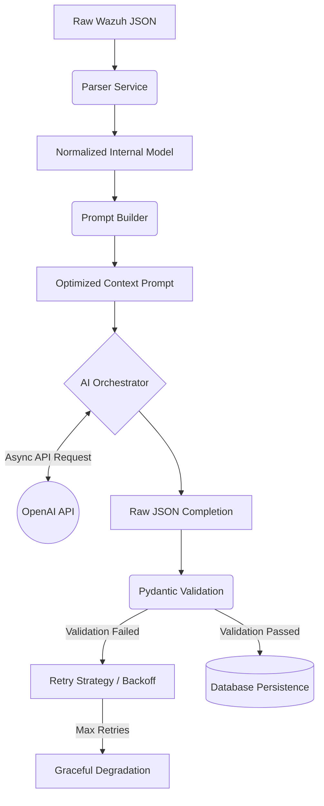

# AI Design Document: AI SOC Copilot

## 1. Executive Summary
This document specifies the enterprise architecture for the Artificial Intelligence (AI) engine powering the AI SOC Copilot. It defines the end-to-end LLM orchestration pipeline, prompt engineering strategies, strict output validation gates, and comprehensive hallucination mitigation protocols required for production cybersecurity operations.

The system is engineered around **Deterministic Structured Outputs**, ensuring that the stochastic nature of Large Language Models (LLMs) is tightly constrained into a predictable, auditable, and reliable API.

---

## 2. Core AI Pipeline Architecture

The AI Workflow operates as a decoupled sequence of deterministic stages, ensuring that the LLM is only invoked when contextual data is fully validated.



### 2.1 The Provider Abstraction (Adapter Pattern)
To ensure long-term vendor neutrality, the AI Orchestrator strictly uses the **Adapter Design Pattern**. The core logic never directly imports provider SDKs (e.g., `openai-python`). Instead, it communicates via a standard `LLMProvider` interface, enabling zero-friction transitions to Azure OpenAI, Anthropic, or on-premise local models (e.g., Llama 3) in the future.

---

## 3. Prompt Engineering & Context Building

### 3.1 Context Window Optimization
Feeding raw Wazuh JSON arrays directly into an LLM wastes tokens and increases latency. The `Parser Service` sanitizes the context by:
- **Truncating Noise:** Dropping verbose, low-value fields (e.g., `full_log`, redundant timestamps).
- **Key Extraction:** Extracting only high-signal telemetry: `rule.id`, `rule.description`, `agent.name`, `srcip`, `dstip`, `process.name`.

### 3.2 Deterministic Prompt Templates (Jinja2)
Prompts are treated as version-controlled code, managed via templating engines to ensure reproducibility.

**Prompt Structure:**
1. **System Persona:** "You are an elite, objective Senior SOC Analyst. Do not invent data."
2. **Task Objective:** "Analyze the following normalized Wazuh alert and extract actionable intelligence."
3. **Context Injection:** Interpolated, minified JSON representing the alert.
4. **Output Constraints:** "You MUST return ONLY a valid JSON object matching the provided schema. Do not include markdown blocks or preamble."

---

## 4. Structured Outputs & Response Validation

The system mandates that the LLM return data exclusively as a strictly typed JSON object.

### 4.1 Enforced JSON Schema
```json
{
  "executive_summary": "String (Max 500 chars)",
  "plain_english_explanation": "String",
  "severity": "Enum: [Critical, High, Medium, Low]",
  "confidence": "Enum: [High, Medium, Low]",
  "mitre": [{"tactic": "String", "technique": "String"}],
  "iocs": [{"type": "Enum:[IP, Hash, Domain]", "value": "String"}],
  "attack_narrative": "String",
  "recommendations": ["String"]
}
```

### 4.2 Validation Gates
The Orchestrator utilizes **Pydantic** to validate the raw text output from the LLM. 
- **Type Checking:** Ensures arrays are arrays, strings are strings.
- **Enum Conformance:** Ensures `severity` strictly matches permitted variants.
- If the output fails Pydantic validation (e.g., trailing commas, missing required keys), the Orchestrator initiates the **Retry Strategy**.

---

## 5. Reliability & Retry Strategy

The AI Orchestrator implements a resilient state machine to handle external provider volatility.

| Failure Mode | Orchestrator Action | Max Attempts |
|---|---|---|
| **JSON Parse Error** | Re-prompt LLM with the specific JSON syntax error attached: *"Your previous response failed JSON parsing with: <error>. Fix it."* | 2 |
| **Schema Violation** | Re-prompt LLM with Pydantic validation error (e.g., *"Severity must be High or Low, got 'Severe'"*). | 2 |
| **API Rate Limit (429)**| Implement Exponential Backoff (1s, 2s, 4s) before retrying. | 3 |
| **Timeout / 5xx** | Single immediate retry. If it fails, degrade gracefully. | 2 |

*If maximum retries are exhausted, the investigation is marked as `Failed` in the database, preserving the original alert for manual human review.*

---

## 6. Hallucination Mitigation & Confidence Scoring

### 6.1 Mitigation Strategies
- **Explicit Grounding:** The system prompt instructs the LLM to output "Insufficient evidence" rather than guessing.
- **Zero-Temperature Inference:** Model temperature is set to `0.0` or `0.1` to enforce deterministic, highly probable token selection over creative variance.
- **Constraint Enforcement:** By forcing responses into a rigid JSON structure, the LLM is mathematically constrained from generating expansive, fabricated narratives.

### 6.2 Confidence Scoring
The LLM is required to self-assess the reliability of its findings.
- **High:** Findings are backed by explicit, deterministic evidence (e.g., known malware hash matched).
- **Medium:** Findings rely on behavioral heuristics (e.g., unusual `PowerShell` arguments).
- **Low:** Evidence is sparse; the conclusion is speculative.

---

## 7. Telemetry: Token Optimization & Cost Estimation

Operational visibility into AI expenditure is critical for enterprise deployment.
- **Token Tracking:** Every API response extracts the `prompt_tokens` and `completion_tokens` metadata provided by OpenAI.
- **Cost Attribution:** The `Investigation Service` calculates the exact USD cost of the inference based on current pricing models (e.g., `$5.00 / 1M prompt tokens`) and persists this metric to the `investigations` database table.
- **Circuit Breakers:** Hard limits are enforced on incoming payload sizes to prevent massive, multi-megabyte log dumps from exhausting budget caps.

---

## 8. Future Architecture: Retrieval-Augmented Generation (RAG)

While the MVP relies on zero-shot inference, the architecture establishes the foundation for a future RAG deployment (Phase 3).

**Future RAG Workflow:**
1. **Vector DB Integration:** A dedicated vector store (e.g., pgvector, Milvus) will house historical incident reports, internal runbooks, and organizational policies.
2. **Context Enrichment:** Before Prompt Construction, the Orchestrator will query the Vector DB using the normalized alert telemetry to retrieve historical context.
3. **Augmented Prompts:** The LLM will receive both the real-time alert and historical context, allowing it to determine if the threat is a recurring issue or a novel attack vector, drastically reducing false positives.
